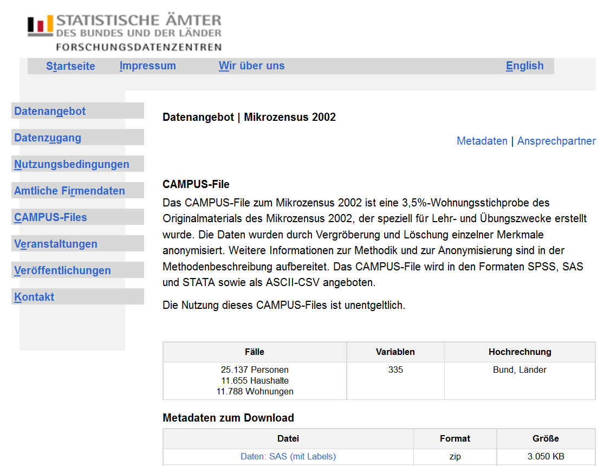

# Datemimport

### Public-Use-File (PUF)

Datei zur öffentlichen Nutzung - 

meist stark anonymisierte Daten

viele Beispiele unter:

<http://www.forschungsdatenzentrum.de>

<http://www.statistik-portal.de>

<http://www.infothek.statistik.rlp.de/lis/MeineRegion/index.asp>

### Scientific-Use-File (SUF)

 Datei zur wissenschaftlichen Nutzung - anonymisierte Daten, die zu wissenschaftlichen Zwecken und zur Sekundäranalyse genutzt werden können. 
 
 
On-Site-Nutzung: 

 *Arbeitsplätze für Gastwissenschaftler
*Kontrollierte Datenfernverarbeitung


### Datenquellen:

* Forschungsdatenzentrum

<http://www.forschungsdatenzentrum.de/>

* GDELT: Global Data on Events, Location and Tone 

<http://gdelt.utdallas.edu/>

* Social security administration puf

<http://www.ssa.gov/policy/docs/data/index.html>

* National health and nutrition examination survey

```{r}
library(survey)
data(nhanes)
```


* FAO Datenbank

<http://cran.r-project.org/web/packages/FAOSTAT/index.html>


### Download Daten - Forschungsdatenzentrum

<http://www.forschungsdatenzentrum.de/>




  ### Dateiformate in R
	
		* Von R werden quelloffene, nicht-proprietäre Formate bevorzugt
		* Es können aber auch Formate von anderen Statistik Software Paketen eingelesen werden
		* R-user speichern Objekte gerne in sog. Workspaces ab
		* Auch hier jedoch gilt: (fast) alles andere ist möglich


### Formate - base package
		
			* R unterstützt von Haus aus schon einige wichtige Formate:
			
				* CSV (Comma Separated Values): 
				* FWF (Fixed With Format): 
				* Tab-getrennte Werte: 

```{r,eval=F}
?read.csv
?read.fwf
?read.delim
```


### CSV Dateien einlesen

  	Liegt ein ordentlich formatierter CSV Datensatz vor, kann er mit dem read.csv() Befehl eingelesen werden
		
    
```{r,eval=F}
? read.csv

? read.csv2
```


```{r}
schulen <- read.csv2("http://schulen.bildung-rp.de/fileadmin/zykLus/schuldaten_export.csv")
head(schulen)
```


### Import von Excel-Daten

* library(foreign) ist für den Import von fremden Datenformaten nötig
* Wenn Excel-Daten vorliegen - als .csv abspeichern
* Dann kann read.csv() genutzt werden um die Daten einzulesen.
* Bei Deutschen Daten kann es sein, dass man read.csv2() wegen der Komma-Separierung braucht.


### Der Arbeitsspeicher

So findet man heraus, in welchem Verzeichnis man sich gerade befindet


```{r}
getwd() # welches Arbeitsverzeichnis

# Man erzeugt ein Objekt in dem man den Pfad abspeichert
main.path <- "C:/"

# Und ändert dann den Pfad mit setwd():
setwd(main.path)


```


Wichtig ist es Slashs anstelle von Backslashs zu verwenden.


### SPSS Dateien einlesen
  	
			* Das (ebenfalls proprietäre) .sav Format lässt sich mit der Funktion read.spss() aus dem Paket foreign lesen
			* Es müssen bei read.spss() allerdings einige Argumente gesetzt werden
			* to.data.frame=TRUE sorgt dafür, dass ein Data Frame entsteht (default ist FALSE)
			* use.value.labels=FALSE verwendet numerische Werte anstelle von Labels (default ist TRUE)
		
		SPSS mit read.spss()


```{r,eval=F}
library(foreign)
?read.spss

link<- "http://www.statistik.at/web_de/static/mz_2013_sds_-_datensatz_080469.sav"
MZ13 <- read.spss(file=link,
                    to.data.frame=TRUE,
                    use.value.labels=FALSE)
```


### STATA Dateien einlesen
Mit dem foreign-paket können auch STATA (.dta) Dateien eingelesen werden:
    
		
		
```{r,eval=F}
?read.dta
data(swiss)
write.dta(swiss,swissfile <- tempfile())
read.dta(swissfile)
```


### Datenmanagement wie in SPSS oder Stata

```{r,eval=F}
install.packages("Rz")
library(Rz)
```


R code zu diesem Abschnitt:

<https://github.com/Japhilko/IntroR/blob/master/2015/rcode/IntroR_B_Datenimportexport.R>


Hier geht es weiter:

