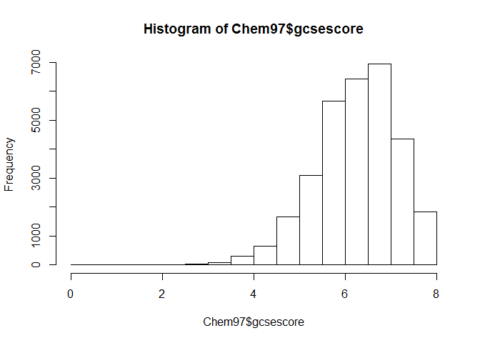

Ein Plot sagt mehr als 1000 Worte
---------------------------------

-   Grafisch gestützte Datenanalyse ist toll
-   Gute Plots können zu einem besseren Verständnis beitragen
-   Einen Plot zu generieren geht schnell
-   Einen guten Plot zu machen kann sehr lange dauern
-   Mit R Plots zu generieren macht Spaß
-   Mit R erstellte Plots haben hohe Qualität
-   Fast jeder Plottyp wird von R unterstützt
-   R kennt eine große Menge an Exportformaten für Grafiken

Plot ist nicht gleich Plot
--------------------------

        -  Bereits das base Package bringt eine große Menge von Plot Funktionen mit
        -  Das lattice Packet erweitert dessen Funktionalität
        -  Eine weit über diese Einführung hinausgehende Übersicht findet sich in Murrell, P (2006): R Graphics.

CRAN Task Views
---------------

-   Zu einigen Themen sind alle Möglichkeiten in R zusammengestellt.
    ([Übersicht der Task Views](https://cran.r-project.org/web/views/))
-   Beispiel:
    [Graphiken](https://cran.r-project.org/web/views/Graphics.html)

Datensatz
---------

    library(mlmRev)
    data(Chem97)

-   [lea] Local Education Authority - a factor
-   [school] School identifier - a factor
-   [student] Student identifier - a factor
-   [score] Point score on A-level Chemistry in 1997
-   [gender] Student's gender
-   [age] Age in month, centred at 222 months or 18.5 years
-   [gcsescore] Average GCSE score of individual.
-   [gcsecnt] Average GCSE score of individual, centered at mean.

Histogramm
----------

Wir erstellen ein Histogramm der Variable gcsescore:

Die Funktion hist()

    # Histogramm
    ?hist

    ## starting httpd help server ...

    ##  done

    hist(Chem97$gcsescore)

<!-- -->

Graphik speichern
-----------------

-   Mit dem button Export in Rstudio kann man die Grafik speichern.
-   Alternativ auch bspw. mit dem Befehl `png`

<!-- -->

    png("Histogramm.png")
    hist(Chem97$gcsescore)
    dev.off()

Histogramme
-----------

-   Die Funktion `hist()` plottet ein Histogramm der Daten
-   Der Funktion muss mindestens ein Beobachtungsvektor übergeben werden
-   `hist()` hat noch sehr viel mehr Argumente, die alle (sinnvolle)
    default values haben

<table>
<thead>
<tr class="header">
<th align="left">Argument</th>
<th align="left">Bedeutung</th>
<th align="left">Beispiel</th>
</tr>
</thead>
<tbody>
<tr class="odd">
<td align="left">main</td>
<td align="left">Überschrift</td>
<td align="left">main=&quot;Hallo Welt&quot;</td>
</tr>
<tr class="even">
<td align="left">xlab</td>
<td align="left">x-Achsenbeschriftung</td>
<td align="left">xlab=&quot;x-Werte&quot;</td>
</tr>
<tr class="odd">
<td align="left">ylab</td>
<td align="left">y-Achsenbeschriftung</td>
<td align="left">ylab=&quot;y-Werte&quot;</td>
</tr>
<tr class="even">
<td align="left">col</td>
<td align="left">Farbe</td>
<td align="left">col=&quot;blue&quot;</td>
</tr>
</tbody>
</table>

Histogramm
----------

    hist(Chem97$gcsescore,col="blue",
         main="Hallo Welt",ylab="y-Werte",
         xlab="x-Werte")

<!-- -->

Weitere Argumente:

    ?plot
    # oder
    ?par

Barplot
-------

-   Die Funktion barplot() erzeugt aus einer Häufigkeitstabelle einen
    Barplot
    -   Ist das übergebene Tabellen-Objekt zweidimensional wird ein
        bedingter Barplot erstellt

<!-- -->

    tabScore <- table(Chem97$score)
    barplot(tabScore)

<!-- -->

Barplots und barcharts
----------------------

Mehr Farben:

    barplot(tabScore)

<!-- -->

    barplot(tabScore,col=rgb(0,0,1))

<!-- -->

    barplot(tabScore,col=rgb(0,1,0))

<!-- -->

    barplot(tabScore,col=rgb(1,0,0))

<!-- -->

    barplot(tabScore,col=rgb(1,0,0,.3))

<!-- -->

Boxplot
-------

-   Einen einfachen Boxplot erstellt man mit `boxplot()`
-   Auch `boxplot()` muss mindestens ein Beobachtungsvektor übergeben
    werden

<!-- -->

    ?boxplot

    boxplot(Chem97$gcsescore,
    horizontal=TRUE)

<!-- -->

-   [Erklärung zu
    Boxplots](http://edoc.hu-berlin.de/dissertationen/gruenwald-andreas-2005-01-17/HTML/chapter2.html)

Gruppierte Boxplots
-------------------

-   Ein sehr einfacher Weg, einen ersten Eindruck über bedingte
    Verteilungen zu bekommen ist über sog. Gruppierte notched Boxplots
-   Dazu muss der Funktion `boxplot()` ein sog. Formel-Objekt übergeben
    werden
-   Die bedingende Variable steht dabei auf der rechten Seite einer
    Tilde

<!-- -->

    boxplot(Chem97$gcsescore~Chem97$gender)

<!-- -->
