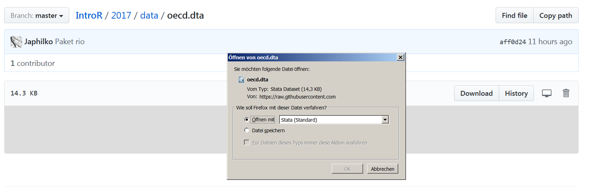

## Daten herunterladen




## Paket laden

- Am Besten eignet sich das Paket `rio`

```{r}
library("rio")
```

- [rio: A Swiss-Army Knife for Data I/O](https://cran.r-project.org/web/packages/rio/README.html)

## Datensatz in die Console laden

```{r}
oecd <- import("../../data/oecd.dta")
```

## Den Datensatz anschauen

```{r}
head(oecd)
```


## Wieviele Zeilen und Spalten

```{r}
nrow(oecd)
ncol(oecd)
```

