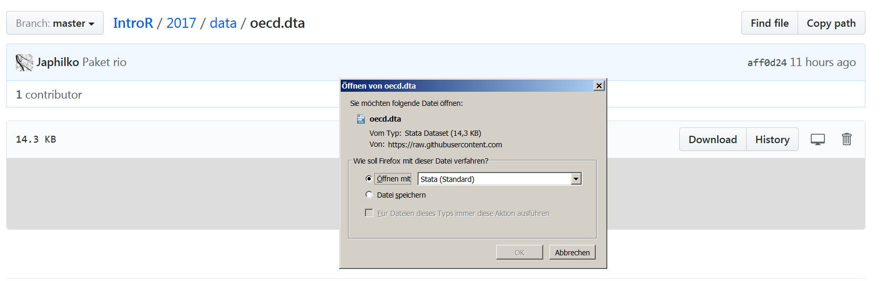

# Lösung - Aufgabe Datenimport
Jan-Philipp Kolb  
3 Mai 2017  


## Aufgabe - Datenimport

- Gehen Sie auf [meine Github Seite](https://github.com/Japhilko/IntroR/blob/master/2017/data/oecd.dta?raw=true) und laden Sie den OECD Datensatz herunter
- Laden Sie den Datensatz mit einer geeigneten Funktion in Ihre Console.

- Finden Sie heraus, wieviele Beobachtungen und Variablen der Datensatz umfasst.


## Daten herunterladen




## Paket laden

- Am Besten eignet sich das Paket `rio`


```r
library("rio")
```

- [rio: A Swiss-Army Knife for Data I/O](https://cran.r-project.org/web/packages/rio/README.html)

## Datensatz in die Console laden


```r
oecd <- import("../../data/oecd.dta")
```

## Den Datensatz anschauen


```r
head(oecd)
```

```
##   Einkommen Armut Bildung WenigRaum Umwelt Lesen Geburtsgewicht
## 1      20.8  11.8     2.2      19.7   10.5 520.0            6.4
## 2      22.2   6.2     0.6      34.0   20.2 502.0            6.8
## 3      21.4  10.0     1.0      12.6   29.8 510.3            7.8
## 4      25.6  15.1     2.1       NaN    NaN 529.3            5.9
## 5      10.8  10.3     1.2      58.9   29.7 502.0            6.7
## 6      23.2   2.7     0.7      17.6   20.2 501.0            4.9
##   Saeuglingsterblichkeit Sterblichkeit Selbstmord Bewegung Rauchen Alkohol
## 1                    5.0          23.7        8.5      NaN     NaN     NaN
## 2                    4.2          24.6        9.5     19.6    27.1    18.6
## 3                    3.7          29.0        9.0     19.1    16.7    13.9
## 4                    5.3          23.4       10.0     23.6     8.6    18.8
## 5                    3.4          24.9        6.2     22.0    21.5    16.8
## 6                    4.4          22.9        5.9     22.7    15.0    24.8
##   Jugendschwanger Bullying Schule
## 1            14.3      NaN    NaN
## 2            12.3     15.6   38.1
## 3             7.8     12.2   21.6
## 4            13.2     14.0   29.5
## 5            11.4      5.5   11.7
## 6             6.6      8.0   25.6
```


## Wieviele Zeilen und Spalten


```r
nrow(oecd)
```

```
## [1] 30
```

```r
ncol(oecd)
```

```
## [1] 16
```

