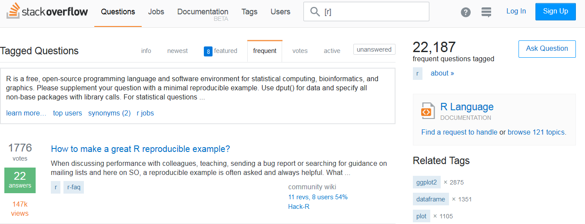

# Einführung in die Datenanalyse mit R - Erster Tag
Jan-Philipp Kolb  
03 Mai 2017  


# Warum R?

## Gründe für die Nutzung von R

- Als Weg kreativ zu sein ...
- Graphiken, Graphiken, Graphiken
- In Kombination mit anderen Programmen nutzbar
- Zur Verbindung von Datenstrukturen
- Zum Automatisieren
- Um die Intelligenz anderer Leute zu nutzen ;-)
- ...


## Gründe

- R ist [frei verfügbar](http://www.inside-r.org/why-use-r). Es kann umsonst [runtergeladen](http://mirrors.softliste.de/cran/) werden.
- R ist eine Skriptsprache 
- Gute Möglichkeiten für die [Visualisierung](http://research.stowers-institute.org/efg/R/) ([Link](http://www.sr.bham.ac.uk/~ajrs/R/r-gallery.html) )
- R wird immer [populärer](https://twitter.com/josiahjdavis/status/559778930476220418)
- [Popularität von R](http://blog.revolutionanalytics.com/popularity/)

## Übersicht - warum R


## R lässt sich kombinieren...


## R für SPSS Nutzer


```r
library("Rcmdr")
```

Bob Munich - [R for SPSS and SAS Users ](https://science.nature.nps.gov/im/datamgmt/statistics/r/documents/r_for_sas_spss_users.pdf)


## [Die Popularität von R](https://gallery.shinyapps.io/cran-gauge/)


## R Nutzer rund um die Welt


## Wo sind die aktivsten Nutzer?


## Erwartungen und Anforderungen

Das kann diese Schulung vermitteln:

- Eine praxisnahe Einfuhrung in die statistische
Programmiersprache R
- Erlernen einer Programmier-Strategie
- Guten Stil
- Die Vorzüge graphischer Datenanalyse


## Erwartungen und Anforderungen II
	
Das kann sie nicht leisten:

-  Eine Einführungsveranstaltung in die Statistik geben
-  Grundlegende datenanalytische Konzepte vermitteln
-  Verständnis zementieren
-  Das Trainieren abnehmen

## R herunterladen:

<http://www.r-project.org/>


## Links

- [Vergleich python und R](http://www.dataschool.io/python-or-r-for-data-science/)

- [Warum man R für Data Science lernen sollte](http://www.r-bloggers.com/why-you-should-learn-r-first-for-data-science/)

- [R Technologie des Jahres](http://www.r-bloggers.com/rstudio-infoworld-2015-technology-of-the-year-award-recipient/)

- [Why R is Good for Business](http://www.fastcolabs.com/3030063/why-the-r-programming-language-is-good-for-business) 

- [Warum R auf r-bloggers](http://www.r-bloggers.com/why-use-r/)

- [Intro R](http://www.ats.ucla.edu/stat/r/seminars/intro.htm)

- [Intro R II](http://www.ats.ucla.edu/stat/r/sk/)

## Probleme mit Excel

Weil andere Programme große Fehler haben:

- [Excel bug](http://blog.revolutionanalytics.com/2013/02/did-an-excel-error-bring-down-the-london-whale.html)

- [Datum in Excel](https://coffeehouse.dataone.org/2014/04/09/abandon-all-hope-ye-who-enter-dates-in-excel/)

- [Probleme mit Excel](http://www.biomedcentral.com/1471-2105/5/80)

## Einordnung 

- [Vergleich mit anderen Programmen](https://www.inwt-statistics.de/blog-artikel-lesen/Statistik-Software-R_SAS_SPSS_STATA_im_Vergleich.html)

# Dein Freund das GUI


## Open Source Programm R

-  R ist eine freie, nicht-kommerzielle Implementierung der Programmiersprache S (von AT&T Bell Laboratories entwickelt)
- Freie Beteiligung - modularer Aufbau (immer mehr Erweiterungspakete)

- Der Download ist auf dieser Seite möglich:

<https://cran.r-project.org/>


## Graphisches User Interface

Aber die meisten Menschen nutzen einen Editor oder ein graphical user interface (GUI).

Aus den folgenden Gründen:

- Syntax highlighting
- Auto-Vervollständigung
- Bessere Übersicht über Graphiken, Bibliotheken

## Verschiedene GUIs

- [Gedit](https://projects.gnome.org/gedit/) mit R-spezifischen Add-ons für Linux

- [Emacs](http://www.gnu.org/software/emacs/)

- [TinnR](http://www.sciviews.org/Tinn-R/)

- Ich nutze [Rstudio!](https://www.rstudio.com/)


## Download der Unterlagen

Auf [github](github.com/Japhilko/IntroR/) sind alle Unterlagen für diesen Kurs zu finden.

[Wie nutzt man github?](https://guides.github.com/activities/hello-world/)


## Rstudio

- Sechs [Gründe](http://www.r-bloggers.com/top-6-reasons-you-need-to-be-using-rstudio/) Rstudio zu nutzen.

- Wie man Rstudio [nutzen kann.](https://support.rstudio.com/hc/en-us/sections/200107586-Using-RStudio)

- [Das Rstudio einrichten](https://support.rstudio.com/hc/en-us/articles/200549016-Customizing-RStudio)

## Aufgabe - Vorbereitung

- Prüfen Sie, ob eine Version von R auf Rechner installiert ist.
- Falls dies nicht der Fall ist, laden Sie [R](r-project.org)  runter und installieren Sie R.
- Prüfen Sie, ob Rstudio installiert ist.
- Falls nicht - [Installieren](http://www.rstudio.com/) sie Rstudio.
- Laden Sie die R-Skripte von meinem GitHub-Account
- Erstellen Sie ein erstes Script und finden Sie das Datum mit dem Befehl `date()` und die R-version mit `sessionInfo()` heraus.


```r
date()
```

```
## [1] "Mon Apr 24 14:37:05 2017"
```


```r
sessionInfo()
```

```
## R version 3.3.2 (2016-10-31)
## Platform: x86_64-w64-mingw32/x64 (64-bit)
## Running under: Windows 7 x64 (build 7601) Service Pack 1
## 
## locale:
## [1] LC_COLLATE=German_Germany.1252  LC_CTYPE=German_Germany.1252   
## [3] LC_MONETARY=German_Germany.1252 LC_NUMERIC=C                   
## [5] LC_TIME=German_Germany.1252    
## 
## attached base packages:
## [1] stats     graphics  grDevices utils     datasets  methods   base     
## 
## loaded via a namespace (and not attached):
##  [1] backports_1.0.4 magrittr_1.5    rprojroot_1.1   tools_3.3.2    
##  [5] htmltools_0.3.5 yaml_2.1.14     Rcpp_0.12.9     stringi_1.1.2  
##  [9] rmarkdown_1.3   knitr_1.15.1    stringr_1.2.0   digest_0.6.11  
## [13] evaluate_0.10
```

# Grundlagen im Umgang mit der Sprache R


## R ist eine Objekt-orientierte Sprache

Vektoren und Zuweisungen

-  R ist eine Objekt-orientierte Sprache
-  `<-` ist der Zuweisungsoperator


```r
b <- c(1,2) # erzeugt ein Objekt mit den Zahlen 1 und 2
```
-  Eine Funktion kann auf dieses Objekt angewendet werden:


```r
mean(b) # berechnet den Mittelwert
```

```
## [1] 1.5
```

Mit den folgenden Funktionen können wir etwas über die Eigenschaften des Objekts lernen:


```r
length(b) # b hat die Länge 2
```

```
## [1] 2
```


## Objektstruktur


```r
str(b) # b ist ein numerischer Vektor
```

```
##  num [1:2] 1 2
```


## Funktionen im base-Paket

|Funktion |Bedeutung          |Beispiel  |
|:--------|:------------------|:---------|
|length() |Länge              |length(b) |
|max()    |Maximum            |max(b)    |
|min()    |Minimum            |min(b)    |
|sd()     |Standardabweichung |sd(b)     |
|var()    |Varianz            |var(b)    |
|mean()   |Mittelwert         |mean(b)   |
|median() |Median             |median(b) |

Diese Funktionen brauchen nur ein Argument.

## Funktionen mit mehr Argumenten

Andere Funktionen brauchen mehr:

|Argument   |Bedeutung         |Beispiel       |
|:----------|:-----------------|:--------------|
|quantile() |90 % Quantile     |quantile(b,.9) |
|sample()   |Stichprobe ziehen |sample(b,1)    |


## Beispiel - Funktionen mit einem Argument


```r
max(b)
```

```
## [1] 2
```

```r
min(b)
```

```
## [1] 1
```

```r
sd(b)
```

```
## [1] 0.7071068
```

```r
var(b)
```

```
## [1] 0.5
```

## Funktionen mit einem Argument


```r
mean(b)
```

```
## [1] 1.5
```

```r
median(b)
```

```
## [1] 1.5
```


## Funktionen mit mehr Argumenten


```r
quantile(b,.9)
```

```
## 90% 
## 1.9
```

```r
sample(b,1) 
```

```
## [1] 1
```


## [Übersicht Befehle](http://cran.r-project.org/doc/manuals/R-intro.html)

<http://cran.r-project.org/doc/manuals/R-intro.html>


## Aufgabe - Zuweisungen und Funktionen

Erzeugen Sie einen Vektor b mit den Zahlen von 1 bis 5 und berechnen Sie...


1. den Mittelwert

2. die Varianz

3. die Standardabweichung

4. die quadratische Wurzel aus dem Mittelwert


## Verschiedene Datentypen

|Datentyp  |Beschreibung                 |Beispiel    |
|:---------|:----------------------------|:-----------|
|numeric   |ganze und reele Zahlen       |5, 3.462    |
|logical   |logische Werte               |FALSE, TRUE |
|character |Buchstaben und Zeichenfolgen |"Hallo"     |

Quelle: [R. Münnich und M. Knobelspieß](https://www.uni-trier.de/fileadmin/fb4/prof/VWL/FIN/Oekonometrie/PC-UEbung/Einfuehrung_in_R.pdf) (2007): Einführung in das statistische Programmpaket R

## Verschiedene Datentypen


```r
b <- c(1,2) # numeric
log <- c(T,F) # logical
char <-c("A","b") # character
fac <- as.factor(c(1,2)) # factor
```

Mit `str()` bekommt man den Objekttyp.

## Indizieren eines Vektors:


```r
A1 <- c(1,2,3,4)
A1
```

```
## [1] 1 2 3 4
```

```r
A1[1]
```

```
## [1] 1
```

```r
A1[4]
```

```
## [1] 4
```

```r
A1[1:3]
```

```
## [1] 1 2 3
```

```r
A1[-4]
```

```
## [1] 1 2 3
```

## data.frames

Beispieldaten generieren:


```r
AGE <- c(20,35,48,12)
SEX <- c("m","w","w","m")
```

Diese beiden Vektoren zu einem data.frame verbinden:


```r
Daten <- data.frame(Alter=AGE,Geschlecht=SEX)
```

Anzahl der Zeilen/Spalten herausfinden


```r
nrow(Daten) # Zeilen
```

```
## [1] 4
```

```r
ncol(Daten) # Spalten
```

```
## [1] 2
```

## Indizieren

Indizieren eines dataframe:


```r
AA <- 4:1
A2 <- cbind(A1,AA)
A2[1,1]
```

```
## A1 
##  1
```

```r
A2[2,]
```

```
## A1 AA 
##  2  3
```

```r
A2[,1]
```

```
## [1] 1 2 3 4
```

```r
A2[,1:2]
```

```
##      A1 AA
## [1,]  1  4
## [2,]  2  3
## [3,]  3  2
## [4,]  4  1
```

## Matrizen und Arrays

-  In Matrizen und Arrays stehen meist nur numerische Werte.
-  Dadurch wird beispielsweise Matrix Multiplikation möglich.
-  Anders als beim data.frame sind mehr als zwei Dimensionen möglich.


```r
A <- matrix(seq(1,100), nrow = 4)
dim(A)
```

```
## [1]  4 25
```

## Ein Array erzeugen


```r
A3 <- array(1:8,c(2,2,2))
A3
```

```
## , , 1
## 
##      [,1] [,2]
## [1,]    1    3
## [2,]    2    4
## 
## , , 2
## 
##      [,1] [,2]
## [1,]    5    7
## [2,]    6    8
```

## Indizieren eines Array


```r
A3[,,2]
```

```
##      [,1] [,2]
## [1,]    5    7
## [2,]    6    8
```


## Listen

-  Eine Liste in R entspricht einem geschachtelten Array in anderen Programmiersprachen
-  Listen können alles enthalten
-  Listen können geschachtelt sein
-  Listen sollte man sehr bedacht verwenden
			
## Indizieren einer Liste


```r
A4 <- list(A1,1)
A4
```

```
## [[1]]
## [1] 1 2 3 4
## 
## [[2]]
## [1] 1
```

```r
A4[[2]]
```

```
## [1] 1
```


## Logische Operatoren


```r
# Ist 1 größer als 2?
1>2
```

```
## [1] FALSE
```

```r
1<2
```

```
## [1] TRUE
```

```r
1==2
```

```
## [1] FALSE
```


## Operatoren um Subset für Datensatz zu bekommen

Diese Operatoren eignen sich gut um Datensätze einzuschränken


```r
Daten
```

```
##   Alter Geschlecht
## 1    20          m
## 2    35          w
## 3    48          w
## 4    12          m
```

```r
Daten[AGE>20,]
```

```
##   Alter Geschlecht
## 2    35          w
## 3    48          w
```

## Datensätze einschränken


```r
Daten[SEX=="w",]
```

```
##   Alter Geschlecht
## 2    35          w
## 3    48          w
```

```r
# gleiches Ergebnis:
Daten[SEX!="m",]
```

```
##   Alter Geschlecht
## 2    35          w
## 3    48          w
```


## Weitere wichtige Optionen


```r
# Ergebnis in ein Objekt speichern
subDat <- Daten[AGE>20,]
```


```r
# mehrere Bedingeungen können mit
# & verknüpft werden:
Daten[AGE>18 & SEX=="w",]
```

```
##   Alter Geschlecht
## 2    35          w
## 3    48          w
```

## Sequenzen


```r
# Sequenz von 1 bis 10
1:10
```

```
##  [1]  1  2  3  4  5  6  7  8  9 10
```


```r
Daten[1:3,]
```

```
##   Alter Geschlecht
## 1    20          m
## 2    35          w
## 3    48          w
```

## Weitere Sequenzen


```r
seq(-2,8,by=1.5)
```

```
## [1] -2.0 -0.5  1.0  2.5  4.0  5.5  7.0
```

```r
a <-seq(3,12,length=12)

b <- seq(to=5,length=12,by=0.2)

d <- 1:10
d <- seq(1,10,1)
d <- seq(length=10,from=1,by=1)
```

## Wiederholungen


```r
# wiederhole 1 10 mal
rep(1,10)
```

```
##  [1] 1 1 1 1 1 1 1 1 1 1
```

```r
rep("A",10)
```

```
##  [1] "A" "A" "A" "A" "A" "A" "A" "A" "A" "A"
```

## Die Funktion paste


```r
?paste
```


```r
paste(1:4)
```

```
## [1] "1" "2" "3" "4"
```

```r
paste("A", 1:6, sep = "")
```

```
## [1] "A1" "A2" "A3" "A4" "A5" "A6"
```

# Wie bekommt man Hilfe?


## Wie bekommt man Hilfe?

-  [Um generell Hilfe zu bekommen:](http://itfeature.com/tag/how-to-get-help-in-r)


```r
help.start()
```

-  Online Dokumentation für die meisten Funktionen:


```r
help(name)
```

-  Nutze ? um Hilfe zu bekommen.


```r
?mean
```

-  example(lm) gibt ein Beispiel für die lineare Regression


```r
example(lm)
```

## Nutzung Suchmaschinen

-  Ich nutze meistens google 
-  Tippe:

```
R-project + Was ich schon immer wissen wollte
```


-  Das funktioniert natürlich mit jeder Suchmaschine!

## [Stackoverflow](http://stackoverflow.com/)

-  Für Fragen zum Programmieren
-  Ist nicht auf R fokussiert
-  Sehr detailierte Diskussionen



# Modularer Aufbau von R


