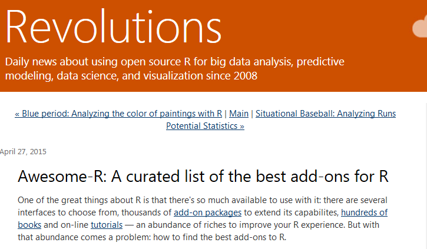

```{r, include=FALSE}
knitr::opts_chunk$set(echo = TRUE,message=F,warning=F)
```

## Aufgekommene Fragen

- A - Wie findet man die besten/am meisten genutzten Pakete für ein spezielles Thema?
- B - Wo werden R-Pakete gespeichert, und wie kann man den Pfad ändern?
- C - Wie speichert man, was man gemacht hat (Stichwort Logfile)
- D - Wie schreibt man Werte in Balkendiagramme? 
- E - Wie fügt man KI`s zu einem Balkendiagramm hinzu?
- F - Wie kann man eine Legende zu einer Basisgraphik hinzufügen?
- G - Wie kann man die Beschriftung in lattice Graphiken ändern?
- H - Wie ändert man die Reihenfolge der Gitter?
- I - Wie kann man sich einen Plot einteilen?

## A - [Die am meisten genutzten Pakete](http://www.kdnuggets.com/2015/06/top-20-r-packages.html)


## A - [Awesome R](https://awesome-r.com/)




- [Quick list - most useful packages](https://support.rstudio.com/hc/en-us/articles/201057987-Quick-list-of-useful-R-packages)

- [RStartHere](https://github.com/rstudio/RStartHere)


## B - Wo werden R-Pakete gespeichert?

- So sieht man auf welche Ordner R zugreift:

```{r}
.libPaths() 
```

- [Man kann den Pfad angeben](http://usi4biz.com/2016/01/21/changing-r-library-path/), in dem ein Pakte gespeichert sein soll:

```{r,eval=F}
.libPaths( c( .libPaths(), "H:/My Documents/data analysis/R") )  
```

## C - Die getane Arbeit abspeichern

- [alle Befehle speichern, die man eingegeben hat:](https://stat.ethz.ch/R-manual/R-devel/library/utils/html/savehistory.html)

```{r,eval=F}
savehistory(file = "try.Rhistory")
```

- Den aktuellen Workspace sichern

```{r,eval=F}
save.image()
```

- dem Kind einen Namen geben:

```{r,eval=F}
save.image("HalloWelt.RData")
```

## D - [Werte in Balkendiagramm schreiben?](https://stats.stackexchange.com/questions/3879/how-to-put-values-over-bars-in-barplot-in-r)

```{r}
ab <- sample(1:3,1000,replace=T)
tab_ab <- table(ab)
barplot(tab_ab,ylim=c(0,600),col="royalblue")
text(1,500,"A")
text(2,500,"B")
text(3,500,"C")
```

## E - [Konfidenzintervalle hinzufügen](http://stats.idre.ucla.edu/r/faq/how-can-i-add-features-or-dimensions-to-my-bar-plot/) 

```{r,eval=F}
install.packages("gplots")
```


```{r}
library(gplots)
```

```{r}
ci.l <- tab_ab * 0.85
ci.u <- tab_ab * 1.15
barplot2(tab_ab, plot.ci = TRUE, ci.l = ci.l, ci.u = ci.u,
         col="chocolate1")
```

## F - Eine Legende zu einer Basisgraphik hinzufügen

```{r}
x <- runif(100)
y <- runif(100)
z <- sample(1:3,100,T)
```

```{r}
plot(x,y,col=z,pch=20)
legend("topright",c("Kategorie A","Kategorie B","Kategorie C"),text.col = 1:3)
```

## G - Text in lattice Graphik Beschriftung

```{r}
library(lattice)
library(mlmRev)
data(Chem97)

Chem97cat <- paste("gender",Chem97$gender,"score",Chem97$score)

histogram(~ gcsescore | factor(Chem97cat),data = Chem97)
```

## H - Reihenfolge der Gitterfenster ändern

```{r}
histogram(~ gcsescore | factor(score),data = Chem97,
index.cond=list(c(4,1,2,3,5,6)))
```

- [Quick R - Lattice Graphiken](http://www.statmethods.net/advgraphs/trellis.html)


## I - [Das Graphikfenster einteilen](http://sphaerula.com/legacy/R/multiplePlotFigure.html)

```{r,eval=F}
get( getOption( "device" ) )()

##  Set the outer margins so that bottom, left, and right are 0
##  and top is 3 lines of text.

old.par <- par( no.readonly = TRUE )
par( oma = c( 0, 0, 3, 0 ) )

##  Plot using layout().

nf <- layout( matrix( c( 1, 2 ), 1, 2, byrow = TRUE),
    c( 1, 1 ), c( 1, 1 ), TRUE )
layout.show( nf )
```

```{r,eval=F}
##  Create the two plots.

plot( rnorm( n = 10, mean = 0, sd = 1 ) )
plot( rpois( n = 10, lambda = 3 ) )

##  Create an overall title.

mtext( "Centered Overall Title", outer = TRUE )

##  Restore the old plotting parameters.

par( old.par )
```

