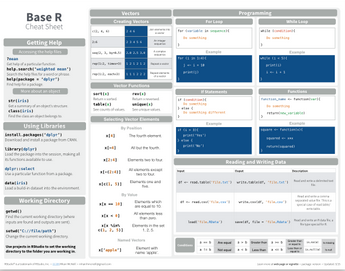

# Wie bekommt man Hilfe?
Jan-Philipp Kolb  
3 Mai 2017  


## Wie bekommt man Hilfe?

-  [Um generell Hilfe zu bekommen:](http://itfeature.com/tag/how-to-get-help-in-r)


```r
help.start()
```

-  Online Dokumentation für die meisten Funktionen:


```r
help(name)
```

-  Nutze ? um Hilfe zu bekommen.


```r
?mean
```

-  example(lm) gibt ein Beispiel für die lineare Regression


```r
example(lm)
```

## Nutzung Suchmaschinen

-  Ich nutze meistens google 
-  Tippe:

```
R-project + Was ich schon immer wissen wollte
```


-  Das funktioniert natürlich mit jeder Suchmaschine!

## [Stackoverflow](http://stackoverflow.com/)

-  Für Fragen zum Programmieren
-  Ist nicht auf R fokussiert
-  Sehr detailierte Diskussionen


## Ein Schummelzettel - Cheatsheet

<https://www.rstudio.com/resources/cheatsheets/>


