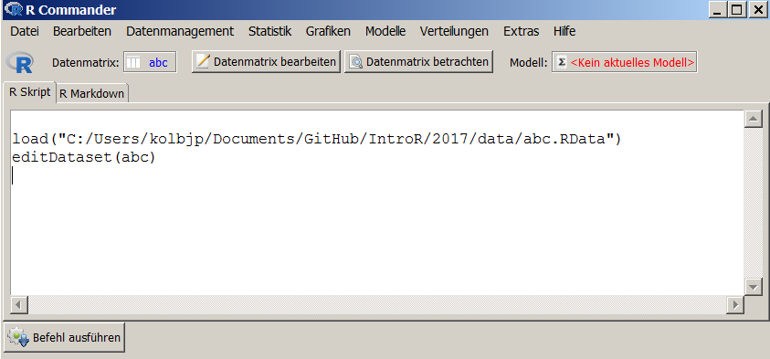

# Intro Datenanalyse mit R - Datenimport
Jan-Philipp Kolb  
3 Mai 2017  


## Datenimport


## Dateiformate in R

-  Von R werden quelloffene, nicht-proprietäre Formate bevorzugt
-  Es können aber auch Formate von anderen Statistik Software Paketen eingelesen werden
-  R-user speichern Objekte gerne in sog. Workspaces ab
-  Auch hier jedoch gilt: (fast) alles andere ist möglich

## Formate - base package

R unterstützt von Haus aus schon einige wichtige Formate:
		
-  CSV (Comma Separated Values): `read.csv()`
-  FWF (Fixed With Format): `read.fwf()`
-  Tab-getrennte Werte: `read.delim()`


## Der Arbeitsspeicher

So findet man heraus, in welchem Verzeichnis man sich gerade befindet


```r
getwd()
```

So kann man das Arbeitsverzeichnis ändern:

Man erzeugt ein Objekt in dem man den Pfad abspeichert:


```r
main.path <- "C:/" # Beispiel für Windows
main.path <- "/users/Name/" # Beispiel für Mac
main.path <- "/home/user/" # Beispiel für Linux
```

Und ändert dann den Pfad mit setwd()


```r
setwd(main.path)
```

Bei Windows ist es wichtig Slashs anstelle von Backslashs zu verwenden.

## Alternative - Arbeitsspeicher


## Import von Excel-Daten

-  `library(foreign)` ist für den Import von fremden Datenformaten nötig
-  Wenn Excel-Daten vorliegen - als .csv abspeichern
-  Dann kann `read.csv()` genutzt werden um die Daten einzulesen.
- Bei Deutschen Daten kann es sein, dass man `read.csv2()` wegen der Komma-Separierung braucht.


```r
library(foreign)
?read.csv
?read.csv2
```

## CSV Dateien einlesen

Zunächst muss das Arbeitsverzeichnis gesetzt werden, in dem sich die Daten befinden:


```r
Dat <- read.csv("schuldaten_export.csv")
```

Wenn es sich um Deutsche Daten handelt:


```r
Dat <- read.csv2("schuldaten_export.csv")
```

## SPSS Dateien einlesen

Dateien können auch direkt aus dem Internet geladen werden:


```r
link<- "http://www.statistik.at/web_de/static/
mz_2013_sds_-_datensatz_080469.sav"

?read.spss
Dat <- read.spss(link,to.data.frame=T)
```

## stata Dateien einlesen


```r
MZ02 <- read.dta("MZ02.dta")
```

- Einführung in Import mit R ([is.R](http://is-r.tumblr.com/post/37181850668/reading-writing-stata-dta-files-with-foreign))

## [Das Paket `rio`](https://cran.r-project.org/web/packages/rio/vignettes/rio.html)


```r
install.packages("rio")
```


```r
library("rio")
x <- import("mtcars.csv")
y <- import("mtcars.rds")
z <- import("mtcars.dta")
```

- [rio: A Swiss-Army Knife for Data I/O](https://cran.r-project.org/web/packages/rio/README.html)

## Datenmanagement ähnlich wie in SPSS oder Stata


```r
install.packages("Rz")
library(Rz)
```

## [Weitere Alternative Rcmdr](https://cran.r-project.org/web/packages/Rcmdr/index.html)


```r
install.packages("Rcmdr")
```

- [Funktioniert auch mit Rstudio](http://www.rcommander.com/)


```r
library(Rcmdr)
```


