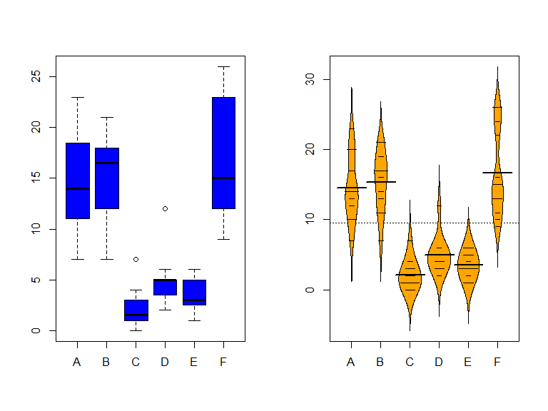
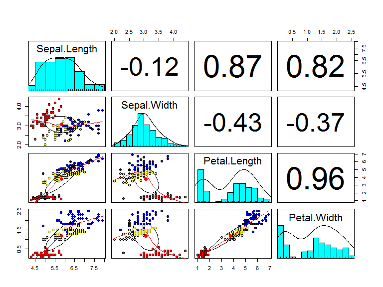

# Intro Datenanalyse 1
Jan-Philipp Kolb  
27 April 2017  

# Warum R nutzen


## Gründe für die Nutzung von R

- Als Weg kreativ zu sein ...
- Graphiken, Graphiken, Graphiken
- In Kombination mit anderen Programmen nutzbar
- Zur Verbindung von Datenstrukturen
- Zum Automatisieren
- Um die Intelligenz anderer Leute zu nutzen ;-)
- ...


## Gründe

- R ist [frei verfügbar](http://www.inside-r.org/why-use-r). Es kann umsonst [runtergeladen](http://mirrors.softliste.de/cran/) werden.
- R ist eine Skriptsprache 
- Gute Möglichkeiten für die [Visualisierung](http://research.stowers-institute.org/efg/R/) ([Link](http://www.sr.bham.ac.uk/~ajrs/R/r-gallery.html) )
- R wird immer [populärer](https://twitter.com/josiahjdavis/status/559778930476220418)
- [Popularität von R](http://blog.revolutionanalytics.com/popularity/)

## Übersicht - warum R


## R lässt sich kombinieren...


## R für SPSS Nutzer


```r
install.packages("Rcmdr")
library("Rcmdr")
```

Bob Munich - [R for SPSS and SAS Users ](https://science.nature.nps.gov/im/datamgmt/statistics/r/documents/r_for_sas_spss_users.pdf)


## [Die Popularität von R](https://gallery.shinyapps.io/cran-gauge/)


## R Nutzer rund um die Welt


## Wo sind die aktivsten Nutzer?


## Erwartungen und Anforderungen

Das kann diese Schulung vermitteln:

- Eine praxisnahe Einfuhrung in die statistische
Programmiersprache R
- Erlernen einer Programmier-Strategie
- Guten Stil
- Die Vorzüge graphischer Datenanalyse


## Erwartungen und Anforderungen II
	
Das kann sie nicht leisten:

-  Eine Einführungsveranstaltung in die Statistik geben
-  Grundlegende datenanalytische Konzepte vermitteln
-  Verständnis zementieren
-  Das Trainieren abnehmen

## R herunterladen:

<http://www.r-project.org/>


## Links

- [Vergleich python und R](http://www.dataschool.io/python-or-r-for-data-science/)

- [Warum man R für Data Science lernen sollte](http://www.r-bloggers.com/why-you-should-learn-r-first-for-data-science/)

- [R Technologie des Jahres](http://www.r-bloggers.com/rstudio-infoworld-2015-technology-of-the-year-award-recipient/)

- [Why R is Good for Business](http://www.fastcolabs.com/3030063/why-the-r-programming-language-is-good-for-business) 

- [Warum R auf r-bloggers](http://www.r-bloggers.com/why-use-r/)

- [Intro R](http://www.ats.ucla.edu/stat/r/seminars/intro.htm)

- [Intro R II](http://www.ats.ucla.edu/stat/r/sk/)

## Probleme mit Excel

Weil andere Programme große Fehler haben:

- [Excel bug](http://blog.revolutionanalytics.com/2013/02/did-an-excel-error-bring-down-the-london-whale.html)

- [Datum in Excel](https://coffeehouse.dataone.org/2014/04/09/abandon-all-hope-ye-who-enter-dates-in-excel/)


## [Probleme mit Excel](http://www.biomedcentral.com/1471-2105/5/80)


## [Vergleich mit anderen Programmen](https://www.inwt-statistics.de/blog-artikel-lesen/Statistik-Software-R_SAS_SPSS_STATA_im_Vergleich.html)


# Dein Freund das GUI


## Open Source Programm R

-  R ist eine freie, nicht-kommerzielle Implementierung der Programmiersprache S (von AT&T Bell Laboratories entwickelt)
- Freie Beteiligung - modularer Aufbau (immer mehr Erweiterungspakete)

- Der Download ist auf dieser Seite möglich:

<https://cran.r-project.org/>


## Graphisches User Interface

Aber die meisten Menschen nutzen einen Editor oder ein graphical user interface (GUI).

Aus den folgenden Gründen:

- Syntax highlighting
- Auto-Vervollständigung
- Bessere Übersicht über Graphiken, Bibliotheken

## Verschiedene GUIs

- [Gedit](https://projects.gnome.org/gedit/) mit R-spezifischen Add-ons für Linux

- [Emacs](http://www.gnu.org/software/emacs/)

- [TinnR](http://www.sciviews.org/Tinn-R/)

- Ich nutze [Rstudio!](https://www.rstudio.com/)


## Download der Unterlagen

Auf [github](github.com/Japhilko/IntroR/) sind alle Unterlagen für diesen Kurs zu finden.

[Wie nutzt man github?](https://guides.github.com/activities/hello-world/)


## Rstudio

- Sechs [Gründe](http://www.r-bloggers.com/top-6-reasons-you-need-to-be-using-rstudio/) Rstudio zu nutzen.

- Wie man Rstudio [nutzen kann.](https://support.rstudio.com/hc/en-us/sections/200107586-Using-RStudio)

- [Das Rstudio einrichten](https://support.rstudio.com/hc/en-us/articles/200549016-Customizing-RStudio)


## Aufgabe - Vorbereitung

- Prüfen Sie, ob eine Version von R auf Rechner installiert ist.
- Falls dies nicht der Fall ist, laden Sie [R](r-project.org)  runter und installieren Sie R.
- Prüfen Sie, ob Rstudio installiert ist.
- Falls nicht - [Installieren](http://www.rstudio.com/) sie Rstudio.
- Laden Sie die R-Skripte von meinem GitHub-Account
- Erstellen Sie ein erstes Script und finden Sie das Datum mit dem Befehl `date()` und die R-version mit `sessionInfo()` heraus.


```r
date()
```

```
## [1] "Thu Apr 27 22:20:08 2017"
```


```r
sessionInfo()
```

```
## R version 3.3.3 (2017-03-06)
## Platform: x86_64-w64-mingw32/x64 (64-bit)
## Running under: Windows 7 x64 (build 7601) Service Pack 1
## 
## locale:
## [1] LC_COLLATE=German_Germany.1252  LC_CTYPE=German_Germany.1252   
## [3] LC_MONETARY=German_Germany.1252 LC_NUMERIC=C                   
## [5] LC_TIME=German_Germany.1252    
## 
## attached base packages:
## [1] stats     graphics  grDevices utils     datasets  methods   base     
## 
## loaded via a namespace (and not attached):
##  [1] backports_1.0.5 magrittr_1.5    rprojroot_1.2   tools_3.3.3    
##  [5] htmltools_0.3.5 yaml_2.1.13     Rcpp_0.12.6     stringi_1.1.1  
##  [9] rmarkdown_1.4   knitr_1.15.1    stringr_1.2.0   digest_0.6.12  
## [13] evaluate_0.10
```

# Grundlagen im Umgang mit der Sprache R


## R ist eine Objekt-orientierte Sprache

Vektoren und Zuweisungen

-  R ist eine Objekt-orientierte Sprache
-  `<-` ist der Zuweisungsoperator


```r
b <- c(1,2) # erzeugt ein Objekt mit den Zahlen 1 und 2
```
-  Eine Funktion kann auf dieses Objekt angewendet werden:


```r
mean(b) # berechnet den Mittelwert
```

```
## [1] 1.5
```

Mit den folgenden Funktionen können wir etwas über die Eigenschaften des Objekts lernen:


```r
length(b) # b hat die Länge 2
```

```
## [1] 2
```


## Objektstruktur


```r
str(b) # b ist ein numerischer Vektor
```

```
##  num [1:2] 1 2
```


## Funktionen im base-Paket

|Funktion |Bedeutung          |Beispiel  |
|:--------|:------------------|:---------|
|length() |Länge              |length(b) |
|max()    |Maximum            |max(b)    |
|min()    |Minimum            |min(b)    |
|sd()     |Standardabweichung |sd(b)     |
|var()    |Varianz            |var(b)    |
|mean()   |Mittelwert         |mean(b)   |
|median() |Median             |median(b) |

Diese Funktionen brauchen nur ein Argument.

## Funktionen mit mehr Argumenten

Andere Funktionen brauchen mehr:

|Argument   |Bedeutung         |Beispiel       |
|:----------|:-----------------|:--------------|
|quantile() |90 % Quantile     |quantile(b,.9) |
|sample()   |Stichprobe ziehen |sample(b,1)    |


## Beispiel - Funktionen mit einem Argument


```r
max(b)
```

```
## [1] 2
```

```r
min(b)
```

```
## [1] 1
```

```r
sd(b)
```

```
## [1] 0.7071068
```

```r
var(b)
```

```
## [1] 0.5
```

## Funktionen mit einem Argument


```r
mean(b)
```

```
## [1] 1.5
```

```r
median(b)
```

```
## [1] 1.5
```


## Funktionen mit mehr Argumenten


```r
quantile(b,.9)
```

```
## 90% 
## 1.9
```

```r
sample(b,1) 
```

```
## [1] 1
```


## [Übersicht Befehle](http://cran.r-project.org/doc/manuals/R-intro.html)

<http://cran.r-project.org/doc/manuals/R-intro.html>


## Aufgabe - Zuweisungen und Funktionen

Erzeugen Sie einen Vektor b mit den Zahlen von 1 bis 5 und berechnen Sie...


1. den Mittelwert

2. die Varianz

3. die Standardabweichung

4. die quadratische Wurzel aus dem Mittelwert

# Datentypen und Indizieren


## Verschiedene Datentypen

|Datentyp  |Beschreibung                 |Beispiel    |
|:---------|:----------------------------|:-----------|
|numeric   |ganze und reele Zahlen       |5, 3.462    |
|logical   |logische Werte               |FALSE, TRUE |
|character |Buchstaben und Zeichenfolgen |"Hallo"     |

Quelle: [R. Münnich und M. Knobelspieß](https://www.uni-trier.de/fileadmin/fb4/prof/VWL/FIN/Oekonometrie/PC-UEbung/Einfuehrung_in_R.pdf) (2007): Einführung in das statistische Programmpaket R

## Verschiedene Datentypen


```r
b <- c(1,2) # numeric
log <- c(T,F) # logical
char <-c("A","b") # character
fac <- as.factor(c(1,2)) # factor
```

Mit `str()` bekommt man den Objekttyp.

## Indizieren eines Vektors:


```r
A1 <- c(1,2,3,4)
A1
```

```
## [1] 1 2 3 4
```

```r
A1[1]
```

```
## [1] 1
```

```r
A1[4]
```

```
## [1] 4
```

```r
A1[1:3]
```

```
## [1] 1 2 3
```

```r
A1[-4]
```

```
## [1] 1 2 3
```

## data.frames

Beispieldaten generieren:


```r
AGE <- c(20,35,48,12)
SEX <- c("m","w","w","m")
```

Diese beiden Vektoren zu einem data.frame verbinden:


```r
Daten <- data.frame(Alter=AGE,Geschlecht=SEX)
```

Anzahl der Zeilen/Spalten herausfinden


```r
nrow(Daten) # Zeilen
```

```
## [1] 4
```

```r
ncol(Daten) # Spalten
```

```
## [1] 2
```

## Indizieren

Indizieren eines dataframe:


```r
AA <- 4:1
A2 <- cbind(A1,AA)
A2[1,1]
```

```
## A1 
##  1
```

```r
A2[2,]
```

```
## A1 AA 
##  2  3
```

```r
A2[,1]
```

```
## [1] 1 2 3 4
```

```r
A2[,1:2]
```

```
##      A1 AA
## [1,]  1  4
## [2,]  2  3
## [3,]  3  2
## [4,]  4  1
```

## Matrizen und Arrays

-  In Matrizen und Arrays stehen meist nur numerische Werte.
-  Dadurch wird beispielsweise Matrix Multiplikation möglich.
-  Anders als beim data.frame sind mehr als zwei Dimensionen möglich.


```r
A <- matrix(seq(1,100), nrow = 4)
dim(A)
```

```
## [1]  4 25
```

## Ein Array erzeugen


```r
A3 <- array(1:8,c(2,2,2))
A3
```

```
## , , 1
## 
##      [,1] [,2]
## [1,]    1    3
## [2,]    2    4
## 
## , , 2
## 
##      [,1] [,2]
## [1,]    5    7
## [2,]    6    8
```

## Indizieren eines Array


```r
A3[,,2]
```

```
##      [,1] [,2]
## [1,]    5    7
## [2,]    6    8
```


## Listen

-  Eine Liste in R entspricht einem geschachtelten Array in anderen Programmiersprachen
-  Listen können alles enthalten
-  Listen können geschachtelt sein
-  Listen sollte man sehr bedacht verwenden
			
## Indizieren einer Liste


```r
A4 <- list(A1,1)
A4
```

```
## [[1]]
## [1] 1 2 3 4
## 
## [[2]]
## [1] 1
```

```r
A4[[2]]
```

```
## [1] 1
```


## Logische Operatoren


```r
# Ist 1 größer als 2?
1>2
```

```
## [1] FALSE
```

```r
1<2
```

```
## [1] TRUE
```

```r
1==2
```

```
## [1] FALSE
```


## Operatoren um Subset für Datensatz zu bekommen

Diese Operatoren eignen sich gut um Datensätze einzuschränken


```r
Daten
```

```
##   Alter Geschlecht
## 1    20          m
## 2    35          w
## 3    48          w
## 4    12          m
```

```r
Daten[AGE>20,]
```

```
##   Alter Geschlecht
## 2    35          w
## 3    48          w
```

## Datensätze einschränken


```r
Daten[SEX=="w",]
```

```
##   Alter Geschlecht
## 2    35          w
## 3    48          w
```

```r
# gleiches Ergebnis:
Daten[SEX!="m",]
```

```
##   Alter Geschlecht
## 2    35          w
## 3    48          w
```


## Weitere wichtige Optionen


```r
# Ergebnis in ein Objekt speichern
subDat <- Daten[AGE>20,]
```


```r
# mehrere Bedingeungen können mit
# & verknüpft werden:
Daten[AGE>18 & SEX=="w",]
```

```
##   Alter Geschlecht
## 2    35          w
## 3    48          w
```

## Sequenzen


```r
# Sequenz von 1 bis 10
1:10
```

```
##  [1]  1  2  3  4  5  6  7  8  9 10
```


```r
Daten[1:3,]
```

```
##   Alter Geschlecht
## 1    20          m
## 2    35          w
## 3    48          w
```

## Weitere Sequenzen


```r
seq(-2,8,by=1.5)
```

```
## [1] -2.0 -0.5  1.0  2.5  4.0  5.5  7.0
```

```r
a <-seq(3,12,length=12)

b <- seq(to=5,length=12,by=0.2)

d <- 1:10
d <- seq(1,10,1)
d <- seq(length=10,from=1,by=1)
```

## Wiederholungen


```r
# wiederhole 1 10 mal
rep(1,10)
```

```
##  [1] 1 1 1 1 1 1 1 1 1 1
```

```r
rep("A",10)
```

```
##  [1] "A" "A" "A" "A" "A" "A" "A" "A" "A" "A"
```

## Die Funktion paste


```r
?paste
```


```r
paste(1:4)
```

```
## [1] "1" "2" "3" "4"
```

```r
paste("A", 1:6, sep = "")
```

```
## [1] "A1" "A2" "A3" "A4" "A5" "A6"
```


# Wie bekommt man Hilfe?


## Wie bekommt man Hilfe?

-  [Um generell Hilfe zu bekommen:](http://itfeature.com/tag/how-to-get-help-in-r)


```r
help.start()
```

-  Online Dokumentation für die meisten Funktionen:


```r
help(name)
```

-  Nutze ? um Hilfe zu bekommen.


```r
?mean
```

-  example(lm) gibt ein Beispiel für die lineare Regression


```r
example(lm)
```

## Nutzung Suchmaschinen

-  Ich nutze meistens google 
-  Tippe:

```
R-project + Was ich schon immer wissen wollte
```


-  Das funktioniert natürlich mit jeder Suchmaschine!

## [Stackoverflow](http://stackoverflow.com/)

-  Für Fragen zum Programmieren
-  Ist nicht auf R fokussiert
-  Sehr detailierte Diskussionen


## Ein Schummelzettel - Cheatsheet

<https://www.rstudio.com/resources/cheatsheets/>


# Modularer Aufbau von R


## Modularer Aufbau


## Modularer Aufbau

- Viele Funktionen sind im Basis-R enthalten 
- Viele spezifische Funktionen sind in zusätzlichen Bibliotheken integriert
- R kann modular erweitert werden durch sog. packages bzw. libraries
- Auf CRAN werden die wichtigsten packages gehostet (im Moment 10430)
- Weitergehende Pakete finden sich z.B. bei [bioconductor](www.bioconductor.org)


```r
install.packages("lme4")

library(lme4)
```

## Installation von Paketen mit RStudio


## Vorhandene Pakete und Installation


## Übersicht viele nützliche Pakete:

- Luhmann - [Tabelle mit vielen nützlichen Paketen](http://www.beltz.de/fileadmin/beltz/downloads/OnlinematerialienPVU/28090_Luhmann/Verwendete%20Pakete.pdf)


Die wichtigsten Pakete zur Visualisierung mit R: 

- [ggplot](http://ggplot2.org/)
- [lattice](http://lattice.r-forge.r-project.org/Vignettes/src/lattice-intro/lattice-intro.pdf)
- [Visualisierung kategorialer Daten ](http://www.statmethods.net/advgraphs/mosaic.html)
- [Interaktive Visualisierungen](http://cran.r-project.org/web/packages/googleVis/vignettes/googleVis_examples.html)
- [plotrix](http://www.inside-r.org/packages/cran/plotrix/docs/draw.circle)
- [Farbpaletten in R](http://cran.r-project.org/web/packages/colorspace/vignettes/hcl-colors.pdf)


## Pakete Regression

- [R-Paket MASS](http://cran.r-project.org/web/packages/MASS/MASS.pdf)

- [Autoregressive Modelle (Zeitreihen)](http://cran.r-project.org/web/packages/tsDyn/vignettes/tsDyn.pdf)

- [Robuste Regressionen](http://robustbase.r-forge.r-project.org/)


- [Nichtparametrische Regression](http://journal.r-project.org/archive/2012-2/RJournal_2012-2_Nie+S~Racine.pdf)

- [Lasso Verfahren](http://web.stanford.edu/~hastie/glmnet/glmnet_alpha.html)

## Big Data

- [Task View - High Performance Computing](http://cran.r-project.org/web/views/HighPerformanceComputing.html)

Weitere interessante Pakete

Paket für den Import/Export - [foreign](http://cran.r-project.org/web/packages/foreign/foreign.pdf)

- [Pakete für Survey Sampling](http://iase-web.org/documents/papers/icots8/ICOTS8_4J1_TILLE.pdf)

- Paket - Latex und R (xtable) ([xtable Galerie](http://cran.r-project.org/web/packages/xtable/vignettes/xtableGallery.pdf))

- [Paket zur Erzeugung von Dummies](http://cran.r-project.org/web/packages/dummies/dummies.pdf)

- [Multivariate Normalverteilung](http://cran.r-project.org/web/packages/mvtnorm/index.html)


- [Paket für Karten](http://www.r-bloggers.com/tag/maptools/)

## Pakete von Github installieren


```r
install.packages("devtools")
library(devtools)

install_github("hadley/ggplot2")
```


## Wie bekomme ich einen Überblick

- [Explore Packages Currently on CRAN
](https://mran.microsoft.com/packages/)

- [Pakete die in letzter Zeit von CRAN heruntergeladen wurden](https://gallery.shinyapps.io/cran-gauge/)


## Aufgabe - Zusatzpakete

Gehen Sie auf <cran.r-project.org> und suchen Sie in dem Bereich, wo die Pakete vorgestellt werden, nach Paketen,...

-  die für die deskriptive Datenanalyse geeignet sind.
-  um Regressionen zu berechnen
-  um fremde Datensätze einzulesen (z.B. SPSS-Daten)
-  um mit großen Datenmengen umzugehen


# Datenimport 


## Datenimport


## Dateiformate in R

-  Von R werden quelloffene, nicht-proprietäre Formate bevorzugt
-  Es können aber auch Formate von anderen Statistik Software Paketen eingelesen werden
-  R-user speichern Objekte gerne in sog. Workspaces ab
-  Auch hier jedoch gilt: (fast) alles andere ist möglich

## Formate - base package

R unterstützt von Haus aus schon einige wichtige Formate:
		
-  CSV (Comma Separated Values): `read.csv()`
-  FWF (Fixed With Format): `read.fwf()`
-  Tab-getrennte Werte: `read.delim()`


## Der Arbeitsspeicher

So findet man heraus, in welchem Verzeichnis man sich gerade befindet


```r
getwd()
```

So kann man das Arbeitsverzeichnis ändern:

Man erzeugt ein Objekt in dem man den Pfad abspeichert:


```r
main.path <- "C:/" # Beispiel für Windows
main.path <- "/users/Name/" # Beispiel für Mac
main.path <- "/home/user/" # Beispiel für Linux
```

Und ändert dann den Pfad mit setwd()


```r
setwd(main.path)
```

Bei Windows ist es wichtig Slashs anstelle von Backslashs zu verwenden.

## Alternative - Arbeitsspeicher


## Import von Excel-Daten

-  `library(foreign)` ist für den Import von fremden Datenformaten nötig
-  Wenn Excel-Daten vorliegen - als .csv abspeichern
-  Dann kann `read.csv()` genutzt werden um die Daten einzulesen.
- Bei Deutschen Daten kann es sein, dass man `read.csv2()` wegen der Komma-Separierung braucht.


```r
library(foreign)
?read.csv
?read.csv2
```

## CSV Dateien einlesen

Zunächst muss das Arbeitsverzeichnis gesetzt werden, in dem sich die Daten befinden:


```r
Dat <- read.csv("schuldaten_export.csv")
```

Wenn es sich um Deutsche Daten handelt:


```r
Dat <- read.csv2("schuldaten_export.csv")
```

## SPSS Dateien einlesen

Dateien können auch direkt aus dem Internet geladen werden:


```r
link<- "http://www.statistik.at/web_de/static/
mz_2013_sds_-_datensatz_080469.sav"

?read.spss
Dat <- read.spss(link,to.data.frame=T)
```

## stata Dateien einlesen


```r
MZ02 <- read.dta("MZ02.dta")
```

- Einführung in Import mit R ([is.R](http://is-r.tumblr.com/post/37181850668/reading-writing-stata-dta-files-with-foreign))

## [Das Paket `rio`](https://cran.r-project.org/web/packages/rio/vignettes/rio.html)


```r
install.packages("rio")
```


```r
library("rio")
x <- import("mtcars.csv")
y <- import("mtcars.rds")
z <- import("mtcars.dta")
```

- [rio: A Swiss-Army Knife for Data I/O](https://cran.r-project.org/web/packages/rio/README.html)

## Datenmanagement ähnlich wie in SPSS oder Stata


```r
install.packages("Rz")
library(Rz)
```

## [Weitere Alternative Rcmdr](https://cran.r-project.org/web/packages/Rcmdr/index.html)


```r
install.packages("Rcmdr")
```

- [Funktioniert auch mit Rstudio](http://www.rcommander.com/)


```r
library(Rcmdr)
```


## Aufgabe - Datenimport

- Gehen Sie auf [meine Github Seite](https://github.com/Japhilko/IntroR/blob/master/2017/data/oecd.dta?raw=true) und laden Sie den OECD Datensatz herunter
- Laden Sie den Datensatz mit einer geeigneten Funktion in Ihre Console.

- Finden Sie heraus, wieviele Beobachtungen und Variablen der Datensatz umfasst.


#  Datenexport 


## Datenexport


## R's Exportformate

-  In R werden offene Dateiformate bevorzugt
-  Als Äquivalenz zu den `read.X()` Funktionen stehen viele `write.X()` Funktionen zur Verfügung
-  Das eigene Format von R sind sog. Workspaces (`.RData`)

## Beispieldatensatz erzeugen


```r
A <- c(1,2,3,4)
B <- c("A","B","C","D")

mydata <- data.frame(A,B)
```


## Überblick Daten Import/Export


```r
save(mydata, file="mydata.RData")
```

## Daten in Excel Format abspeichern


```r
write.csv(mydata,file="mydata.csv") 
```


```r
library(xlsx)
write.xlsx(mydata,file="mydata.xlsx") 
```


## Daten in stata Format abspeichern


```r
library(foreign)
write.dta(mydata,file="mydata.dta") 
```

## Auch zum Export eignet sich das `rio` Paket


```r
library("rio")

export(mtcars, "mtcars.csv")
export(mtcars, "mtcars.rds")
export(mtcars, "mtcars.dta")
```


## Links Export

- [Quick R](http://www.statmethods.net/input/exportingdata.html) für das Exportieren von Daten:

- Hilfe zum Export auf dem [cran Server](http://cran.r-project.org/doc/manuals/r-release/R-data.pdf)

- [Zurück zur Gliederung.](https://github.com/Japhilko/IntroR/blob/master/2016/README.md)


# Exkurs: Datenquellen 


## Datenzugang

- Public-Use-File (PUF) Datei zur öffentlichen Nutzung - meist stark anonymisierte Daten
(Beispiele: [FDZ](www.forschungsdatenzentrum.de), [Statistik Portal](www.statistik-portal.de), [Meine Region](www.infothek.statistik.rlp.de/lis/MeineRegion/index.asp) )

- Scientific-Use-File (SUF) - Datei zur wissenschaftlichen Nutzung - anonymisierte Daten, die zu wissenschaftlichen Zwecken und zur Sekundäranalyse genutzt werden können. 
 
- On-Site-Nutzung - Arbeitsplätze für Gastwissenschaftler - Kontrollierte Datenfernverarbeitung


## Datenquellen

- Auf dem Portal [datahub.io](http://datahub.io/) sind sehr viele Beispieldatensätze in verschiedenen Formaten abrufbar. 

- Weitere Portale: [OpenGov](http://ropengov.github.io/projects/), [okfn](http://data.okfn.org/), [enigma](https://app.enigma.io/table/org.worldbank.hnp.data), 
Amazon Web Services ([AWS](http://aws.amazon.com/de/public-data-sets/))


- Umweltdaten ([National climatic data center](http://www.ncdc.noaa.gov/ibtracs/index.php?name=ibtracs-data))


- [FAO Datenbank](http://cran.r-project.org/web/packages/FAOSTAT/index.html)


```r
library("FAOSTAT")
```

- Public Use File für Soziales in den USA [Social security administration ](http://www.ssa.gov/policy/docs/data/index.html)

- National health and nutrition examination survey


```r
library(survey)
data(nhanes)
```


## Das R-Paket datasets


```r
library(datasets)
```

Beispiel Erdbeben Datensatz:


```r
head(quakes)
```


## Datensatz zum US Zensus


```r
library(UScensus2010)
```

## Weltbank Daten

[`WDI`](https://cran.r-project.org/web/packages/WDI/index.html) - World Development Indicators (World Bank) - [Einführung in das Paket](https://github.com/vincentarelbundock/WDI)


```r
library(WDI)
```


```r
WDIsearch('gdp')[1:10,]
```


## Nutzung von WDI Daten


```r
dat <-  WDI(indicator='NY.GDP.PCAP.KD', country=c('MX','CA','US'), start=1960, end=2012)
head(dat)
```


## Erste Grafik mit WDI Daten


## OpenStreetMap

> OpenStreetMap (OSM) ist ein kollaboratives Projekt um eine editierbare Weltkarte zu erzeugen.

[Wikipedia - OpenStreetMap](https://en.wikipedia.org/wiki/OpenStreetMap)

## Download von OpenStreetMap Daten


```r
library(osmar)
api <- osmsource_api()
library(ggmap)
```


```r
cityC <- geocode("Berlin",source="google")
bb <- center_bbox(cityC$lon,cityC$lat,1000, 1000)
uaBerlin <- get_osm(bb, source = api)
```

- Ausschnitte von OpenStreetMap für einzelne Städte ([metro extracts](https://mapzen.com/data/metro-extracts/))

- Liste möglicher Datenquellen für räumliche Analysen ([weltweit](http://wiki.openstreetmap.org/wiki/Potential_Datasources), [Deutschland](http://wiki.openstreetmap.org/wiki/DE:Potential_Datasources)
)

- [SALB](http://wiki.openstreetmap.org/wiki/SALB) - Administrative Grenzen

- Kartendaten ([openaprs](http://www.openaprs.net/))


## TwittR


```r
library(twitteR)
library(streamR)
```

<http://www.r-bloggers.com/mapping-the-world-with-tweets-including-a-gif-without-cats-and-a-shiny-app/>

## worldHires Daten


```r
library(mapdata)
data(worldHiresMapEnv)
map('worldHires', col=1:10)
```


## Historische Daten

- [Historischer Geocoder](http://www.azavea.com/blogs/newsletter/v2i3/azavea-research-historic-geocoder/)

- [Paket HistData](http://www.inside-r.org/packages/cran/HistData)


```r
library(HistData)
data(Arbuthnot)
```


## GDELT Daten

- [GDELT](http://www.gdeltproject.org/)
- Nutzung von GDELT Daten ([Beispiel 1](http://quantifyingmemory.blogspot.de/2013/04/mapping-gdelt-data-in-r-and-some.html), 
[Beispiel 2](http://www.kalevleetaru.com/))


```r
library(GDELTtools)
test.filter <- list(ActionGeo_ADM1Code=c("NI", "US"), ActionGeo_CountryCode="US")
test.results <- GetGDELT(start.date="1979-01-01", end.date="1979-12-31",
                         filter=test.filter)
```


## Andere Datenquellen


- [Die US Flughäfen und Fluglinien](http://www.sasanalysis.com/2013/06/the-us-airports-with-most-flight-routes.html)

- Mehr Daten [hier](http://openflights.org/data.html)


```r
link1 <- "http://openflights.svn.sourceforge.net/viewvc/openflights/
openflights/data/airports.dat"
airport <- read.csv(link1, header = F)

link2 <- "http://openflights.svn.sourceforge.net/viewvc/openflights/
openflights/data/routes.dat"
route <- read.csv(link2, header = F)
```


- Hafen Daten ([Natural earth data](http://www.naturalearthdata.com/downloads/10m-cultural-vectors/))

- [Minimalistische Karten](http://www.r-bloggers.com/minimalist-maps/)

- [Census results - Germany](https://ergebnisse.zensus2011.de/)
- [Census results - Britain](http://www.r-bloggers.com/2011-census-open-atlas-project/) and [boundaries](http://www.ons.gov.uk/ons/guide-method/census/2011/census-data/2011-census-prospectus/new-developments-for-2011-census-results/2011-census-geography/2011-census-geography-prospectus/index.html)
- [Data on airports](http://openflights.org/data.html) and an [example](http://www.milanor.net/blog/?p=594) on the usage in R


- [ADFC/opengeodb](http://www.fa-technik.adfc.de/code/opengeodb/)


```r
link <- "http://www.fa-technik.adfc.de/code/opengeodb/DE9.tab"
info <- read.csv(link,sep="\t",header=F)
```


## Weitere Quellen


- [ICEDS European Data Server](http://geocommons.com/overlays/96341)


- [Mobilfunkdaten](http://opencellid.org/), [CO2 Emmissionen](http://databank.worldbank.org/data/reports.aspx?source=2&country=DEU&series=&period=)

- Daten für New York ([Daten](https://data.cityofnewyork.us/), [Beispiel](https://data.cityofnewyork.us/City-Government/Parking-Violations-Issued-Fiscal-Year-2014-August-/jt7v-77mi)


#  Datenanalyse 


## Streuungsmaße

Im base Paket sind die wichtigsten Streuungsmaße enthalten:

-  Varianz: `var()`
-  Standardabweichung: `sd()`
-  Minimum und Maximum: `min()` und `max()`
-  Range: `range()`


```r
ab <- rnorm(100); var(ab)
```

```
## [1] 1.275675
```

```r
sd(ab); range(ab)
```

```
## [1] 1.129458
```

```
## [1] -2.482100  2.947881
```

## Extremwerte


```r
min(ab)
```

```
## [1] -2.4821
```

```r
max(ab)
```

```
## [1] 2.947881
```


## Fehlende Werte

- Sind `NA`s vorhanden muss dies der Funktion mitgeteilt werden


```r
ab[10] <- NA

var(ab)
```

```
## [1] NA
```

Bei fehlenden Werten muss ein weiteres Argument mitgegeben werden:


```r
var(ab,na.rm=T)
```

```
## [1] 1.284462
```

## Häufigkeiten und gruppierte Kennwerte

-  Eine Auszählung der Häufigkeiten der Merkmale einer Variable liefert `table()`
-  Mit `table()` sind auch Kreuztabellierungen möglich indem zwei Variablen durch Komma getrennt werden: `table(x,y)` liefert Häufigkeiten von `y` für gegebene Ausprägungen von `x`


```r
x <- sample(1:10,100,replace=T)

table(x)
```

```
## x
##  1  2  3  4  5  6  7  8  9 10 
## 11 12 11  9 12  9 12  8  8  8
```

## Tabellieren - weiteres Beispiel


```r
musician <- sample(c("yes","no"),100,replace=T)
```


```r
?table
```


```r
table(x)
```

```
## x
##  1  2  3  4  5  6  7  8  9 10 
## 11 12 11  9 12  9 12  8  8  8
```

```r
table(x,musician)
```

```
##     musician
## x    no yes
##   1   3   8
##   2   8   4
##   3   9   2
##   4   7   2
##   5   5   7
##   6   4   5
##   7   5   7
##   8   1   7
##   9   5   3
##   10  4   4
```

## Eine weitere Tabelle


```r
data(esoph)
table(esoph$agegp)
```

```
## 
## 25-34 35-44 45-54 55-64 65-74   75+ 
##    15    15    16    16    15    11
```


## Häufigkeitstabellen

- `prop.table()` liefert die relativen Häufigkeiten
- Wird die Funktion  außerhalb einer `table()` Funktion geschrieben erhält man die relativen Häufigkeiten bezogen auf alle Zellen

Die Funktion prop.table()


```r
table(esoph$agegp,esoph$alcgp)
```

```
##        
##         0-39g/day 40-79 80-119 120+
##   25-34         4     4      3    4
##   35-44         4     4      4    3
##   45-54         4     4      4    4
##   55-64         4     4      4    4
##   65-74         4     3      4    4
##   75+           3     4      2    2
```

## Die Funktion `prop.table`


```r
?prop.table
```


```r
prop.table(table(esoph$agegp,
esoph$alcgp),1)
```

```
##        
##         0-39g/day     40-79    80-119      120+
##   25-34 0.2666667 0.2666667 0.2000000 0.2666667
##   35-44 0.2666667 0.2666667 0.2666667 0.2000000
##   45-54 0.2500000 0.2500000 0.2500000 0.2500000
##   55-64 0.2500000 0.2500000 0.2500000 0.2500000
##   65-74 0.2666667 0.2000000 0.2666667 0.2666667
##   75+   0.2727273 0.3636364 0.1818182 0.1818182
```


## Die aggregate Funktion

- Mit der `aggregate()` Funktion können Kennwerte für Untergruppen erstellt werden
- `aggregate(x,by,FUN)` müssen mindestens drei Argumente übergeben werden:


```r
aggregate(state.x77,by=list(state.region),mean)
```

```
##         Group.1 Population   Income Illiteracy Life Exp    Murder  HS Grad
## 1     Northeast   5495.111 4570.222   1.000000 71.26444  4.722222 53.96667
## 2         South   4208.125 4011.938   1.737500 69.70625 10.581250 44.34375
## 3 North Central   4803.000 4611.083   0.700000 71.76667  5.275000 54.51667
## 4          West   2915.308 4702.615   1.023077 71.23462  7.215385 62.00000
##      Frost      Area
## 1 132.7778  18141.00
## 2  64.6250  54605.12
## 3 138.8333  62652.00
## 4 102.1538 134463.00
```

			
x: ein oder mehrere Beobachtungsvektor(en) für den der Kennwert berechnet werden soll

by: eine oder mehrere bedingende Variable(n)

FUN: die Funktion welche den Kennwert berechnet (z.B. `mean` oder `sd`)
			
			
- Die Ausgabe kann mit Hilfe von `xtabs()` in eine schöne zweidimensionale Tabelle überführt werden

## Beispieldatensatz - apply Funktion


```r
ApplyDat <- cbind(1:4,runif(4),rnorm(4))
```


```r
apply(ApplyDat,1,mean)
```

```
## [1] 0.4716602 1.2015323 1.4372189 1.8300832
```

```r
apply(ApplyDat,2,mean)
```

```
## [1] 2.5000000 0.8384566 0.3669144
```


## Die Funktion apply


```r
apply(ApplyDat,1,var)
```

```
## [1] 0.4314949 0.4782003 1.8878686 3.5837045
```

```r
apply(ApplyDat,1,sd)
```

```
## [1] 0.6568827 0.6915203 1.3739973 1.8930675
```

```r
apply(ApplyDat,1,range)
```

```
##            [,1]      [,2]      [,3]      [,4]
## [1,] -0.2638246 0.7961921 0.4188577 0.5164321
## [2,]  1.0000000 2.0000000 3.0000000 4.0000000
```

```r
apply(ApplyDat,1,length)
```

```
## [1] 3 3 3 3
```

## Argumente der Funktion apply

- Für `margin=1` die Funktion `mean` auf die Reihen angewendet,

- Für `margin=2` die Funktion `mean` auf die Spalten angewendet,

- Anstatt `mean` können auch andere Funktionen wie `var`, `sd` oder `length` verwendet werden.

## Die Funktion tapply


```r
ApplyDat <- data.frame(Income=rnorm(5,1400,200),
                       Sex=sample(c(1,2),5,replace=T))
```


- Auch andere Funktionen können eingesetzt werden.... - Auch selbst programmierte Funktionen
- Im Beispiel wird die einfachste eigene Funktion angewendet.


```r
ApplyDat
```

```
##     Income Sex
## 1 1344.940   1
## 2 1052.460   2
## 3 1349.384   2
## 4 1307.758   1
## 5 1393.767   1
```

## Beispiel Funktion tapply


```r
tapply(ApplyDat$Income,ApplyDat$Sex,mean)
```

```
##        1        2 
## 1348.822 1200.922
```

```r
tapply(ApplyDat$Income,
       ApplyDat$Sex,function(x)x)
```

```
## $`1`
## [1] 1344.940 1307.758 1393.767
## 
## $`2`
## [1] 1052.460 1349.384
```

## Links Datenanalyse

- Die Benutzung von `apply`, `tapply`, etc. (Artikel bei [R-bloggers](http://www.r-bloggers.com/using-apply-sapply-lapply-in-r/)) 

- [Quick-R zu deskriptiver Statistik](http://www.statmethods.net/stats/descriptives.html)

- [Quick-R zur Funktion `aggregate`](http://www.statmethods.net/management/aggregate.html)


## Aufgabe - Apply Funktion anwenden

- Erstellen Sie eine Matrix A mit 4 Zeilen und 25 Spalten, die die Werte 1 bis 100 enthält. Analog dazu erstellen Sie eine Matrix B mit 25 Zeilen und 4 Spalten, die die Werte 1 bis 100 enthält.

- Berechnen Sie mittels dem apply()-Befehl den Mittelwert und die Varianz für jede Zeile von A bzw. B.

- Berechnen Sie mittels dem apply()-Befehl den Mittelwert und die Varianz für jede Spalte von
A bzw. B.

- Standardisieren        ist        eine        häuge        Transformation        von        Daten;        dafür        wird        der        Mittelwert        von
der        entsprechenden        Zeile        o der        Spalte        abgezogen        und        durch        die        entsprechende        Standardab-
weichung         geteilt.             Somit         b esitzen         die         Daten         einen         Mittelwert         von         0         und         eine         Standardab-
weichung        von        1.           Standardisieren        Sie        die        Spalten        der        Matrix
A
.


[Zurück zur Gliederung.](https://github.com/Japhilko/IntroR/blob/master/2016/README.md)


# Einfache Grafiken


## Ein Plot sagt mehr als 1000 Worte

-  Grafisch gestützte Datenanalyse ist toll
-  Gute Plots können zu einem besseren Verständnis beitragen
-  Einen Plot zu generieren geht schnell
-  Einen guten Plot zu machen kann sehr lange dauern
-  Mit R Plots zu generieren macht Spaß
-  Mit R erstellte Plots haben hohe Qualität
-  Fast jeder Plottyp wird von R unterstützt
-  R kennt eine große Menge an Exportformaten für Grafiken
		
## Plot ist nicht gleich Plot

-  Bereits das base Package bringt eine große Menge von Plot Funktionen mit
-  Das lattice Packet erweitert dessen Funktionalität
-  Eine weit über diese Einführung hinausgehende Übersicht findet sich in Murrell, P (2006): R Graphics.

## CRAN Task Views		
		
-  Zu einigen Themen sind alle Möglichkeiten in R zusammengestellt. ([Übersicht der Task Views](https://cran.r-project.org/web/views/))
- Zur Zeit gibt es 35 Task Views
- [Alle Pakete eines Task Views können mit folgendem Befehl installiert werden:](https://mran.microsoft.com/rpackages/)


```r
install.packages("ctv")
library("ctv")
install.views("Bayesian")
```


##  Task View zu Thema [Graphiken](https://cran.r-project.org/web/views/Graphics.html)


## Datensatz


```r
library(mlmRev)
data(Chem97)
```

- [lea] Local Education Authority - a factor
- [school] School identifier - a factor
- [student] Student identifier - a factor
- [score] Point score on A-level Chemistry in 1997
- [gender] Student's gender
- [age] Age in month, centred at 222 months or 18.5 years
- [gcsescore] Average GCSE score of individual.
- [gcsecnt] Average GCSE score of individual, centered at mean.


## Histogramm - Die Funktion hist()

Wir erstellen ein Histogramm der Variable gcsescore:


```r
?hist
```


```r
hist(Chem97$gcsescore)
```

<!-- -->


## Graphik speichern

- Mit dem button Export in Rstudio kann man die Grafik speichern.


## Befehl um Graphik zu speichern

- Alternativ auch bspw. mit den Befehlen `png`, `pdf` oder `jpeg`


```r
png("Histogramm.png")
hist(Chem97$gcsescore)
dev.off()
```

## Histogramme

-  Die Funktion `hist()` plottet ein Histogramm der Daten
-  Der Funktion muss mindestens ein Beobachtungsvektor übergeben werden
- `hist()` hat noch sehr viel mehr Argumente, die alle (sinnvolle) default values haben


|Argument |Bedeutung            |Beispiel          |
|:--------|:--------------------|:-----------------|
|main     |Überschrift          |main="Hallo Welt" |
|xlab     |x-Achsenbeschriftung |xlab="x-Werte"    |
|ylab     |y-Achsenbeschriftung |ylab="y-Werte"    |
|col      |Farbe                |col="blue"        |

## Histogramm


```r
hist(Chem97$gcsescore,col="blue",
     main="Hallo Welt",ylab="y-Werte", xlab="x-Werte")
```

<!-- -->

Weitere Argumente:


```r
?plot
# oder
?par
```

## Barplot

-	 Die Funktion `barplot()` erzeugt aus einer Häufigkeitstabelle einen Barplot
-  Ist das übergebene Tabellen-Objekt zweidimensional wird ein bedingter Barplot erstellt


```r
tabScore <- table(Chem97$score)
```


```r
barplot(tabScore)
```

## Barplots und barcharts


```r
barplot(tabScore)
```

<!-- -->

## Mehr Farben:


```r
barplot(tabScore,col=rgb(0,0,1))
```

<!-- -->

## Grüne Farbe 


```r
barplot(tabScore,col=rgb(0,1,0))
```

<!-- -->

## Rote Farbe 


```r
barplot(tabScore,col=rgb(1,0,0))
```

<!-- -->


## Transparent


```r
barplot(tabScore,col=rgb(1,0,0,.3))
```

<!-- -->

## Boxplot

-  Einen einfachen Boxplot erstellt man mit `boxplot()`
-  Auch `boxplot()` muss mindestens ein Beobachtungsvektor übergeben werden


```r
?boxplot
```

## Horizontaler Boxplot


```r
boxplot(Chem97$gcsescore,
horizontal=TRUE)
```

<!-- -->

- [Erklärung zu Boxplots](http://edoc.hu-berlin.de/dissertationen/gruenwald-andreas-2005-01-17/HTML/chapter2.html)

## Gruppierte Boxplots

-  Ein sehr einfacher Weg, einen ersten Eindruck über bedingte Verteilungen zu bekommen ist über sog. Gruppierte notched Boxplots
-  Dazu muss der Funktion `boxplot()` ein sog. Formel-Objekt übergeben werden
-  Die bedingende Variable steht dabei auf der rechten Seite einer Tilde


## Beispiel grupierter Boxplot


```r
boxplot(Chem97$gcsescore~Chem97$gender)
```

<!-- -->

## Alternativen zu Boxplot

Violinplot 

-  Baut auf Boxplot auf 
-  Zusätzlich Informationen über Dichte der Daten 
-  Dichte wird über Kernel Methode berechnet.
-  weißer Punkt - Median
-  Je weiter die Ausdehnung, desto größer ist die Dichte an dieser Stelle. 


```r
# Beispieldaten erzeugen
x <- rnorm(100)
y <- rnorm(100)
```

## Die Bibliothek `vioplot`


```r
library(vioplot)
plot(x, y, xlim=c(-5,5), ylim=c(-5,5))
vioplot(x, col="tomato", horizontal=TRUE, at=-4, 
        add=TRUE,lty=2, rectCol="gray")
vioplot(y, col="cyan", horizontal=FALSE, at=-4, 
        add=TRUE,lty=2)
```

##  `vioplot` - Das Ergebnis

<!-- -->


## Alternativen zum Boxplot


```r
library(beanplot)
par(mfrow = c(1,2))
boxplot(count~spray,data=InsectSprays,col="blue")
beanplot(count~spray,data=InsectSprays,col="orange")
```

<!-- -->

# Grafiken für bedingte, bi- und multivariate Verteilungen

## Scatterplots

- Ein einfacher two-way scatterplot kann mit der Funktion plot() erstellt werden
-  plot() muss mindestens ein x und ein y Beobachtungsvektor übergeben werden
-  Um die Farbe der Plot-Symbole anzupassen gibt es die Option col (Farbe als character oder numerisch)
-  Die Plot-Symbole selbst können mit pch} (plotting character) angepasst werden (character oder numerisch)
-  Die Achenbeschriftungen (labels) werden mit xlab und ylab definiert


## Aufgabe - einfache Grafiken

- Laden Sie den Datensatz VADeaths und erzeugen Sie den
folgenden plot:

<!-- -->

[Zurück zur Gliederung.](https://github.com/Japhilko/IntroR/blob/master/2016/README.md)


# Zusammenhang 


## Edgar Anderson's Iris Daten


```r
data(iris)
head(iris)
```

```
##   Sepal.Length Sepal.Width Petal.Length Petal.Width Species
## 1          5.1         3.5          1.4         0.2  setosa
## 2          4.9         3.0          1.4         0.2  setosa
## 3          4.7         3.2          1.3         0.2  setosa
## 4          4.6         3.1          1.5         0.2  setosa
## 5          5.0         3.6          1.4         0.2  setosa
## 6          5.4         3.9          1.7         0.4  setosa
```

petal length and width - Blütenblatt Länge und Breite

sepal length and width - Kelchblatt Länge und Breite 

- [Wikipedia Artikel zum IRIS Datensatz](https://en.wikipedia.org/wiki/Iris_flower_data_set)

## Zusammenhang zwischen stetigen Variablen


```r
# Pearson Korrelationskoeffizient
cor(iris$Sepal.Length,iris$Petal.Length)
```

```
## [1] 0.8717538
```

- Korrelation zwischen Länge Kelchblatt und Blütenblatt 0,87
- Der Pearson'sche Korrelationskoeffizient ist die default methode in `cor()`.

## Zusammenhang zwischen mehreren Variablen


```r
pairs(iris[,1:4])
```

<!-- -->

## Zusammenhang zwischen mehreren Variablen


```r
library("psych")
pairs.panels(iris[1:4],bg=c("red","yellow","blue")
[iris$Species],pch=21,main="")
```

<!-- -->

## Verschiedene Korrelationskoeffizienten


```r
# Pearson Korrelationskoeffizient
cor(iris[,1:4]) 
```

```
##              Sepal.Length Sepal.Width Petal.Length Petal.Width
## Sepal.Length    1.0000000  -0.1175698    0.8717538   0.8179411
## Sepal.Width    -0.1175698   1.0000000   -0.4284401  -0.3661259
## Petal.Length    0.8717538  -0.4284401    1.0000000   0.9628654
## Petal.Width     0.8179411  -0.3661259    0.9628654   1.0000000
```


```r
# Kendall's tau (Rangkorrelation)
cor(iris[,1:4], method = "kendall") 
```

```
##              Sepal.Length Sepal.Width Petal.Length Petal.Width
## Sepal.Length   1.00000000 -0.07699679    0.7185159   0.6553086
## Sepal.Width   -0.07699679  1.00000000   -0.1859944  -0.1571257
## Petal.Length   0.71851593 -0.18599442    1.0000000   0.8068907
## Petal.Width    0.65530856 -0.15712566    0.8068907   1.0000000
```


```r
# Spearman's rho (Rangkorrelation)
cor(iris[,1:4], method = "spearman") 
```

```
##              Sepal.Length Sepal.Width Petal.Length Petal.Width
## Sepal.Length    1.0000000  -0.1667777    0.8818981   0.8342888
## Sepal.Width    -0.1667777   1.0000000   -0.3096351  -0.2890317
## Petal.Length    0.8818981  -0.3096351    1.0000000   0.9376668
## Petal.Width     0.8342888  -0.2890317    0.9376668   1.0000000
```

## Zusammenhang zwischen kategorialen Variablen

- chisq.test() testet, ob zwei kategoriale Merkmale stochastisch unabhängig sind.
- Getestet wird gegen die Nullhypothese der Gleichverteilung


## Levelplot


```r
library("lattice")
library("AER")
data(BankWages)
levelplot(table(BankWages$education,BankWages$job))
```

<!-- -->

## Visualisierung von Zusammenhängen zwischen kategorialen Variablen


```r
mosaicplot(~ Sex + Age + Survived, 
           data = Titanic, color = TRUE)
```

<!-- -->

## Shading

Flächen werden entsprechend der Residuen eingefärbt:


```r
mosaicplot(~ Sex + Age + Survived, 
           data = Titanic, shade = TRUE)
```

<!-- -->

## Literatur zu Zusammenhangsmaßen

-  Methodensammlung mit R
-  Beispiele zu Zusammenhangsmaßen
-  Umsetzung in R

Sachs - [Angewandte Statistik mit R](https://books.google.de/books/about/Angewandte_Statistik.html?id=S-zXmAEACAAJ&redir_esc=y)

# Das lattice Paket 


## Das lattice-Paket

> It is designed to meet most typical graphics needs with minimal tuning, but can also be easily extended to handle most nonstandard requirements. 

<http://stat.ethz.ch/R-manual/R-devel/library/lattice/html/Lattice.html>

## Histogramm mit Lattice


```r
library("lattice");library("mlmRev")
data(Chem97)
histogram(~ gcsescore, data = Chem97)
```

<!-- -->

## Histogramm mit Lattice


```r
  histogram(~ gcsescore | factor(score),data = Chem97)
```

<!-- -->

## Die Dichte mit Lattice zeichnen


```r
densityplot(~ gcsescore | factor(score), Chem97, 
	groups=gender,plot.points=FALSE,auto.key=TRUE)
```

<!-- -->

[Einführung in das Paket lattice](http://www.isid.ac.in/~deepayan/R-tutorials/labs/04_lattice_lab.pdf)

## Boxplot mit Lattice zeichnen


```r
bwplot(factor(score) ~ gcsescore | gender, Chem97)
```

<!-- -->

## Boxplot mit Lattice zeichnen


```r
bwplot(gcsescore ~ gender | factor(score), Chem97,
 layout = c(6, 1))
```

<!-- -->

## Univariate Plots


```r
barchart(yield ~ variety | site, data = barley,
         groups = year, layout = c(1,6), stack = TRUE,
         auto.key = list(space = "right"),
         ylab = "Barley Yield (bushels/acre)",
         scales = list(x = list(rot = 45)))
```

<!-- -->


## Densityplot


```r
densityplot( ~ height | voice.part, data = singer, layout = c(2, 4),  
            xlab = "Height (inches)", bw = 5)
```

<!-- -->

## Bivariate Plots


```r
qq(gender ~ gcsescore | factor(score), Chem97,
   f.value = ppoints(100), type = c("p", "g"), aspect = 1)
```

<!-- -->

## xyplot


```r
xyplot(Sepal.Length + Sepal.Width ~ Petal.Length + Petal.Width | Species,
       data = iris, scales = "free", layout = c(2, 2),
       auto.key = list(x = .6, y = .7, corner = c(0, 0)))
```

<!-- -->

## Multivariate Plots


```r
splom(~iris[1:4], groups = Species, data = iris)
```

<!-- -->


```r
super.sym <- trellis.par.get("superpose.symbol")
splom(~iris[1:4], groups = Species, data = iris,
      panel = panel.superpose,
      key = list(title = "Three Varieties of Iris",
                 columns = 3, 
                 points = list(pch = super.sym$pch[1:3],
                 col = super.sym$col[1:3]),
                 text = list(c("Setosa", "Versicolor", "Virginica"))))
```

<!-- -->


## parallelplot


```r
parallelplot(~iris[1:4] | Species, iris)
```

<!-- -->

## Lattice Befehle

- [Übersicht aller Lattice Befehle](http://www.isid.ac.in/~deepayan/R-tutorials/labs/04_lattice_lab.pdf)


## Aufgabe - OECD Datensatz

- Laden Sie den oecd-Datensatz herunter und lesen Sie ihn mit folgender Funktion ein:


```r
data <- read.csv("oecd.csv",header = TRUE)
```

- Überprufen Sie die Dimension der OECD-Daten.

- Berechnen Sie die Mittelwerte und Varianzen der einzelnen
Variablen mit einem geeigneten apply Befehl.

- In welchem Land waren die meisten Jugendlichen mindestens
zweimal betrunken? Wie hoch ist der maximale Prozentsatz?

- In welchem Land ist die Sterblichkeit am geringsten? Wie
hoch ist sie in diesem Land?

- Erstellen Sie einen neuen Datensatz, der aufsteigend nach
dem Einkommen geordnet ist. Speichern Sie diesen in einer
neuen .csv Datei

[Zurück zur Gliederung.](https://github.com/Japhilko/IntroR/blob/master/2016/README.md)


    
# Die lineare Regression 


## Die lineare Regression

Maindonald - [DataAnalysis](https://cran.r-project.org/doc/contrib/usingR.pdf)

-  Einführung in R 
-  Datenanalyse
-  Statistische Modelle
-  Inferenzkonzepte
-  Regression mit einem Prädiktor
-  Multiple lineare Regression
-  Ausweitung des linearen Modells
-  ...

## Lineare Regression in R - Beispieldatensatz

John H. Maindonald and W. John Braun

DAAG - [Data Analysis and Graphics Data and Functions](http://cran.ms.unimelb.edu.au/web/packages/DAAG/DAAG.pdf)


```r
library("DAAG")
data(roller)
```

help on roller data:


```r
?roller
```

## Das lineare Regressionsmodell in R

Schätzen eines Regressionsmodells:


```r
roller.lm <- lm(depression ~ weight, data = roller)
```

So bekommt man die Schätzwerte:


```r
summary(roller.lm)
```

Falls das Modell ohne Intercept geschätzt werden soll:


```r
lm(depression ~ -1 + weight, data = roller)
```


## Summary des Modells


```r
summary(roller.lm)
```

## R arbeitet mit Objekten

- `roller.lm` ist nun ein spezielles Regressions-Objekt
- Auf dieses Objekt können nun verschiedene Funktionen angewendet werden


```r
predict(roller.lm) # Vorhersage
resid(roller.lm) # Residuen
```

## Residuenplot

-  Sind Annahmen des linearen Regressionsmodells verletzt? 
-  Dies ist der Fall, wenn ein Muster abweichend von einer Linie zu erkennen ist.
-  Hier ist der Datensatz sehr klein


```r
plot(roller.lm,1)
```

## Residuenplot


```r
plot(roller.lm,2)
```

- Wenn die Residuen normalverteilt sind sollten sie auf einer Linie liegen.

## Linkliste - lineare Regression

-  Regression - [r-bloggers](http://www.r-bloggers.com/r-tutorial-series-simple-linear-regression/)

-  Das Komplette Buch von [Faraway](http://cran.r-project.org/doc/contrib/Faraway-PRA.pdf)- sehr intuitiv geschrieben.

-  Gute Einführung auf [Quick-R](http://www.statmethods.net/stats/regression.html)

- [Multiple Regression](https://www.r-bloggers.com/multiple-regression-part-1/)


