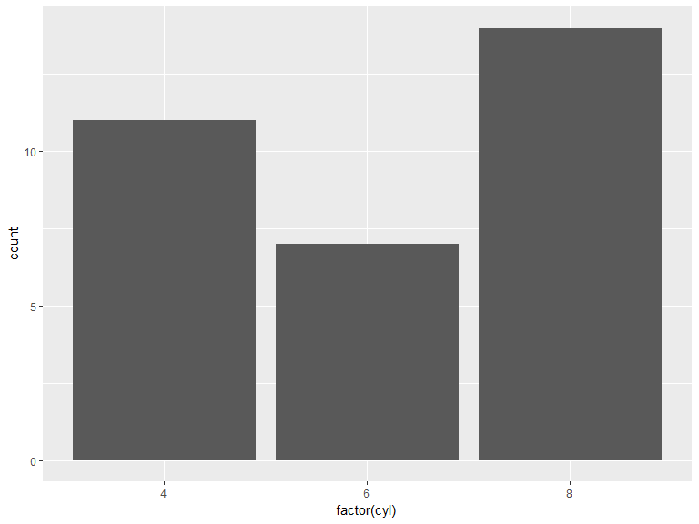
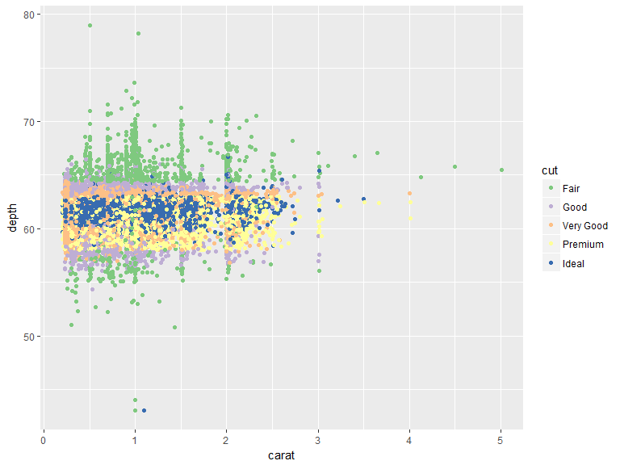
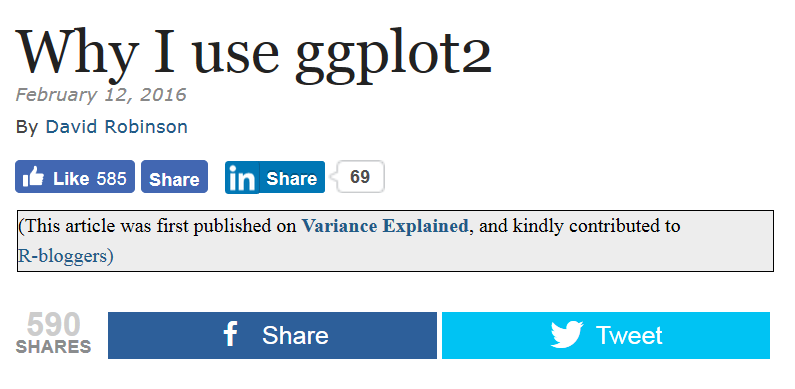
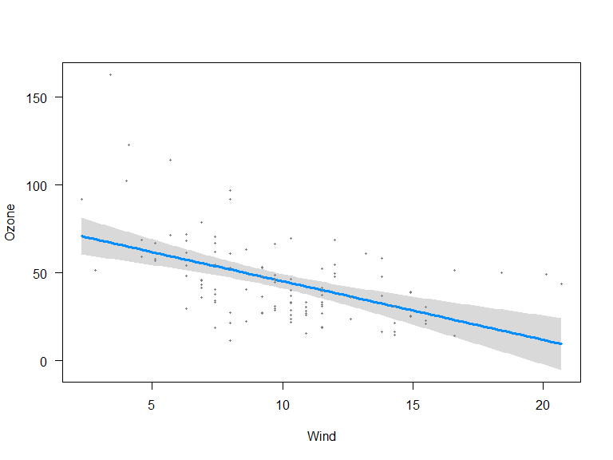
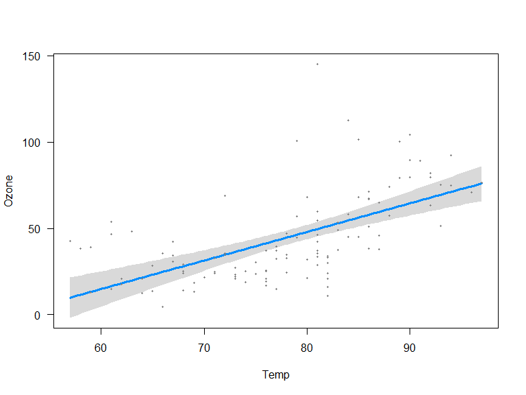
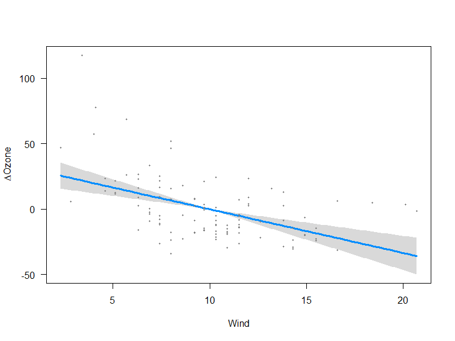

# Intro Datenanalyse mit R
Jan-Philipp Kolb  
3 und 4 Mai 2017  

# Fragen von Gestern


## Aufgekommene Fragen

- A - Wie findet man die besten/am meisten genutzten Pakete für ein spezielles Thema?
- B - Wo werden R-Pakete gespeichert, und wie kann man den Pfad ändern?
- C - Wie speichert man, was man gemacht hat (Stichwort Logfile)
- D - Wie schreibt man Werte in Balkendiagramme? 
- E - Wie fügt man KI`s zu einem Balkendiagramm hinzu?
- F - Wie kann man eine Legende zu einer Basisgraphik hinzufügen?
- G - Wie kann man die Beschriftung in lattice Graphiken ändern?
- H - Wie ändert man die Reihenfolge der Gitter?
- I - Wie kann man sich einen Plot einteilen?

## A - [Die am meisten genutzten Pakete](http://www.kdnuggets.com/2015/06/top-20-r-packages.html)


## A - [Awesome R](https://awesome-r.com/)


- [Quick list - most useful packages](https://support.rstudio.com/hc/en-us/articles/201057987-Quick-list-of-useful-R-packages)

- [RStartHere](https://github.com/rstudio/RStartHere)


## B - Wo werden R-Pakete gespeichert?

- So sieht man auf welche Ordner R zugreift:


```r
.libPaths() 
```

```
## [1] "D:/Eigene Dateien/Dokumente/R/win-library/3.3"
## [2] "D:/Programme/R-3.3.3/library"
```

- [Man kann den Pfad angeben](http://usi4biz.com/2016/01/21/changing-r-library-path/), in dem ein Pakte gespeichert sein soll:


```r
.libPaths( c( .libPaths(), "H:/My Documents/data analysis/R") )  
```

## C - Die getane Arbeit abspeichern

- [alle Befehle speichern, die man eingegeben hat:](https://stat.ethz.ch/R-manual/R-devel/library/utils/html/savehistory.html)


```r
savehistory(file = "try.Rhistory")
```

- Den aktuellen Workspace sichern


```r
save.image()
```

- dem Kind einen Namen geben:


```r
save.image("HalloWelt.RData")
```

## D - [Werte in Balkendiagramm schreiben?](https://stats.stackexchange.com/questions/3879/how-to-put-values-over-bars-in-barplot-in-r)


```r
ab <- sample(1:3,1000,replace=T)
tab_ab <- table(ab)
barplot(tab_ab,ylim=c(0,600),col="royalblue")
text(1,500,"A")
text(2,500,"B")
text(3,500,"C")
```

<!-- -->

## E - [Konfidenzintervalle hinzufügen](http://stats.idre.ucla.edu/r/faq/how-can-i-add-features-or-dimensions-to-my-bar-plot/) 


```r
install.packages("gplots")
```


```r
library(gplots)
```


```r
ci.l <- tab_ab * 0.85
ci.u <- tab_ab * 1.15
barplot2(tab_ab, plot.ci = TRUE, ci.l = ci.l, ci.u = ci.u,
         col="chocolate1")
```

<!-- -->

## F - Eine Legende zu einer Basisgraphik hinzufügen


```r
x <- runif(100)
y <- runif(100)
z <- sample(1:3,100,T)
```


```r
plot(x,y,col=z,pch=20)
legend("topright",c("Kategorie A","Kategorie B","Kategorie C"),text.col = 1:3)
```

<!-- -->

## G - Text in lattice Graphik Beschriftung


```r
library(lattice)
library(mlmRev)
data(Chem97)

Chem97cat <- paste("gender",Chem97$gender,"score",Chem97$score)

histogram(~ gcsescore | factor(Chem97cat),data = Chem97)
```

<!-- -->

## H - Reihenfolge der Gitterfenster ändern


```r
histogram(~ gcsescore | factor(score),data = Chem97,
index.cond=list(c(4,1,2,3,5,6)))
```

<!-- -->

- [Quick R - Lattice Graphiken](http://www.statmethods.net/advgraphs/trellis.html)


## I - [Das Graphikfenster einteilen](http://sphaerula.com/legacy/R/multiplePlotFigure.html)


```r
get( getOption( "device" ) )()

##  Set the outer margins so that bottom, left, and right are 0
##  and top is 3 lines of text.

old.par <- par( no.readonly = TRUE )
par( oma = c( 0, 0, 3, 0 ) )

##  Plot using layout().

nf <- layout( matrix( c( 1, 2 ), 1, 2, byrow = TRUE),
    c( 1, 1 ), c( 1, 1 ), TRUE )
layout.show( nf )
```


```r
##  Create the two plots.

plot( rnorm( n = 10, mean = 0, sd = 1 ) )
plot( rpois( n = 10, lambda = 3 ) )

##  Create an overall title.

mtext( "Centered Overall Title", outer = TRUE )

##  Restore the old plotting parameters.

par( old.par )
```


## Aufgabe - OECD Datensatz

- Laden Sie den oecd-Datensatz herunter und lesen Sie ihn mit folgender Funktion ein:


```r
data <- read.csv("oecd.csv",header = TRUE)
```

- Überprüfen Sie die Dimension der OECD-Daten.

- Berechnen Sie die Mittelwerte und Varianzen der einzelnen
Variablen mit einem geeigneten apply Befehl.

- In welchem Land waren die meisten Jugendlichen mindestens
zweimal betrunken? Wie hoch ist der maximale Prozentsatz?

- In welchem Land ist die Sterblichkeit am geringsten? Wie
hoch ist sie in diesem Land?

- Erstellen Sie einen neuen Datensatz, der aufsteigend nach
dem Einkommen geordnet ist. Speichern Sie diesen in einer
neuen `.csv` Datei
    
# Die lineare Regression 


## Die lineare Regression

Maindonald - [DataAnalysis](https://cran.r-project.org/doc/contrib/usingR.pdf)

-  Einführung in R 
-  Datenanalyse
-  Statistische Modelle
-  Inferenzkonzepte
-  Regression mit einem Prädiktor
-  Multiple lineare Regression
-  Ausweitung des linearen Modells
-  ...

## Lineare Regression in R - Beispieldatensatz

John H. Maindonald and W. John Braun

DAAG - [Data Analysis and Graphics Data and Functions](http://cran.ms.unimelb.edu.au/web/packages/DAAG/DAAG.pdf)


```r
install.packages("DAAG")
```


```r
library("DAAG")
data(roller)
```


Hilfe für den `roller` Datensatz:


```r
?roller
```


```r
roller
```


 weight   depression
-------  -----------
    1.9            2
    3.1            1
    3.3            5
    4.8            5
    5.3           20
    6.1           20
    6.4           23
    7.6           10
    9.8           30
   12.4           25

## Das lineare Regressionsmodell in R

Schätzen eines Regressionsmodells:


```r
roller.lm <- lm(depression ~ weight, data = roller)
```

So bekommt man die Schätzwerte:


```r
summary(roller.lm)
```

```
## 
## Call:
## lm(formula = depression ~ weight, data = roller)
## 
## Residuals:
##    Min     1Q Median     3Q    Max 
## -8.180 -5.580 -1.346  5.920  8.020 
## 
## Coefficients:
##             Estimate Std. Error t value Pr(>|t|)   
## (Intercept)  -2.0871     4.7543  -0.439  0.67227   
## weight        2.6667     0.7002   3.808  0.00518 **
## ---
## Signif. codes:  0 '***' 0.001 '**' 0.01 '*' 0.05 '.' 0.1 ' ' 1
## 
## Residual standard error: 6.735 on 8 degrees of freedom
## Multiple R-squared:  0.6445,	Adjusted R-squared:  0.6001 
## F-statistic:  14.5 on 1 and 8 DF,  p-value: 0.005175
```

Falls das Modell ohne Intercept geschätzt werden soll:


```r
lm(depression ~ -1 + weight, data = roller)
```

```
## 
## Call:
## lm(formula = depression ~ -1 + weight, data = roller)
## 
## Coefficients:
## weight  
##  2.392
```


## Summary des Modells


```r
summary(roller.lm)
```

```
## 
## Call:
## lm(formula = depression ~ weight, data = roller)
## 
## Residuals:
##    Min     1Q Median     3Q    Max 
## -8.180 -5.580 -1.346  5.920  8.020 
## 
## Coefficients:
##             Estimate Std. Error t value Pr(>|t|)   
## (Intercept)  -2.0871     4.7543  -0.439  0.67227   
## weight        2.6667     0.7002   3.808  0.00518 **
## ---
## Signif. codes:  0 '***' 0.001 '**' 0.01 '*' 0.05 '.' 0.1 ' ' 1
## 
## Residual standard error: 6.735 on 8 degrees of freedom
## Multiple R-squared:  0.6445,	Adjusted R-squared:  0.6001 
## F-statistic:  14.5 on 1 and 8 DF,  p-value: 0.005175
```

## R arbeitet mit Objekten

- `roller.lm` ist nun ein spezielles Regressions-Objekt
- Auf dieses Objekt können nun verschiedene Funktionen angewendet werden


```r
predict(roller.lm) # Vorhersage
```

```
##         1         2         3         4         5         6         7 
##  2.979669  6.179765  6.713114 10.713233 12.046606 14.180002 14.980026 
##         8         9        10 
## 18.180121 24.046962 30.980502
```

```r
resid(roller.lm) # Residuen
```

```
##          1          2          3          4          5          6 
## -0.9796695 -5.1797646 -1.7131138 -5.7132327  7.9533944  5.8199976 
##          7          8          9         10 
##  8.0199738 -8.1801213  5.9530377 -5.9805017
```

## Residuenplot

-  Sind Annahmen des linearen Regressionsmodells verletzt? 
-  Dies ist der Fall, wenn ein Muster abweichend von einer Linie zu erkennen ist.
-  Hier ist der Datensatz sehr klein


```r
plot(roller.lm,1)
```

<!-- -->

## Residuenplot


```r
plot(roller.lm,2)
```

<!-- -->

- Wenn die Residuen normalverteilt sind sollten sie auf einer Linie liegen.

## Linkliste - lineare Regression

-  Regression - [r-bloggers](http://www.r-bloggers.com/r-tutorial-series-simple-linear-regression/)

-  Das Komplette Buch von [Faraway](http://cran.r-project.org/doc/contrib/Faraway-PRA.pdf)- sehr intuitiv geschrieben.

-  Gute Einführung auf [Quick-R](http://www.statmethods.net/stats/regression.html)

- [Multiple Regression](https://www.r-bloggers.com/multiple-regression-part-1/)


## Aufgabe - lineare Regression

<!--
[Mietspiegel München](http://data.ub.uni-muenchen.de/2/)
-->

Beschrieben wird Wegstrecke, dreier Spielzeugautos die in unterschiedlichen Winkeln Rampe herunterfuhren.

- angle: Winkel der Rampe
- distance: Zurückgelegte Strecke des Spielzeugautos
- car: Autotyp (1, 2 oder 3)

(a) Lesen Sie den  Datensatz `toycars` in einen dataframe `data` ein und  wandeln Sie die Variable `car` des Datensatzes  in  einen Faktor  (`as.factor`) um.

(b) Erstellen  Sie  drei Boxplots,  die die zurückgelegte Strecke  getrennt  nach  dem Faktor car darstellen.

(c) Schätzen Sie für die Autos die Parameter  des folgenden linearen Modells mit  Hilfe der Funktion `lm()`

$$ distance_i= \beta_0 + \beta_1 \cdot angle_i + \epsilon_i$$

(d) Überprüfen  Sie deskriptiv  die Anpassung der drei  Modelle,  indem Sie die Regressiongerade  in  einen Plot  von `distance` gegen `angle` einfügen. Deutet das
$$ R^2 $$ jeweils auf eine gute Modellanpassung hin?


# Die logistische Regression 


## Agresti - [Categorical Data Analysis
 (2002)](https://mathdept.iut.ac.ir/sites/mathdept.iut.ac.ir/files/AGRESTI.PDF)


-  Sehr intuitiv geschriebenes Buch
-  Sehr ausführliches begleitendes Skript von [Thompson](http://statweb.stanford.edu/~owen/courses/306a/Splusdiscrete2.pdf)
-  Das Skript eignet sich um die kategoriale Datenanalyse nachzuvollziehen

## Faraway Bücher zu Regression in R


-  Logistische Regressionen gut erklärt
-  Beispiele mit R-code
    - Faraway - Extending the linear model with r
    - Faraway - [Practical Regression and Anova using R](https://cran.r-project.org/doc/contrib/Faraway-PRA.pdf)
    
    
## Binäre AVs mit `glm`

-  Die [logistische Regression](http://data.princeton.edu/R/glms.html) gehört zur Klasse der generalisierten linearen Modelle (GLM)
-  Die Funktion zur Schätzung eines Modells dieser Klasse in heißt `glm()`
-  `glm()` muss 1. ein Formel-Objekt mitgegeben werden und 2. die Klasse (binomial, gaussian, Gamma) samt link-Funktion (logit, probit, cauchit, log, cloglog)

## Beispieldaten für die logistische Regression 


```r
install.packages("HSAUR")
```


```r
library("HSAUR")
data("plasma", package = "HSAUR")
```


```r
head(plasma)
```


 fibrinogen   globulin  ESR      
-----------  ---------  ---------
       2.52         38  ESR < 20 
       2.56         31  ESR < 20 
       2.19         33  ESR < 20 
       2.18         31  ESR < 20 
       3.41         37  ESR < 20 
       2.46         36  ESR < 20 

## Der `plasma` Datensatz


```r
?plasma
```


##  Logistische Regression mit R

- [Kategoriale Daten: ](http://homepage.univie.ac.at/herbert.nagel/KategorialeDaten.pdf)


```r
cdplot(ESR ~ fibrinogen, data = plasma)
```

<!-- -->

## [Logistische Regression](http://ww2.coastal.edu/kingw/statistics/R-tutorials/logistic.html) mit R


```r
plasma_glm_1 <- glm(ESR ~ fibrinogen, data = plasma, 
                    family = binomial())
```


```r
summary(plasma_glm_1)
```

```
## 
## Call:
## glm(formula = ESR ~ fibrinogen, family = binomial(), data = plasma)
## 
## Deviance Residuals: 
##     Min       1Q   Median       3Q      Max  
## -0.9298  -0.5399  -0.4382  -0.3356   2.4794  
## 
## Coefficients:
##             Estimate Std. Error z value Pr(>|z|)  
## (Intercept)  -6.8451     2.7703  -2.471   0.0135 *
## fibrinogen    1.8271     0.9009   2.028   0.0425 *
## ---
## Signif. codes:  0 '***' 0.001 '**' 0.01 '*' 0.05 '.' 0.1 ' ' 1
## 
## (Dispersion parameter for binomial family taken to be 1)
## 
##     Null deviance: 30.885  on 31  degrees of freedom
## Residual deviance: 24.840  on 30  degrees of freedom
## AIC: 28.84
## 
## Number of Fisher Scoring iterations: 5
```


## Weitere Beispieldaten


```r
install.packages("faraway")
```


```r
library("faraway")
```


```r
data(orings)
```


 temp   damage
-----  -------
   53        5
   57        1
   58        1


## Generalisierte Regression mit R - weitere Funktionen

- Logistisches Modell mit Probit-Link:


```r
probitmod <- glm(cbind(damage,6-damage) ~ temp, 
	family=binomial(link=probit), orings)
```

- Regression mit Zähldaten:


```r
modp <- glm(Species ~ .,family=poisson,gala)
```

- Proportional odds logistic regression im Paket `MASS`:


```r
library("MASS")
house.plr<-polr(Sat~Infl,weights=Freq,data=housing)
```

## Linkliste - logistische Regression

-  Einführung in [logistische Regression](http://ww2.coastal.edu/kingw/statistics/R-tutorials/logistic.html)


-  [Code zum Buch von Faraway](http://www.maths.bath.ac.uk/~jjf23/ELM/scripts/binary.R)


# Faktoren in R 


## Was sind Faktoren in R

- Faktoren können eine begrenzte Zahl von Ausprägungen annehmen
- Sie werden oft auch als kategoriale Variablen bezeichnet
- Sie sind vor allem bei der Modellierung wichtig
- Faktoren werden anders behandelt als stetige Variablen
- Wenn man diese Variablen richtig definiert werden sie auch von R richtig behandelt

<http://www.stat.berkeley.edu/~s133/factors.html>

## Beispiel Definition von Faktoren


```r
data <- c(1,2,2,3,1,2,3,3,1,2,3,3,1)
fdata <- factor(data)
fdata
```

```
##  [1] 1 2 2 3 1 2 3 3 1 2 3 3 1
## Levels: 1 2 3
```

- `labels` direkt definieren


```r
rdata <- factor(data,labels=c("I","II","III"))
rdata
```

```
##  [1] I   II  II  III I   II  III III I   II  III III I  
## Levels: I II III
```


## Weitere Möglichkeit der Definition


```r
levels(fdata) <- c('I','II','III')
fdata
```

```
##  [1] I   II  II  III I   II  III III I   II  III III I  
## Levels: I II III
```


## Beispiel Monate


```r
mons <- c("March","April","January",
          "November","January","September",
          "October","September","November",
          "August","January","November",
          "November","February","May",
          "August","July","December",
          "August","August","September",
          "November","February","April")
mons <- factor(mons)
table(mons)
```

```
## mons
##     April    August  December  February   January      July     March 
##         2         4         1         2         3         1         1 
##       May  November   October September 
##         1         5         1         3
```

## Beispiel: ordered factor


```r
mons <- factor(mons,levels=c("January","February",
                             "March","April","May","June",
                             "July","August","September",  
                             "October","November",
                             "December"),
               ordered=TRUE)

mons[1] < mons[2]
```

```
## [1] TRUE
```

## Rücktransformation


```r
fert <- c(10,20,20,50,10,20,10,50,20)
fert <- factor(fert,levels=c(10,20,50),ordered=TRUE)
fert
```

```
## [1] 10 20 20 50 10 20 10 50 20
## Levels: 10 < 20 < 50
```

```r
mean(fert)
```

```
## [1] NA
```

```r
mean(as.numeric(levels(fert)[fert]))
```

```
## [1] 23.33333
```


## Tabellen mit Faktoren


```r
lets <- sample(letters,size=100,replace=TRUE)
lets <- factor(lets)
table(lets[1:5])
```

```
## 
## a b c d e f g h i j k l m n o p q r s t u v w x y z 
## 0 0 1 0 0 0 0 0 0 0 1 0 0 0 1 0 0 0 0 1 0 1 0 0 0 0
```


# Grafiken mit ggplot 


## Das Paket `ggplot2`

- Entwickelt von Hadley Wickham
- Viele Informationen unter:
- <http://ggplot2.org/>
- Den Graphiken liegt eine eigene Grammitik zu Grunde


## [Einführung in `ggplot2`](www.r-bloggers.com/basic-introduction-to-ggplot2/)

<http://www.r-bloggers.com/basic-introduction-to-ggplot2/>


```r
install.packages("ggplot2")
```


```r
library(ggplot2)
?ggplot2
```


## Der `diamonds` Datensatz


```r
head(diamonds)
```


 carat  cut         color   clarity    depth   table   price      x      y      z
------  ----------  ------  --------  ------  ------  ------  -----  -----  -----
  0.23  Ideal       E       SI2         61.5      55     326   3.95   3.98   2.43
  0.21  Premium     E       SI1         59.8      61     326   3.89   3.84   2.31
  0.23  Good        E       VS1         56.9      65     327   4.05   4.07   2.31
  0.29  Premium     I       VS2         62.4      58     334   4.20   4.23   2.63
  0.31  Good        J       SI2         63.3      58     335   4.34   4.35   2.75
  0.24  Very Good   J       VVS2        62.8      57     336   3.94   3.96   2.48


## Wie nutzt man `qplot`

- Die Funktion `qplot` wird für schnelle Graphiken verwendet (quick plots)
- bei der Funktion `ggplot` kann man alles bis ins Detail kontrollieren


```r
# histogram
qplot(depth, data=diamonds)
```

<!-- -->


## Ein Balkendiagramm


```r
qplot(cut, depth, data=diamonds)
```

<!-- -->

## Ein weiteres Balkendiagramm


```r
qplot(factor(cyl), data=mtcars,geom="bar")
```

<!-- -->


## Boxplot


```r
qplot(data=diamonds,x=cut,y=depth,geom="boxplot")
```

<!-- -->


## Scatterplot


```r
# scatterplot
qplot(carat, depth, data=diamonds)
```

<!-- -->


## Farbe hinzu:


```r
qplot(carat, depth, data=diamonds,color=cut)
```

<!-- -->


## Trendlinie hinzufügen


```r
myGG<-qplot(data=diamonds,x=carat,y=depth,color=carat) 
myGG + stat_smooth(method="lm")
```

<!-- -->

## Graphik drehen


```r
qplot(factor(cyl), data=mtcars, geom="bar") + 
coord_flip()
```

<!-- -->


## Wie nutzt man ggplot

- die aestetics:


```r
ggplot(diamonds, aes(clarity, fill=cut)) + geom_bar()
```

<!-- -->


## Farben selber wählen

Es wird das Paket `RColorBrewer` verwendet um die Farbpalette zu ändern


```r
install.packages("RColorBrewer")
```


```r
library(RColorBrewer)
myColors <- brewer.pal(5,"Accent")
names(myColors) <- levels(diamonds$cut)
colScale <- scale_colour_manual(name = "cut",
                                values = myColors)
```

<http://stackoverflow.com/questions/6919025/>

## Eine Graphik mit den gewählten Farben


```r
p <- ggplot(diamonds,aes(carat, depth,colour = cut)) + 
  geom_point()
p + colScale
```

<!-- -->


## Speichern mit ggsave


```r
ggsave("Graphik.jpg")
```

## Links

- [Warum man ggplot2 für einfache Grafiken nutzen sollte](http://www.r-bloggers.com/why-i-use-ggplot2/)



- [Einführung in ggplot2](https://opr.princeton.edu/workshops/Downloads/2015Jan_ggplot2Koffman.pdf)


- [ggplot2 Basics](http://tutorials.iq.harvard.edu/R/Rgraphics/Rgraphics.html)

- Noam Ross - [Quick Introduction to ggplot2](http://www.noamross.net/blog/2012/10/5/ggplot-introduction.html)

- [Plugin ggplot2](https://www.r-bloggers.com/rcmdrplugin-kmggplot2_0-2-4-is-on-cran/)

# Regressionsdiagnostik mit R-Paket `visreg` 


## Regressionsdiagnostik mit Basis-R

Ein einfaches Modell

```r
N <- 5
x1 <- rnorm(N)
y <- runif(N)
```


```r
par(mfrow=c(1,2))
plot(density(x1))
plot(density(y))
```

<!-- -->


## Modellvorhersage machen


```r
mod1 <- lm(y~x1)
pre <- predict(mod1)
y
```

```
## [1] 0.9411023 0.3828133 0.3874452 0.9460138 0.2913519
```

```r
pre
```

```
##         1         2         3         4         5 
## 0.5951064 0.6200788 0.6078568 0.5829215 0.5427631
```

## Regressionsdiagnostik mit Basis-R


```r
plot(x1,y)
abline(mod1)
segments(x1, y, x1, pre, col="red")
```

<!-- -->

## Beispieldaten Luftqualität


```r
library(datasets)
?airquality
```


## Das `visreg`-Paket 

Ein Modell wird auf dem airquality Datensatz geschätzt


```r
install.packages("visreg")
```


```r
library(visreg)
fit <- lm(Ozone ~ Solar.R + Wind + Temp, data = airquality)
summary(fit)
```

```
## 
## Call:
## lm(formula = Ozone ~ Solar.R + Wind + Temp, data = airquality)
## 
## Residuals:
##     Min      1Q  Median      3Q     Max 
## -40.485 -14.219  -3.551  10.097  95.619 
## 
## Coefficients:
##              Estimate Std. Error t value Pr(>|t|)    
## (Intercept) -64.34208   23.05472  -2.791  0.00623 ** 
## Solar.R       0.05982    0.02319   2.580  0.01124 *  
## Wind         -3.33359    0.65441  -5.094 1.52e-06 ***
## Temp          1.65209    0.25353   6.516 2.42e-09 ***
## ---
## Signif. codes:  0 '***' 0.001 '**' 0.01 '*' 0.05 '.' 0.1 ' ' 1
## 
## Residual standard error: 21.18 on 107 degrees of freedom
##   (42 observations deleted due to missingness)
## Multiple R-squared:  0.6059,	Adjusted R-squared:  0.5948 
## F-statistic: 54.83 on 3 and 107 DF,  p-value: < 2.2e-16
```

## Visualisierung


```r
visreg(fit)
```

<!-- --><!-- --><!-- -->

## [Und dann mit `visreg` visualisiert.](http://myweb.uiowa.edu/pbreheny/publications/visreg.pdf)

- Zweites Argument -  Spezifikation erklärende Variable für Visualisierung


```r
visreg(fit, "Wind", type = "contrast")
```

<!-- -->

## Visualisierung mit dem Paket `visreg`


```r
visreg(fit, "Wind", type = "contrast")
```

<!-- -->


## Das `visreg`-Paket 

- Das Default-Argument für type ist conditional.


```r
visreg(fit, "Wind", type = "conditional")
```

<!-- -->


## Regression mit Faktoren

Mit `visreg` können die Effekte bei Faktoren visualisiert werden.


```r
airquality$Heat <- cut(airquality$Temp, 3, 
	labels=c("Cool", "Mild", "Hot"))
fit.heat <- lm(Ozone ~ Solar.R + Wind + Heat, 
	data = airquality)
summary(fit.heat)
```

```
## 
## Call:
## lm(formula = Ozone ~ Solar.R + Wind + Heat, data = airquality)
## 
## Residuals:
##     Min      1Q  Median      3Q     Max 
## -33.473 -12.794  -2.686   8.461 107.035 
## 
## Coefficients:
##             Estimate Std. Error t value Pr(>|t|)    
## (Intercept) 48.27682    8.83072   5.467 3.07e-07 ***
## Solar.R      0.06524    0.02145   3.042  0.00296 ** 
## Wind        -3.49803    0.59042  -5.925 3.94e-08 ***
## HeatMild     9.05367    4.88257   1.854  0.06648 .  
## HeatHot     43.13970    5.98618   7.207 8.79e-11 ***
## ---
## Signif. codes:  0 '***' 0.001 '**' 0.01 '*' 0.05 '.' 0.1 ' ' 1
## 
## Residual standard error: 19.9 on 106 degrees of freedom
##   (42 observations deleted due to missingness)
## Multiple R-squared:  0.6554,	Adjusted R-squared:  0.6424 
## F-statistic:  50.4 on 4 and 106 DF,  p-value: < 2.2e-16
```

## Effekte von Faktoren


```r
par(mfrow=c(1,2))
visreg(fit.heat, "Heat", type = "contrast")
visreg(fit.heat, "Heat", type = "conditional")
```

<!-- -->


## Das Paket visreg - Interaktionen


```r
airquality$Heat <- cut(airquality$Temp, 3, 
labels=c("Cool", "Mild", "Hot"))
fit <- lm(Ozone ~ Solar.R + Wind * Heat, data = airquality)
summary(fit)
```

```
## 
## Call:
## lm(formula = Ozone ~ Solar.R + Wind * Heat, data = airquality)
## 
## Residuals:
##     Min      1Q  Median      3Q     Max 
## -34.472 -11.640  -1.919   7.403 102.428 
## 
## Coefficients:
##               Estimate Std. Error t value Pr(>|t|)    
## (Intercept)    4.48042   17.38219   0.258 0.797102    
## Solar.R        0.07634    0.02137   3.572 0.000538 ***
## Wind           0.05854    1.34860   0.043 0.965458    
## HeatMild      56.72928   18.53110   3.061 0.002805 ** 
## HeatHot       94.68619   18.61619   5.086 1.63e-06 ***
## Wind:HeatMild -4.11933    1.57108  -2.622 0.010054 *  
## Wind:HeatHot  -4.88125    1.74358  -2.800 0.006101 ** 
## ---
## Signif. codes:  0 '***' 0.001 '**' 0.01 '*' 0.05 '.' 0.1 ' ' 1
## 
## Residual standard error: 19.28 on 104 degrees of freedom
##   (42 observations deleted due to missingness)
## Multiple R-squared:  0.6825,	Adjusted R-squared:  0.6642 
## F-statistic: 37.26 on 6 and 104 DF,  p-value: < 2.2e-16
```

## Steuern der Graphikausgabe mittels `layout`


```r
visreg(fit, "Wind", by = "Heat",layout=c(3,1))
```

<!-- -->


## Das Paket `visreg` - Interaktionen overlay


```r
fit <- lm(Ozone ~ Solar.R + Wind * Heat, data = airquality)
visreg(fit, "Wind", by="Heat", overlay=TRUE, partial=FALSE)
```

<!-- -->

## Das Paket `visreg` - `visreg2d`


```r
fit2 <- lm(Ozone ~ Solar.R + Wind * Temp, data = airquality)
visreg2d(fit2, "Wind", "Temp", plot.type = "image")
```

<!-- -->

## Das Paket visreg - surface


```r
visreg2d(fit2, "Wind", "Temp", plot.type = "persp")
```

<!-- -->


# Karten erstellen mit maptools


## Das Paket maptools

- Datensatz `wrld_simpl` aus dem Paket [maptools](https://cran.r-project.org/web/packages/maptools/index.html) 
- Polygone für fast alle Staaten der Erde


```r
library(maptools)
data(wrld_simpl)
```


      FIPS   ISO2   ISO3    UN  NAME                
----  -----  -----  -----  ---  --------------------
ATG   AC     AG     ATG     28  Antigua and Barbuda 
DZA   AG     DZ     DZA     12  Algeria             
AZE   AJ     AZ     AZE     31  Azerbaijan          
ALB   AL     AL     ALB      8  Albania             

## Hello world


```r
data(wrld_simpl)
plot(wrld_simpl)
```

<!-- -->


## Der shapefile

- Es handelt sich um einen `shapefile` 


```r
typeof(wrld_simpl)
```

```
## [1] "S4"
```

- Die Daten sind als `S4` abgespeichert
- Es gibt verschiedene Slots
- In einem davon ist Information als `data.frame` gespeichert.

## Der Datensatz


```r
head(wrld_simpl@data)
```


      FIPS   ISO2   ISO3    UN  NAME                
----  -----  -----  -----  ---  --------------------
ATG   AC     AG     ATG     28  Antigua and Barbuda 
DZA   AG     DZ     DZA     12  Algeria             
AZE   AJ     AZ     AZE     31  Azerbaijan          
ALB   AL     AL     ALB      8  Albania             


## Die Struktur der Daten


```r
head(wrld_simpl@data$NAME)
```

```
## [1] Antigua and Barbuda Algeria             Azerbaijan         
## [4] Albania             Armenia             Angola             
## 246 Levels: Aaland Islands Afghanistan Albania Algeria ... Zimbabwe
```


```r
head(wrld_simpl@data$ISO2)
```

```
## [1] AG DZ AZ AL AM AO
## 246 Levels: AD AE AF AG AI AL AM AN AO AQ AR AS AT AU AW AX AZ BA BB ... ZW
```


```r
head(wrld_simpl@data$POP2005)
```

```
## [1]    83039 32854159  8352021  3153731  3017661 16095214
```


## Eine logische Abfrage


```r
ind_SA <- wrld_simpl@data$NAME =="South Africa"
head(ind_SA)
```

```
## [1] FALSE FALSE FALSE FALSE FALSE FALSE
```


```r
table(ind_SA)
```

```
## ind_SA
## FALSE  TRUE 
##   245     1
```

## Eine Karte für Süd Afrika

- Ein Land zeichnen


```r
SouthAfrica <- wrld_simpl[ind_SA,]
plot(SouthAfrica)
```

<!-- -->

## Mehr als ein Land zeichnen


```r
EuropeList <- c('Germany', 'France')
my_map <- wrld_simpl[wrld_simpl$NAME %in% EuropeList, ]
par(mai=c(0,0,0,0))
plot(my_map)
```

<!-- -->

## Mehr Farbe


```r
my_map@data$color <- c("blue","green")
plot(my_map,col=my_map@data$color)
```

<!-- -->

## Mehr Farbe für die Welt


```r
plot(wrld_simpl, bg='azure2', col='green',
     border='lightgray')
```

<!-- -->

## Eine Karte für Europa


```r
Europe <- wrld_simpl[wrld_simpl$REGION=="150",]
plot(Europe,col="royalblue")
```

<!-- -->


## Europa ohne Russland


```r
ind <- which(Europe@data$NAME=="Russia")
EU <- Europe[-ind,]
plot(EU,col="blue",border="darkgray")
```

<!-- -->

## Spielen Sie mit Farben


```r
EU$colors <- "green"
plot(EU,col=EU$colors,border="darkgray")
```

<!-- -->

```r
pop05 <- Europe$POP2005
Europe$colors[pop05>mean(pop05)] <- "royalblue"
plot(Europe,col=Europe$colors)
```

<!-- -->

## Mehr über Farben

[Colors in R](http://www.stat.columbia.edu/~tzheng/files/Rcolor.pdf)


```r
Europe$colors[pop05>median(pop05)] <- "chocolate4"
plot(Europe,col=Europe$colors)
```

<!-- -->

## Europa - Farbschattierung blau


```r
val <- Europe$POP2005/max(Europe$POP2005)
plot(Europe,col=rgb(0,0,val))
```

<!-- -->

## Europa - Farbschattierung rot


```r
val <- Europe$POP2005/max(Europe$POP2005)
plot(Europe,col=rgb(val,0,0))
```

<!-- -->

## Europa - Farbschattierung grün


```r
val <- Europe$POP2005/max(Europe$POP2005)
plot(Europe,col=rgb(0,val,0))
```

<!-- -->

## Europa - Farbschattierung grau


```r
val <- Europe$POP2005/max(Europe$POP2005)
plot(Europe,col=rgb(val,val,val))
```

<!-- -->

## Europa - zwei Graphiken nebeneinander


```r
par(mfrow=c(1,2))
plot(Europe,col=rgb(val,0,val))
plot(Europe,col=rgb(val,val,0))
```

<!-- -->

## Europa - Punkte hinzufügen


```r
which(Europe$ISO2=="FR") # 10
```

```
## [1] 10
```

```r
plot(Europe)
points(Europe$LON[10],Europe$LAT[10],col="red",pch=20)
```

<!-- -->

## Europa - Blasen hinzufügen


```r
pop <- Europe$POP2005
pop <- pop/max(pop)*10
plot(Europe)
points(Europe$LON,Europe$LAT,cex=pop,col=rgb(0,0,1,.2),
pch=20)
```

<!-- -->

## Europa - Text hinzufügen


```r
plot(Europe)
text(Europe$LON,Europe$LAT,Europe$ISO2,col="red")
```

<!-- -->

## Europa - Linien hinzufügen


```r
which(Europe$ISO2=="FR") # 15
which(Europe$ISO2=="DE") # 16
```


```r
Dat <- cbind(Europe$LON[15:16],Europe$LAT[15:16])
plot(Europe)
lines(Dat,col="red",lwd=2)
```

<!-- -->


## Global Adminastrative Boundaries - [GADM](http://www.gadm.org/) - NUTS level 1


```r
library(raster)
```


```r
library(raster)
LUX1 <- getData('GADM', country='LUX', level=1)
plot(LUX1)
```

<!-- -->


## Ein Blick auf die Daten


# Weitere Themen im Ausblick 


## [Mehr User Interface](http://www.linuxlinks.com/article/20110306113701179/GUIsforR.html) - Der R-commander


```r
library("Rcmdr")
```

- Ein anderes Beispiel:


```r
install.packages(c("JGR","Deducer","DeducerExtras"))
```


```r
library("JGR")
JGR()
```


- Allerdings ist es gerade der interessante Punkt an R, dass es eine Skriptsprache ist

<!--

-->


## [Interaktive Grafiken mit R](http://www.statmethods.net/advgraphs/interactive.html)

Das Paket `iplots`


```r
install.packages("iplots",dep=TRUE)
```

- Das Paket laden:


```r
library(iplots)
```

- Der Datensatz


```r
cyl.f <- factor(mtcars$cyl)
gear.f <- factor(mtcars$factor)
attach(mtcars)
```

## Ein erstes interaktives Histogramm


```r
ihist(mpg) # histogram
```


## Mehr interaktive Graphiken


```r
ibar(carb) # barchart
iplot(mpg, wt) # scatter plot
ibox(mtcars[c("qsec","disp","hp")]) # boxplots
ipcp(mtcars[c("mpg","wt","hp")]) # parallel coordinates
imosaic(cyl.f,gear.f) # mosaic plot 
```


## [Tabellen für Publikationen](https://www.r-statistics.com/2013/01/stargazer-package-for-beautiful-latex-tables-from-r-statistical-models-output/)


```r
install.packages("stargazer")
```


```r
library(stargazer)
stargazer(attitude)
```


<!--

-->

## Tabellen mit dem R-Paket knitr


```r
library(knitr)
kable(head(iris), format = "latex")
```


## Nichtlineare Regression

Folien zum [Workshop](https://github.com/Japhilko/npRegression/tree/master/slides):

<https://github.com/Japhilko/npRegression/tree/master/slides>


```r
library(splines)
```


## Beispiel einer [interaktiven Karte](http://rpubs.com/Japhilko82/Campsites) 

[interaktiven Karte](http://rpubs.com/Japhilko82/Campsites)  und [Rcode](https://raw.githubusercontent.com/Japhilko/GeoData/master/2015/rcode/SpatMA_Interactive%20maps.R) um eine interaktive Karte mit leaflet zu erzeugen.

## 


