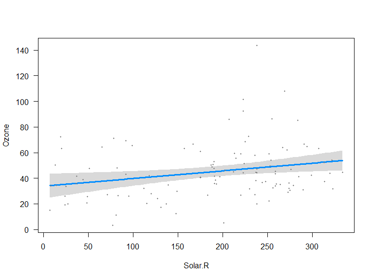
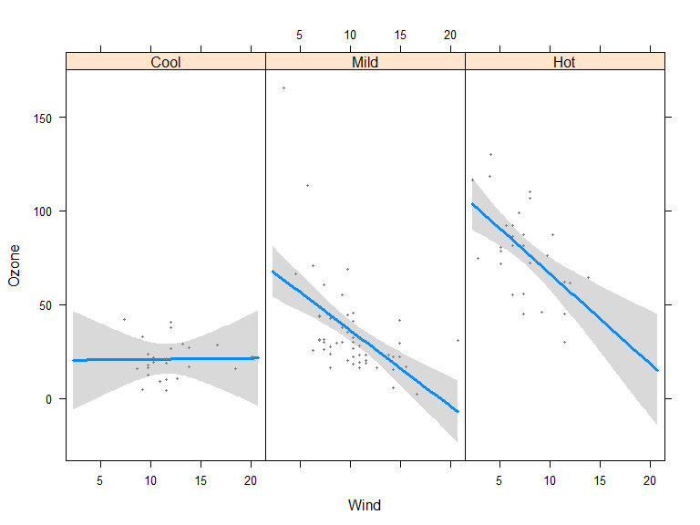
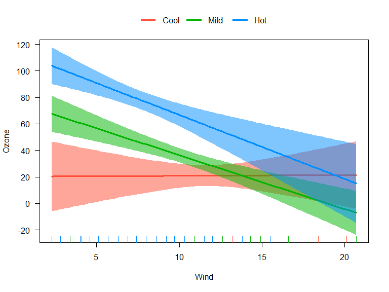
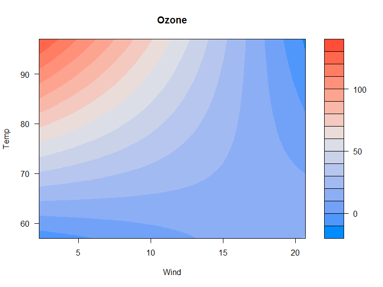

# Regressionsdiagnostik
Jan-Philipp Kolb  
4 Mai 2017  


## Regressionsdiagnostik mit Basis-R

Ein einfaches Modell

```r
N <- 5
x1 <- rnorm(N)
y <- runif(N)
```


```r
par(mfrow=c(1,2))
plot(density(x1))
plot(density(y))
```

<!-- -->


## Modellvorhersage machen


```r
mod1 <- lm(y~x1)
pre <- predict(mod1)
y
```

```
## [1] 0.13478276 0.01432842 0.35118646 0.11234878 0.24024904
```

```r
pre
```

```
##          1          2          3          4          5 
## 0.06691254 0.09894213 0.31434164 0.20937590 0.16332326
```

## Regressionsdiagnostik mit Basis-R


```r
plot(x1,y)
abline(mod1)
segments(x1, y, x1, pre, col="red")
```

<!-- -->


## Das `visreg`-Paket 

Ein Modell wird auf dem airquality Datensatz geschätzt


```r
install.packages("visreg")
```


```r
library(visreg)
fit <- lm(Ozone ~ Solar.R + Wind + Temp, data = airquality)
```

## Visualisierung


```r
visreg(fit)
```

<!-- --><!-- --><!-- -->

## [Und dann mit `visreg` visualisiert.](http://myweb.uiowa.edu/pbreheny/publications/visreg.pdf)

- Zweites Argument -  Spezifikation erklärende Variable für Visualisierung


```r
visreg(fit, "Wind", type = "contrast")
```

## Visualisierung mit dem Paket `visreg`


```r
visreg(fit, "Wind", type = "contrast")
```

<!-- -->


## Das `visreg`-Paket 

- Das Default-Argument für type ist conditional.


```r
visreg(fit, "Wind", type = "conditional")
```

<!-- -->


## Regression mit Faktoren

Mit `visreg` können die Effekte bei Faktoren visualisiert werden.


```r
airquality$Heat <- cut(airquality$Temp, 3, 
	labels=c("Cool", "Mild", "Hot"))
fit.heat <- lm(Ozone ~ Solar.R + Wind + Heat, 
	data = airquality)
```

## Effekte von Faktoren


```r
par(mfrow=c(1,2))
visreg(fit.heat, "Heat", type = "contrast")
visreg(fit.heat, "Heat", type = "conditional")
```

<!-- -->


## Das Paket visreg - Interaktionen


```r
airquality$Heat <- cut(airquality$Temp, 3, 
labels=c("Cool", "Mild", "Hot"))
fit <- lm(Ozone ~ Solar.R + Wind * Heat, data = airquality)
```

## Steuern der Graphikausgabe mittels `layout`


```r
visreg(fit, "Wind", by = "Heat",layout=c(3,1))
```

<!-- -->


## Das Paket `visreg` - Interaktionen overlay


```r
fit <- lm(Ozone ~ Solar.R + Wind * Heat, data = airquality)
visreg(fit, "Wind", by="Heat", overlay=TRUE, partial=FALSE)
```

<!-- -->

## Das Paket `visreg` - `visreg2d`


```r
fit2 <- lm(Ozone ~ Solar.R + Wind * Temp, data = airquality)
visreg2d(fit2, "Wind", "Temp", plot.type = "image")
```

<!-- -->

## Das Paket visreg - surface


```r
visreg2d(fit2, "Wind", "Temp", plot.type = "persp")
```

<!-- -->

