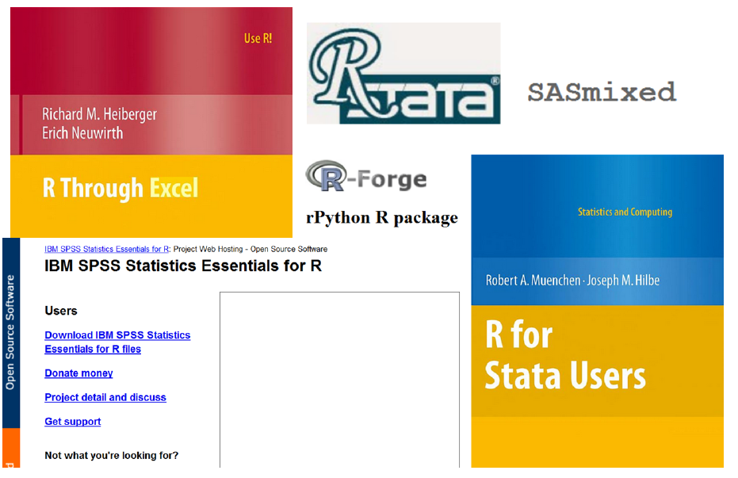

# Intro Datenanalyse mit R - Warum R nutzen?
Jan-Philipp Kolb  
03 Mai 2017  

## Gründe für die Nutzung von R

- Als Weg kreativ zu sein ...
- Graphiken, Graphiken, Graphiken
- In Kombination mit anderen Programmen nutzbar
- Zur Verbindung von Datenstrukturen
- Zum Automatisieren
- Um die Intelligenz anderer Leute zu nutzen ;-)
- ...


## Gründe

- R ist [frei verfügbar](http://www.inside-r.org/why-use-r). Es kann umsonst [runtergeladen](http://mirrors.softliste.de/cran/) werden.
- R ist eine Skriptsprache 
- Gute Möglichkeiten für die [Visualisierung](http://research.stowers-institute.org/efg/R/) ([Link](http://www.sr.bham.ac.uk/~ajrs/R/r-gallery.html) )
- R wird immer [populärer](https://twitter.com/josiahjdavis/status/559778930476220418)
- [Popularität von R](http://blog.revolutionanalytics.com/popularity/)

## Übersicht - warum R


## R lässt sich kombinieren...




## R für SPSS Nutzer


```r
library("Rcmdr")
```

Bob Munich - [R for SPSS and SAS Users ](https://science.nature.nps.gov/im/datamgmt/statistics/r/documents/r_for_sas_spss_users.pdf)


## [Die Popularität von R](https://gallery.shinyapps.io/cran-gauge/)


## R Nutzer rund um die Welt


## Wo sind die aktivsten Nutzer?


## Erwartungen und Anforderungen

Das kann diese Schulung vermitteln:

- Eine praxisnahe Einfuhrung in die statistische
Programmiersprache R
- Erlernen einer Programmier-Strategie
- Guten Stil
- Die Vorzüge graphischer Datenanalyse


## Erwartungen und Anforderungen II
	
Das kann sie nicht leisten:

-  Eine Einführungsveranstaltung in die Statistik geben
-  Grundlegende datenanalytische Konzepte vermitteln
-  Verständnis zementieren
-  Das Trainieren abnehmen

## R herunterladen:

<http://www.r-project.org/>


## Links

- [Vergleich python und R](http://www.dataschool.io/python-or-r-for-data-science/)

- [Warum man R für Data Science lernen sollte](http://www.r-bloggers.com/why-you-should-learn-r-first-for-data-science/)

- [R Technologie des Jahres](http://www.r-bloggers.com/rstudio-infoworld-2015-technology-of-the-year-award-recipient/)

- [Why R is Good for Business](http://www.fastcolabs.com/3030063/why-the-r-programming-language-is-good-for-business) 

- [Warum R auf r-bloggers](http://www.r-bloggers.com/why-use-r/)

- [Intro R](http://www.ats.ucla.edu/stat/r/seminars/intro.htm)

- [Intro R II](http://www.ats.ucla.edu/stat/r/sk/)

## Probleme mit Excel

Weil andere Programme große Fehler haben:

- [Excel bug](http://blog.revolutionanalytics.com/2013/02/did-an-excel-error-bring-down-the-london-whale.html)

- [Datum in Excel](https://coffeehouse.dataone.org/2014/04/09/abandon-all-hope-ye-who-enter-dates-in-excel/)

- [Probleme mit Excel](http://www.biomedcentral.com/1471-2105/5/80)

## Einordnung 

- [Vergleich mit anderen Programmen](https://www.inwt-statistics.de/blog-artikel-lesen/Statistik-Software-R_SAS_SPSS_STATA_im_Vergleich.html)
