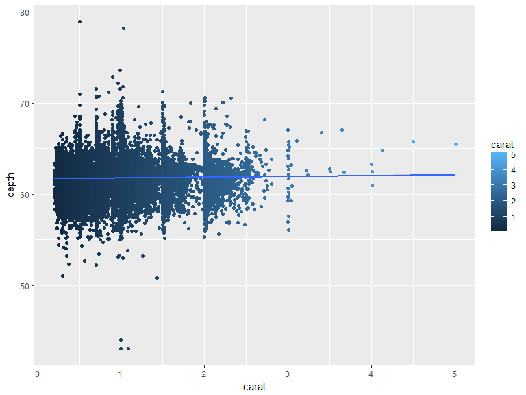
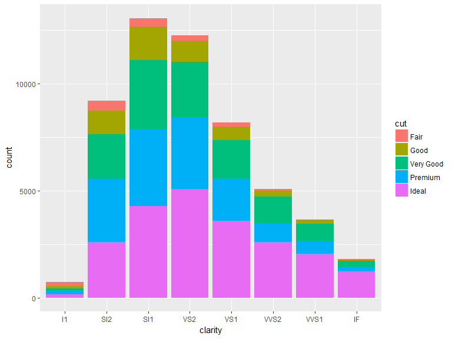

# Intro Datenanalyse mit R - ggplot2
Jan-Philipp Kolb  
04 Mai  2017  


## Das Paket `ggplot2`

- Entwickelt von Hadley Wickham
- Viele Informationen unter:
- <http://ggplot2.org/>
- Den Graphiken liegt eine eigene Grammitik zu Grunde


## [Basiseinführung `ggplot2`](www.r-bloggers.com/basic-introduction-to-ggplot2/)

<www.r-bloggers.com/basic-introduction-to-ggplot2/>


```r
install.packages("ggplot2")
```


```r
library(ggplot2)
```

## Der `diamonds` Datensatz


```r
head(diamonds)
```


 carat  cut         color   clarity    depth   table   price      x      y      z
------  ----------  ------  --------  ------  ------  ------  -----  -----  -----
  0.23  Ideal       E       SI2         61.5      55     326   3.95   3.98   2.43
  0.21  Premium     E       SI1         59.8      61     326   3.89   3.84   2.31
  0.23  Good        E       VS1         56.9      65     327   4.05   4.07   2.31
  0.29  Premium     I       VS2         62.4      58     334   4.20   4.23   2.63
  0.31  Good        J       SI2         63.3      58     335   4.34   4.35   2.75
  0.24  Very Good   J       VVS2        62.8      57     336   3.94   3.96   2.48


## Wie nutzt man `qplot`

- Die Funktion `qplot` wird für schnelle Graphiken verwendet (quick plots)
- bei der Funktion `ggplot` kann man alles bis ins Detail kontrollieren


```r
# histogram
qplot(depth, data=diamonds)
```

<!-- -->


## Ein Balkendiagramm


```r
qplot(cut, depth, data=diamonds)
```

<!-- -->

## Ein weiteres Balkendiagramm


```r
qplot(factor(cyl), data=mtcars,geom="bar")
```

<!-- -->


## Boxplot


```r
qplot(data=diamonds,x=cut,y=depth,geom="boxplot")
```

<!-- -->


## Scatterplot


```r
# scatterplot
qplot(carat, depth, data=diamonds)
```

<!-- -->


## Farbe hinzu:


```r
qplot(carat, depth, data=diamonds,color=cut)
```

<!-- -->


## Trendlinie hinzufügen


```r
myGG<-qplot(data=diamonds,x=carat,y=depth,color=carat) 
myGG + stat_smooth(method="lm")
```

<!-- -->

## Graphik drehen


```r
qplot(factor(cyl), data=mtcars, geom="bar") + 
coord_flip()
```

<!-- -->


## Wie nutzt man ggplot

- die aestetics:


```r
ggplot(diamonds, aes(clarity, fill=cut)) + geom_bar()
```

<!-- -->


## Farben selber wählen

Es wird das Paket `RColorBrewer` verwendet um die Farbpalette zu ändern


```r
install.packages("RColorBrewer")
```


```r
library(RColorBrewer)
myColors <- brewer.pal(5,"Accent")
names(myColors) <- levels(diamonds$cut)
colScale <- scale_colour_manual(name = "cut",
                                values = myColors)
```

<http://stackoverflow.com/questions/6919025/>

## Eine Graphik mit den gewählten Farben


```r
p <- ggplot(diamonds,aes(carat, depth,colour = cut)) + 
  geom_point()
p + colScale
```

<!-- -->


## Speichern mit ggsave


```r
ggsave("Graphik.jpg")
```

## Links

- [Warum man ggplot2 für einfache Grafiken nutzen sollte](http://www.r-bloggers.com/why-i-use-ggplot2/)


- [Einführung in ggplot2](https://opr.princeton.edu/workshops/Downloads/2015Jan_ggplot2Koffman.pdf)


- [ggplot2 Basics](http://tutorials.iq.harvard.edu/R/Rgraphics/Rgraphics.html)

- Noam Ross - [Quick Introduction to ggplot2](http://www.noamross.net/blog/2012/10/5/ggplot-introduction.html)

- [Plugin ggplot2](https://www.r-bloggers.com/rcmdrplugin-kmggplot2_0-2-4-is-on-cran/)
