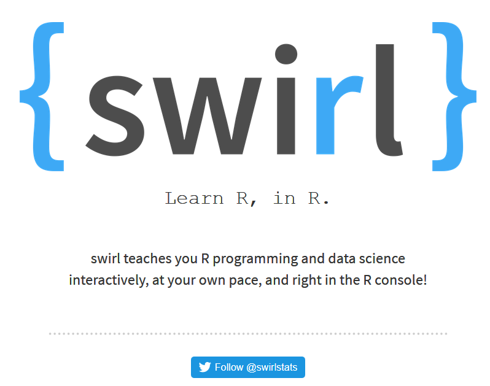
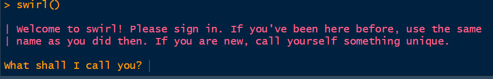

```{r setup, include=FALSE}
knitr::opts_chunk$set(echo = FALSE)
```

## [Das Paket `swirl`](https://swirlstats.com/)



## Der Start mit `swirl`

```{r}
library(swirl)
```

```{r,eval=F}
swirl()
```




<!--
https://www.r-bloggers.com/likert-plots-and-grouped-likert-plots-rstats/

https://www.r-bloggers.com/why-use-rtutor-for-interactive-tutorials-if-there-is-rstudios-learnr/

https://www.r-bloggers.com/visualising-bias-and-unbiasedness/
-->

## Einen Likert plot erzeugen

```{r}
library(sjPlot)
library(sjmisc)
data(efc)
```


<!--
https://r4ds.had.co.nz/graphics-for-communication.html#saving-your-plots
-->
