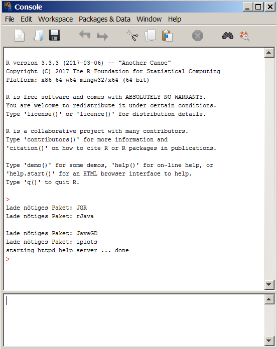
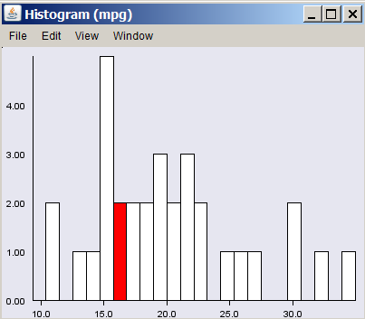

```{r, include=FALSE}
knitr::opts_chunk$set(echo = TRUE,warning=F,message=F,eval=F)
```

## [Mehr User Interface](http://www.linuxlinks.com/article/20110306113701179/GUIsforR.html) - Der R-commander

```{r,eval=F}
library("Rcmdr")
```

- Ein anderes Beispiel:

```{r,eval=F}
install.packages(c("JGR","Deducer","DeducerExtras"))
```

```{r,eval=F}
library("JGR")
JGR()
```



- Allerdings ist es gerade der interessante Punkt an R, dass es eine Skriptsprache ist

<!--

-->


## [Interaktive Grafiken mit R](http://www.statmethods.net/advgraphs/interactive.html)

Das Paket `iplots`

```{r,eval=F}
install.packages("iplots",dep=TRUE)
```

- Das Paket laden:

```{r}
library(iplots)
```

- Der Datensatz

```{r,eval=F}
cyl.f <- factor(mtcars$cyl)
gear.f <- factor(mtcars$factor)
attach(mtcars)
```

## Ein erstes interaktives Histogramm

```{r,eval=F}
ihist(mpg) # histogram
```



## Mehr interaktive Graphiken

```{r}
ibar(carb) # barchart
iplot(mpg, wt) # scatter plot
ibox(mtcars[c("qsec","disp","hp")]) # boxplots
ipcp(mtcars[c("mpg","wt","hp")]) # parallel coordinates
imosaic(cyl.f,gear.f) # mosaic plot 
```


## [Tabellen für Publikationen](https://www.r-statistics.com/2013/01/stargazer-package-for-beautiful-latex-tables-from-r-statistical-models-output/)

```{r,eval=F}
install.packages("stargazer")
```


```{r,eval=F}
library(stargazer)
stargazer(attitude)
```


<!--

-->

## Tabellen mit dem R-Paket knitr

```{r,eval=F}
library(knitr)
kable(head(iris), format = "latex")
```


## Nichtlineare Regression

Folien zum [Workshop](https://github.com/Japhilko/npRegression/tree/master/slides):

<https://github.com/Japhilko/npRegression/tree/master/slides>

```{r,eval=F}
library(splines)
```


