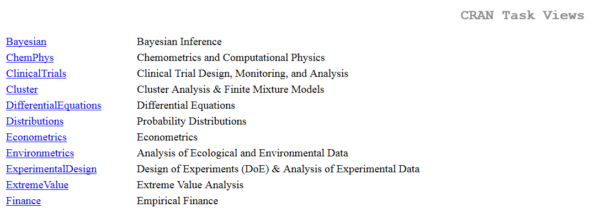

# Einführung in die Datenanalyse mit R  - Einfache Grafiken
Jan-Philipp Kolb  
3 Mai 2017  


## Ein Plot sagt mehr als 1000 Worte

-  Grafisch gestützte Datenanalyse ist toll
-  Gute Plots können zu einem besseren Verständnis beitragen
-  Einen Plot zu generieren geht schnell
-  Einen guten Plot zu machen kann sehr lange dauern
-  Mit R Plots zu generieren macht Spaß
-  Mit R erstellte Plots haben hohe Qualität
-  Fast jeder Plottyp wird von R unterstützt
-  R kennt eine große Menge an Exportformaten für Grafiken
		
## Plot ist nicht gleich Plot

-  Bereits das base Package bringt eine große Menge von Plot Funktionen mit
-  Das lattice Packet erweitert dessen Funktionalität
-  Eine weit über diese Einführung hinausgehende Übersicht findet sich in Murrell, P (2006): R Graphics.

## CRAN Task Views		
		
-  Zu einigen Themen sind alle Möglichkeiten in R zusammengestellt. ([Übersicht der Task Views](https://cran.r-project.org/web/views/))
- Zur Zeit gibt es 35 Task Views
- [Alle Pakete eines Task Views können mit folgendem Befehl installiert werden:](https://mran.microsoft.com/rpackages/)


```r
install.packages("ctv")
library("ctv")
install.views("Bayesian")
```



##  Task View zu Thema [Graphiken](https://cran.r-project.org/web/views/Graphics.html)


## Datensatz


```r
library(mlmRev)
data(Chem97)
```

- [lea] Local Education Authority - a factor
- [school] School identifier - a factor
- [student] Student identifier - a factor
- [score] Point score on A-level Chemistry in 1997
- [gender] Student's gender
- [age] Age in month, centred at 222 months or 18.5 years
- [gcsescore] Average GCSE score of individual.
- [gcsecnt] Average GCSE score of individual, centered at mean.


## Histogramm - Die Funktion hist()

Wir erstellen ein Histogramm der Variable gcsescore:


```r
?hist
```


```r
hist(Chem97$gcsescore)
```

<!-- -->


## Graphik speichern

- Mit dem button Export in Rstudio kann man die Grafik speichern.


## Befehl um Graphik zu speichern

- Alternativ auch bspw. mit den Befehlen `png`, `pdf` oder `jpeg`


```r
png("Histogramm.png")
hist(Chem97$gcsescore)
dev.off()
```

## Histogramme

-  Die Funktion `hist()` plottet ein Histogramm der Daten
-  Der Funktion muss mindestens ein Beobachtungsvektor übergeben werden
- `hist()` hat noch sehr viel mehr Argumente, die alle (sinnvolle) default values haben


|Argument |Bedeutung            |Beispiel          |
|:--------|:--------------------|:-----------------|
|main     |Überschrift          |main="Hallo Welt" |
|xlab     |x-Achsenbeschriftung |xlab="x-Werte"    |
|ylab     |y-Achsenbeschriftung |ylab="y-Werte"    |
|col      |Farbe                |col="blue"        |

## Histogramm


```r
hist(Chem97$gcsescore,col="blue",
     main="Hallo Welt",ylab="y-Werte", xlab="x-Werte")
```

<!-- -->

Weitere Argumente:


```r
?plot
# oder
?par
```

## Barplot

-	 Die Funktion `barplot()` erzeugt aus einer Häufigkeitstabelle einen Barplot
-  Ist das übergebene Tabellen-Objekt zweidimensional wird ein bedingter Barplot erstellt


```r
tabScore <- table(Chem97$score)
```


```r
barplot(tabScore)
```

## Barplots und barcharts


```r
barplot(tabScore)
```

<!-- -->

## Mehr Farben:


```r
barplot(tabScore,col=rgb(0,0,1))
```

<!-- -->

## Grüne Farbe 


```r
barplot(tabScore,col=rgb(0,1,0))
```

<!-- -->

## Rote Farbe 


```r
barplot(tabScore,col=rgb(1,0,0))
```

<!-- -->


## Transparent


```r
barplot(tabScore,col=rgb(1,0,0,.3))
```

<!-- -->

## Boxplot

-  Einen einfachen Boxplot erstellt man mit `boxplot()`
-  Auch `boxplot()` muss mindestens ein Beobachtungsvektor übergeben werden


```r
?boxplot
```

## Horizontaler Boxplot


```r
boxplot(Chem97$gcsescore,
horizontal=TRUE)
```

<!-- -->

- [Erklärung zu Boxplots](http://edoc.hu-berlin.de/dissertationen/gruenwald-andreas-2005-01-17/HTML/chapter2.html)

## Gruppierte Boxplots

-  Ein sehr einfacher Weg, einen ersten Eindruck über bedingte Verteilungen zu bekommen ist über sog. Gruppierte notched Boxplots
-  Dazu muss der Funktion `boxplot()` ein sog. Formel-Objekt übergeben werden
-  Die bedingende Variable steht dabei auf der rechten Seite einer Tilde


## Beispiel grupierter Boxplot


```r
boxplot(Chem97$gcsescore~Chem97$gender)
```

<!-- -->

## Alternativen zu Boxplot

Violinplot 

-  Baut auf Boxplot auf 
-  Zusätzlich Informationen über Dichte der Daten 
-  Dichte wird über Kernel Methode berechnet.
-  weißer Punkt - Median
-  Je weiter die Ausdehnung, desto größer ist die Dichte an dieser Stelle. 


```r
# Beispieldaten erzeugen
x <- rnorm(100)
y <- rnorm(100)
```

## Die Bibliothek `vioplot`


```r
library(vioplot)
plot(x, y, xlim=c(-5,5), ylim=c(-5,5))
vioplot(x, col="tomato", horizontal=TRUE, at=-4, 
        add=TRUE,lty=2, rectCol="gray")
vioplot(y, col="cyan", horizontal=FALSE, at=-4, 
        add=TRUE,lty=2)
```

##  `vioplot` - Das Ergebnis

<!-- -->


## Alternativen zum Boxplot


```r
library(beanplot)
par(mfrow = c(1,2))
boxplot(count~spray,data=InsectSprays,col="blue")
beanplot(count~spray,data=InsectSprays,col="orange")
```

<!-- -->

# Grafiken für bedingte, bi- und multivariate Verteilungen

## Scatterplots

- Ein einfacher two-way scatterplot kann mit der Funktion plot() erstellt werden
-  plot() muss mindestens ein x und ein y Beobachtungsvektor übergeben werden
-  Um die Farbe der Plot-Symbole anzupassen gibt es die Option col (Farbe als character oder numerisch)
-  Die Plot-Symbole selbst können mit pch} (plotting character) angepasst werden (character oder numerisch)
-  Die Achenbeschriftungen (labels) werden mit xlab und ylab definiert
