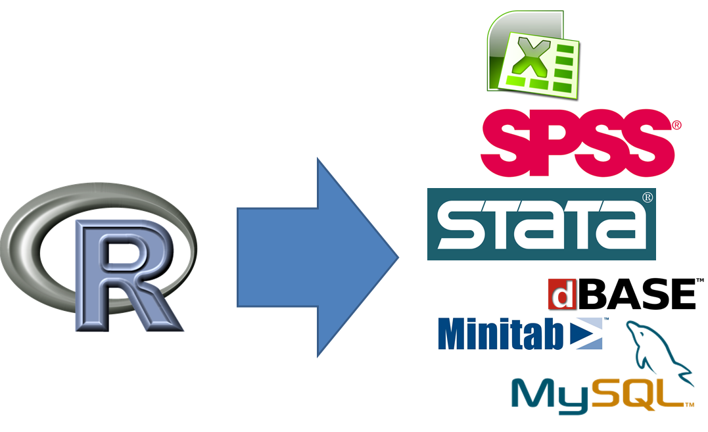

# Intro Datenanalyse mit R - Datenexport
Jan-Philipp Kolb  
3 Mai 2017  


## Datenexport



## R's Exportformate

-  In R werden offene Dateiformate bevorzugt
-  Als Äquivalenz zu den `read.X()` Funktionen stehen viele `write.X()` Funktionen zur Verfügung
-  Das eigene Format von R sind sog. Workspaces (`.RData`)

## Beispieldatensatz erzeugen


```r
A <- c(1,2,3,4)
B <- c("A","B","C","D")

mydata <- data.frame(A,B)
```


## Überblick Daten Import/Export


```r
save(mydata, file="mydata.RData")
```

## Daten in Excel Format abspeichern


```r
write.csv(mydata,file="mydata.csv") 
```


```r
library(xlsx)
write.xlsx(mydata,file="mydata.xlsx") 
```


## Daten in stata Format abspeichern


```r
library(foreign)
write.dta(mydata,file="mydata.dta") 
```

## Auch zum Export eignet sich das `rio` Paket


```r
library("rio")

export(mtcars, "mtcars.csv")
export(mtcars, "mtcars.rds")
export(mtcars, "mtcars.dta")
```


## Links Export

- [Quick R](http://www.statmethods.net/input/exportingdata.html) für das Exportieren von Daten:

- Hilfe zum Export auf dem [cran Server](http://cran.r-project.org/doc/manuals/r-release/R-data.pdf)

- [Zurück zur Gliederung.](https://github.com/Japhilko/IntroR/blob/master/2016/README.md)
