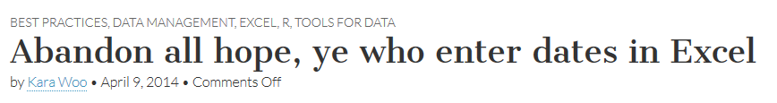
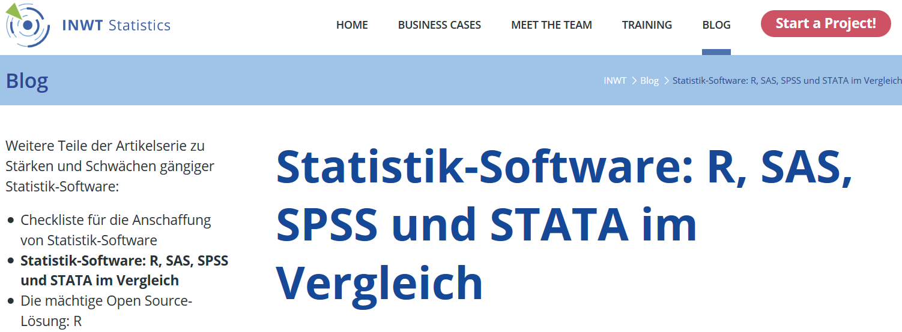
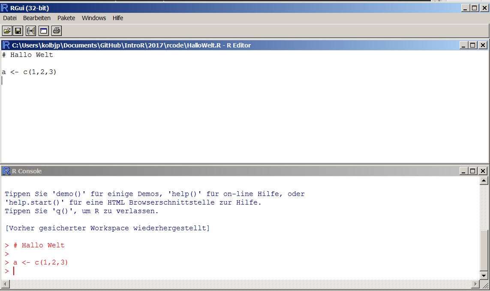
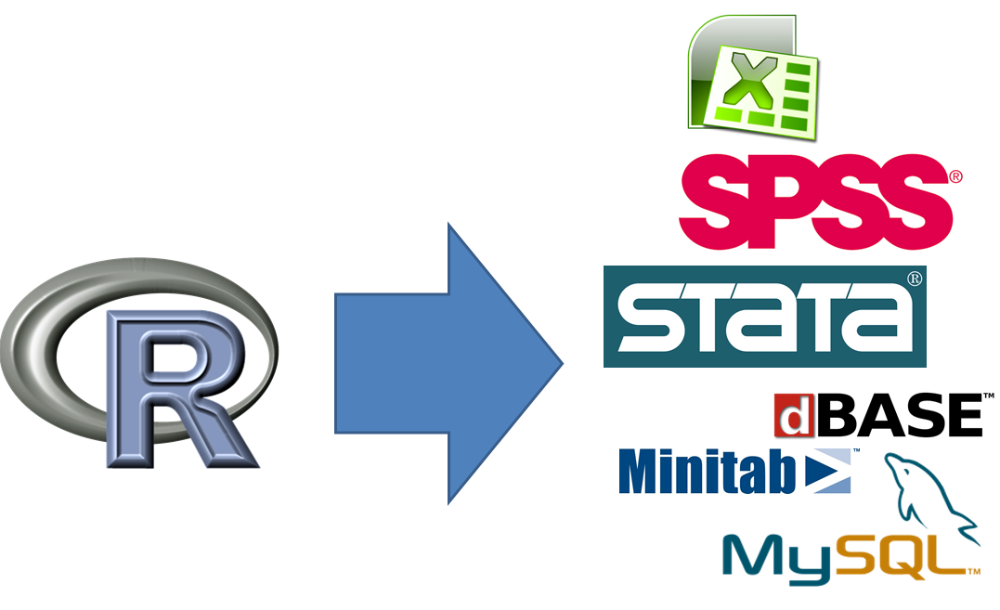

# Warum R nutzen


## Grundätzliches

- Meistens sind die Kenntnisse und Fähigkeiten der Teilnehmer sehr heterogen - bitte sagen, wenn es zu schnell oder langsam geht
- Wenn Fragen sind - immer fragen
- R macht zusammen mehr Spaß - gerne den Nachbarn fragen


## Gründe für die Nutzung von R

- [Als Weg kreativ zu sein ...](http://blog.revolutionanalytics.com/2015/10/r-user-groups-highlight-r-creativity.html)
- [Graphiken](http://matthewlincoln.net/2014/12/20/adjacency-matrix-plots-with-r-and-ggplot2.html), [Graphiken](https://www.r-bloggers.com/3d-plots-with-ggplot2-and-plotly/), [Graphiken](https://procomun.wordpress.com/2011/03/18/splomr/)
- [In Kombination mit anderen Programmen nutzbar](https://github.com/Japhilko/RInterfaces)
- Zur [Verbindung von Datenstrukturen](https://github.com/Japhilko/RInterfaces/blob/master/slides/Datenimport.md)
- [Zum Automatisieren](https://cran.r-project.org/web/packages/MplusAutomation/index.html)
- [Um die Intelligenz anderer Leute zu nutzen ;-)](https://www.r-bloggers.com/)
- ...


## Gründe

- R ist [frei verfügbar](http://www.inside-r.org/why-use-r). Es kann umsonst [runtergeladen](http://mirrors.softliste.de/cran/) werden.
- R ist eine [Skriptsprache](https://de.wikipedia.org/wiki/Skriptsprache)
- Gute Möglichkeiten für die [Visualisierung](http://research.stowers-institute.org/efg/R/) ([Link](http://www.sr.bham.ac.uk/~ajrs/R/r-gallery.html) )
- R wird immer [populärer](https://twitter.com/josiahjdavis/status/559778930476220418)
- [Popularität von R](http://blog.revolutionanalytics.com/popularity/)

<!--
## Übersicht - warum R


-->

## R lässt sich kombinieren...


## R für SPSS Nutzer


```r
install.packages("Rcmdr")
library("Rcmdr")
```

Bob Muenchen - [R for SPSS and SAS Users ](https://science.nature.nps.gov/im/datamgmt/statistics/r/documents/r_for_sas_spss_users.pdf)


## [Die Popularität von R](https://gallery.shinyapps.io/cran-gauge/)


<!--
## [R Nutzer rund um die Welt](http://revolution-computing.typepad.com/)


-->

<!--
## [Wo sind die aktivsten Nutzer?](http://spatial.ly/)


-->

## Erwartungen und Anforderungen

Das kann diese Schulung vermitteln:

- Eine praxisnahe Einführung in die statistische
Programmiersprache R
- Erlernen einer Programmier-Strategie
- Guten Stil
- Die Vorzüge graphischer Datenanalyse


## Erwartungen und Anforderungen II
	
Das kann sie nicht leisten:

-  Eine Einführungsveranstaltung in die Statistik geben
-  Grundlegende datenanalytische Konzepte vermitteln
-  Verständnis zementieren
-  Das Trainieren abnehmen


## R herunterladen:

<http://www.r-project.org/>


## Links


- [Warum man R für Data Science lernen sollte](http://www.r-bloggers.com/why-you-should-learn-r-first-for-data-science/)

- [R Technologie des Jahres](http://www.r-bloggers.com/rstudio-infoworld-2015-technology-of-the-year-award-recipient/)

- [Why R is Good for Business](http://www.fastcolabs.com/3030063/why-the-r-programming-language-is-good-for-business) 

- [Warum R auf r-bloggers](http://www.r-bloggers.com/why-use-r/)

- [Intro R](http://www.ats.ucla.edu/stat/r/seminars/intro.htm)

- [Intro R II](http://www.ats.ucla.edu/stat/r/sk/)

- [Vergleich python und R](http://www.dataschool.io/python-or-r-for-data-science/)

## Probleme mit Excel

Weil andere Programme große Fehler haben:

- [Excel bug](http://blog.revolutionanalytics.com/2013/02/did-an-excel-error-bring-down-the-london-whale.html)

- [Datum in Excel](https://coffeehouse.dataone.org/2014/04/09/abandon-all-hope-ye-who-enter-dates-in-excel/)



## [Probleme mit Excel](http://www.biomedcentral.com/1471-2105/5/80)


## [Vergleich mit anderen Programmen](https://www.inwt-statistics.de/blog-artikel-lesen/Statistik-Software-R_SAS_SPSS_STATA_im_Vergleich.html)



# Dein Freund das GUI


## Open Source Programm R

-  R ist eine freie, nicht-kommerzielle Implementierung der Programmiersprache S (von AT&T Bell Laboratories entwickelt)
- Freie Beteiligung - modularer Aufbau (immer mehr Erweiterungspakete)

- Der Download ist auf dieser Seite möglich:

<https://cran.r-project.org/>





## Graphisches User Interface

Aber die meisten Menschen nutzen einen Editor oder ein graphical user interface (GUI).

Aus den folgenden Gründen:

- Syntax highlighting
- Auto-Vervollständigung
- Bessere Übersicht über Graphiken, Bibliotheken

## Verschiedene GUIs

- [Gedit](https://projects.gnome.org/gedit/) mit R-spezifischen Add-ons für Linux

- [Emacs](http://www.gnu.org/software/emacs/)

- [TinnR](http://www.sciviews.org/Tinn-R/)

- Ich nutze [Rstudio!](https://www.rstudio.com/)


## Rstudio

- Sechs [Gründe](http://www.r-bloggers.com/top-6-reasons-you-need-to-be-using-rstudio/) Rstudio zu nutzen.

- Wie man Rstudio [nutzen kann.](https://support.rstudio.com/hc/en-us/sections/200107586-Using-RStudio)

- [Das Rstudio einrichten](https://support.rstudio.com/hc/en-us/articles/200549016-Customizing-RStudio)


## Download der Unterlagen

Auf [github](https://github.com/Japhilko/IntroR/tree/master/2017) sind alle Unterlagen für diesen Kurs zu finden.


[Wie nutzt man github?](https://guides.github.com/activities/hello-world/)


## Aufgabe - Vorbereitung

- Prüfen Sie, ob eine Version von R auf Rechner installiert ist.
- Falls dies nicht der Fall ist, laden Sie [R](r-project.org)  runter und installieren Sie R.
- Prüfen Sie, ob Rstudio installiert ist.
- Falls nicht - [Installieren](http://www.rstudio.com/) sie Rstudio.
- Laden Sie die R-Skripte von meinem GitHub-Account
- Erstellen Sie ein erstes Script und finden Sie das Datum mit dem Befehl `date()` und die R-version mit `sessionInfo()` heraus.


```r
date()
```

```
## [1] "Mon May 06 10:09:58 2019"
```


```r
sessionInfo()
```

```
## R version 3.5.0 (2018-04-23)
## Platform: x86_64-w64-mingw32/x64 (64-bit)
## Running under: Windows 7 x64 (build 7601) Service Pack 1
## 
## Matrix products: default
## 
## locale:
## [1] LC_COLLATE=German_Germany.1252  LC_CTYPE=German_Germany.1252   
## [3] LC_MONETARY=German_Germany.1252 LC_NUMERIC=C                   
## [5] LC_TIME=German_Germany.1252    
## 
## attached base packages:
## [1] stats     graphics  grDevices utils     datasets  methods   base     
## 
## loaded via a namespace (and not attached):
##  [1] compiler_3.5.0  backports_1.1.2 magrittr_1.5    rprojroot_1.3-2
##  [5] tools_3.5.0     htmltools_0.3.6 yaml_2.1.19     Rcpp_0.12.17   
##  [9] stringi_1.1.7   rmarkdown_1.10  knitr_1.20      stringr_1.4.0  
## [13] digest_0.6.18   evaluate_0.10.1
```

# Grundlagen im Umgang mit der Sprache R


## R ist eine Objekt-orientierte Sprache

Vektoren und Zuweisungen

-  R ist eine Objekt-orientierte Sprache
-  `<-` ist der Zuweisungsoperator


```r
b <- c(1,2) # erzeugt ein Objekt mit den Zahlen 1 und 2
```
-  Eine Funktion kann auf dieses Objekt angewendet werden:


```r
mean(b) # berechnet den Mittelwert
```

```
## [1] 1.5
```

Mit den folgenden Funktionen können wir etwas über die Eigenschaften des Objekts lernen:


```r
length(b) # b hat die Länge 2
```

```
## [1] 2
```


## Objektstruktur


```r
str(b) # b ist ein numerischer Vektor
```

```
##  num [1:2] 1 2
```


## Funktionen im base-Paket

|Funktion |Bedeutung          |Beispiel  |
|:--------|:------------------|:---------|
|length() |Länge              |length(b) |
|max()    |Maximum            |max(b)    |
|min()    |Minimum            |min(b)    |
|sd()     |Standardabweichung |sd(b)     |
|var()    |Varianz            |var(b)    |
|mean()   |Mittelwert         |mean(b)   |
|median() |Median             |median(b) |

Diese Funktionen brauchen nur ein Argument.

## Funktionen mit mehr Argumenten

Andere Funktionen brauchen mehr:

|Argument   |Bedeutung         |Beispiel       |
|:----------|:-----------------|:--------------|
|quantile() |90 % Quantile     |quantile(b,.9) |
|sample()   |Stichprobe ziehen |sample(b,1)    |


## Beispiel - Funktionen mit einem Argument


```r
max(b)
```

```
## [1] 2
```

```r
min(b)
```

```
## [1] 1
```

```r
sd(b)
```

```
## [1] 0.7071068
```

```r
var(b)
```

```
## [1] 0.5
```

## Funktionen mit einem Argument


```r
mean(b)
```

```
## [1] 1.5
```

```r
median(b)
```

```
## [1] 1.5
```


## Funktionen mit mehr Argumenten


```r
quantile(b,.9)
```

```
## 90% 
## 1.9
```

```r
sample(b,1) 
```

```
## [1] 2
```


## [Übersicht Befehle](http://cran.r-project.org/doc/manuals/R-intro.html)

<http://cran.r-project.org/doc/manuals/R-intro.html>


## Aufgabe - Zuweisungen und Funktionen

Erzeugen Sie einen Vektor b mit den Zahlen von 1 bis 5 und berechnen Sie...


1. den Mittelwert

2. die Varianz

3. die Standardabweichung

4. die quadratische Wurzel aus dem Mittelwert

# Datentypen und Indizieren


## Verschiedene Datentypen

|Datentyp  |Beschreibung                 |Beispiel      |
|:---------|:----------------------------|:-------------|
|numeric   |ganze und reele Zahlen       |`5, 3.462`    |
|logical   |logische Werte               |`FALSE, TRUE` |
|character |Buchstaben und Zeichenfolgen |`"Hallo"`     |

Quelle: [R. Münnich und M. Knobelspieß](https://www.uni-trier.de/fileadmin/fb4/prof/VWL/FIN/Oekonometrie/PC-UEbung/Einfuehrung_in_R.pdf) (2007): Einführung in das statistische Programmpaket R

## Verschiedene Datentypen


```r
b <- c(1,2) # numeric
log <- c(T,F) # logical
char <-c("A","b") # character
fac <- as.factor(c(1,2)) # factor
```

Mit `str()` bekommt man den Objekttyp.


```r
str(fac)
```

```
##  Factor w/ 2 levels "1","2": 1 2
```


## Indizieren eines Vektors:


```r
A1 <- c(1,2,3,4)
A1
```

```
## [1] 1 2 3 4
```

```r
A1[1]
```

```
## [1] 1
```

```r
A1[4]
```

```
## [1] 4
```

```r
A1[1:3]
```

```
## [1] 1 2 3
```

```r
A1[-4]
```

```
## [1] 1 2 3
```

## data.frames

Beispieldaten generieren:


```r
AGE <- c(20,35,48,12)
SEX <- c("m","w","w","m")
```

Diese beiden Vektoren zu einem data.frame verbinden:


```r
Daten <- data.frame(Alter=AGE,Geschlecht=SEX)
```

Anzahl der Zeilen/Spalten herausfinden


```r
nrow(Daten) # Zeilen
```

```
## [1] 4
```

```r
ncol(Daten) # Spalten
```

```
## [1] 2
```

## Indizieren

Indizieren eines dataframe:


```r
AA <- 4:1
A2 <- cbind(A1,AA)
A2[1,1]
```

```
## A1 
##  1
```

```r
A2[2,]
```

```
## A1 AA 
##  2  3
```

```r
A2[,1]
```

```
## [1] 1 2 3 4
```

```r
A2[,1:2]
```

```
##      A1 AA
## [1,]  1  4
## [2,]  2  3
## [3,]  3  2
## [4,]  4  1
```

## Matrizen und Arrays

-  In Matrizen und Arrays stehen meist nur numerische Werte.
-  Dadurch wird beispielsweise Matrix Multiplikation möglich.
-  Anders als beim data.frame sind mehr als zwei Dimensionen möglich.


```r
A <- matrix(seq(1,100), nrow = 4)
dim(A)
```

```
## [1]  4 25
```

## Ein Array erzeugen


```r
A3 <- array(1:8,c(2,2,2))
A3
```

```
## , , 1
## 
##      [,1] [,2]
## [1,]    1    3
## [2,]    2    4
## 
## , , 2
## 
##      [,1] [,2]
## [1,]    5    7
## [2,]    6    8
```

## Indizieren eines Array


```r
A3[,,2]
```

```
##      [,1] [,2]
## [1,]    5    7
## [2,]    6    8
```


## Listen

-  Eine Liste in R entspricht einem geschachtelten Array in anderen Programmiersprachen
-  Listen können alles enthalten
-  Listen können geschachtelt sein
-  Listen sollte man sehr bedacht verwenden
			
## Indizieren einer Liste


```r
A4 <- list(A1,1)
A4
```

```
## [[1]]
## [1] 1 2 3 4
## 
## [[2]]
## [1] 1
```

```r
A4[[2]]
```

```
## [1] 1
```


## Logische Operatoren


```r
# Ist 1 größer als 2?
1>2
```

```
## [1] FALSE
```

```r
1<2
```

```
## [1] TRUE
```

```r
1==2
```

```
## [1] FALSE
```


## Operatoren um Subset für Datensatz zu bekommen

Diese Operatoren eignen sich gut um Datensätze einzuschränken


```r
Daten
```

```
##   Alter Geschlecht
## 1    20          m
## 2    35          w
## 3    48          w
## 4    12          m
```

```r
Daten[AGE>20,]
```

```
##   Alter Geschlecht
## 2    35          w
## 3    48          w
```

## Datensätze einschränken


```r
Daten[SEX=="w",]
```

```
##   Alter Geschlecht
## 2    35          w
## 3    48          w
```

```r
# gleiches Ergebnis:
Daten[SEX!="m",]
```

```
##   Alter Geschlecht
## 2    35          w
## 3    48          w
```


## Weitere wichtige Optionen


```r
# Ergebnis in ein Objekt speichern
subDat <- Daten[AGE>20,]
```


```r
# mehrere Bedingeungen können mit
# & verknüpft werden:
Daten[AGE>18 & SEX=="w",]
```

```
##   Alter Geschlecht
## 2    35          w
## 3    48          w
```

## Sequenzen


```r
# Sequenz von 1 bis 10
1:10
```

```
##  [1]  1  2  3  4  5  6  7  8  9 10
```


```r
Daten[1:3,]
```

```
##   Alter Geschlecht
## 1    20          m
## 2    35          w
## 3    48          w
```

## Weitere Sequenzen


```r
seq(-2,8,by=1.5)
```

```
## [1] -2.0 -0.5  1.0  2.5  4.0  5.5  7.0
```

```r
a <-seq(3,12,length=12)

b <- seq(to=5,length=12,by=0.2)

d <- 1:10
d <- seq(1,10,1)
d <- seq(length=10,from=1,by=1)
```

## Wiederholungen


```r
# wiederhole 1 10 mal
rep(1,10)
```

```
##  [1] 1 1 1 1 1 1 1 1 1 1
```

```r
rep("A",10)
```

```
##  [1] "A" "A" "A" "A" "A" "A" "A" "A" "A" "A"
```

## Die Funktion paste


```r
?paste
```


```r
paste(1:4)
```

```
## [1] "1" "2" "3" "4"
```

```r
paste("A", 1:6, sep = "")
```

```
## [1] "A1" "A2" "A3" "A4" "A5" "A6"
```

- Ein weiteres Beispiel:


```r
paste0("A", 1:6)
```

```
## [1] "A1" "A2" "A3" "A4" "A5" "A6"
```


# Wie bekommt man Hilfe?


## Wie bekommt man Hilfe?

-  [Um generell Hilfe zu bekommen:](http://itfeature.com/tag/how-to-get-help-in-r)


```r
help.start()
```

-  Online Dokumentation für die meisten Funktionen:


```r
help(name)
```

-  Nutze ? um Hilfe zu bekommen.


```r
?mean
```

-  example(lm) gibt ein Beispiel für die lineare Regression


```r
example(lm)
```

## Nutzung Suchmaschinen

-  Ich nutze meistens google 
-  Tippe:

```
R-project + Was ich schon immer wissen wollte
```


-  Das funktioniert natürlich mit jeder Suchmaschine!

## [Stackoverflow](http://stackoverflow.com/)

-  Für Fragen zum Programmieren
-  Ist nicht auf R fokussiert
-  Sehr detailierte Diskussionen


## Ein Schummelzettel - Cheatsheet

<https://www.rstudio.com/resources/cheatsheets/>


# Modularer Aufbau von R


## Modularer Aufbau


## Modularer Aufbau

- Viele Funktionen sind im Basis-R enthalten 
- Viele spezifische Funktionen sind in zusätzlichen Bibliotheken integriert
- R kann modular erweitert werden durch sog. packages bzw. libraries
- Auf CRAN werden die wichtigsten packages gehostet (im Moment 10430)
- Weitergehende Pakete finden sich z.B. bei [bioconductor](www.bioconductor.org)


```r
install.packages("lme4")

library(lme4)
```

## Installation von Paketen mit RStudio


## Vorhandene Pakete und Installation


## Übersicht viele nützliche Pakete:

- Luhmann - [Tabelle mit vielen nützlichen Paketen](http://www.beltz.de/fileadmin/beltz/downloads/OnlinematerialienPVU/28090_Luhmann/Verwendete%20Pakete.pdf)

Weitere interessante Pakete:

- Paket für den Import/Export - [foreign](http://cran.r-project.org/web/packages/foreign/foreign.pdf)

- [Pakete für Survey Sampling](http://iase-web.org/documents/papers/icots8/ICOTS8_4J1_TILLE.pdf)

- `xtable` Paket für die Integration von Latex und R ([xtable Galerie](http://cran.r-project.org/web/packages/xtable/vignettes/xtableGallery.pdf))

- [Paket zur Erzeugung von Dummies](http://cran.r-project.org/web/packages/dummies/dummies.pdf)

- [Multivariate Normalverteilung](http://cran.r-project.org/web/packages/mvtnorm/index.html)


- [Paket für Karten](http://www.r-bloggers.com/tag/maptools/)

## Pakete von Github installieren


```r
install.packages("devtools")
library(devtools)

install_github("hadley/ggplot2")
```


## Wie bekomme ich einen Überblick

- [Explore Packages Currently on CRAN
](https://mran.microsoft.com/packages/)

- [Pakete die in letzter Zeit von CRAN heruntergeladen wurden](https://gallery.shinyapps.io/cran-gauge/)


## Aufgabe - Zusatzpakete

Gehen Sie auf <https://cran.r-project.org/> und suchen Sie in dem Bereich, wo die Pakete vorgestellt werden, nach Paketen,...

-  die für die deskriptive Datenanalyse geeignet sind.
-  um Regressionen zu berechnen
-  um fremde Datensätze einzulesen (z.B. SPSS-Daten)
-  um mit großen Datenmengen umzugehen


# Datenimport 


## Datenimport


## Dateiformate in R

-  Von R werden quelloffene, nicht-proprietäre Formate bevorzugt
-  Es können aber auch Formate von anderen Statistik Software Paketen eingelesen werden
-  R-user speichern Objekte gerne in sog. Workspaces ab
-  Auch hier jedoch gilt: (fast) alles andere ist möglich

## Formate - base package

R unterstützt von Haus aus schon einige wichtige Formate:
		
-  CSV (Comma Separated Values): `read.csv()`
-  FWF (Fixed With Format): `read.fwf()`
-  Tab-getrennte Werte: `read.delim()`


## Der Arbeitsspeicher

So findet man heraus, in welchem Verzeichnis man sich gerade befindet


```r
getwd()
```

So kann man das Arbeitsverzeichnis ändern:

Man erzeugt ein Objekt in dem man den Pfad abspeichert:


```r
main.path <- "C:/" # Beispiel für Windows
main.path <- "/users/Name/" # Beispiel für Mac
main.path <- "/home/user/" # Beispiel für Linux
```

Und ändert dann den Pfad mit setwd()


```r
setwd(main.path)
```

Bei Windows ist es wichtig Slashs anstelle von Backslashs zu verwenden.

## Alternative - Arbeitsspeicher


## Import von Excel-Daten

-  `library(foreign)` ist für den Import von fremden Datenformaten nötig
-  Wenn Excel-Daten vorliegen - als .csv abspeichern
-  Dann kann `read.csv()` genutzt werden um die Daten einzulesen.
- Bei Deutschen Daten kann es sein, dass man `read.csv2()` wegen der Komma-Separierung braucht.


```r
library(foreign)
?read.csv
?read.csv2
```

## CSV Dateien einlesen

Zunächst muss das Arbeitsverzeichnis gesetzt werden, in dem sich die Daten befinden:


```r
Dat <- read.csv("schuldaten_export.csv")
```

Wenn es sich um Deutsche Daten handelt:


```r
Dat <- read.csv2("schuldaten_export.csv")
```

## SPSS Dateien einlesen

Dateien können auch direkt aus dem Internet geladen werden:


```r
link<- "http://www.statistik.at/web_de/static/
mz_2013_sds_-_datensatz_080469.sav"

?read.spss
Dat <- read.spss(link,to.data.frame=T)
```

## stata Dateien einlesen


```r
MZ02 <- read.dta("MZ02.dta")
```

- Einführung in Import mit R ([is.R](http://is-r.tumblr.com/post/37181850668/reading-writing-stata-dta-files-with-foreign))

## [Das Paket `rio`](https://cran.r-project.org/web/packages/rio/vignettes/rio.html)


```r
install.packages("rio")
```


```r
library("rio")
x <- import("mtcars.csv")
y <- import("mtcars.rds")
z <- import("mtcars.dta")
```

- [rio: A Swiss-Army Knife for Data I/O](https://cran.r-project.org/web/packages/rio/README.html)

## Datenmanagement ähnlich wie in SPSS oder Stata


```r
install.packages("Rz")
library(Rz)
```

## [Weitere Alternative Rcmdr](https://cran.r-project.org/web/packages/Rcmdr/index.html)


```r
install.packages("Rcmdr")
```

- [Funktioniert auch mit Rstudio](http://www.rcommander.com/)


```r
library(Rcmdr)
```


## Aufgabe - Datenimport

- Gehen Sie auf [meine Github Seite](https://github.com/Japhilko/IntroR/blob/master/2017/data/oecd.dta?raw=true) und laden Sie den OECD Datensatz herunter
- Laden Sie den Datensatz mit einer geeigneten Funktion in Ihre Console.

- Finden Sie heraus, wieviele Beobachtungen und Variablen der Datensatz umfasst.


#  Datenexport 


## Datenexport



## R's Exportformate

-  In R werden offene Dateiformate bevorzugt
-  Als Äquivalenz zu den `read.X()` Funktionen stehen viele `write.X()` Funktionen zur Verfügung
-  Das eigene Format von R sind sog. Workspaces (`.RData`)

## Beispieldatensatz erzeugen


```r
A <- c(1,2,3,4)
B <- c("A","B","C","D")

mydata <- data.frame(A,B)
```


## Überblick Daten Import/Export


```r
save(mydata, file="mydata.RData")
```

## Daten in Excel Format abspeichern


```r
write.csv(mydata,file="mydata.csv") 
```


```r
library(xlsx)
write.xlsx(mydata,file="mydata.xlsx") 
```


## Daten in stata Format abspeichern


```r
library(foreign)
write.dta(mydata,file="mydata.dta") 
```

## Auch zum Export eignet sich das `rio` Paket


```r
library("rio")

export(mtcars, "mtcars.csv")
export(mtcars, "mtcars.rds")
export(mtcars, "mtcars.dta")
```


## Links Export

- [Quick R](http://www.statmethods.net/input/exportingdata.html) für das Exportieren von Daten:

- Hilfe zum Export auf dem [CRAN Server](http://cran.r-project.org/doc/manuals/r-release/R-data.pdf)


#  Datenanalyse 


## Streuungsmaße

In Basis R sind die wichtigsten Streuungsmaße enthalten:

-  Varianz: `var()`
-  Standardabweichung: `sd()`
-  Minimum und Maximum: `min()` und `max()`
-  Range: `range()`


```r
ab <- rnorm(100)
var(ab)
```

```
## [1] 0.8223242
```

```r
sd(ab)
```

```
## [1] 0.9068209
```

```r
range(ab)
```

```
## [1] -1.840412  2.364395
```

## Extremwerte


```r
min(ab)
```

```
## [1] -1.840412
```

```r
max(ab)
```

```
## [1] 2.364395
```


## Fehlende Werte

- Sind `NA`s vorhanden muss dies der Funktion mitgeteilt werden


```r
ab[10] <- NA
var(ab)
```

```
## [1] NA
```

Bei fehlenden Werten muss ein weiteres Argument mitgegeben werden:


```r
var(ab,na.rm=T)
```

```
## [1] 0.8271721
```

## Häufigkeiten und gruppierte Kennwerte

-  Eine Auszählung der Häufigkeiten der Merkmale einer Variable liefert `table()`
-  Mit `table()` sind auch Kreuztabellierungen möglich indem zwei Variablen durch Komma getrennt werden: `table(x,y)` liefert Häufigkeiten von `y` für gegebene Ausprägungen von `x`


```r
x <- sample(1:10,100,replace=T)
table(x)
```

```
## x
##  1  2  3  4  5  6  7  8  9 10 
##  9 10  4  9 14 13 10 13  6 12
```

## Tabellieren - weiteres Beispiel


```r
musician <- sample(c("yes","no"),100,replace=T)
```


```r
?table
```


```r
table(x)
```

```
## x
##  1  2  3  4  5  6  7  8  9 10 
##  9 10  4  9 14 13 10 13  6 12
```

```r
table(x,musician)
```

```
##     musician
## x    no yes
##   1   6   3
##   2   4   6
##   3   4   0
##   4   4   5
##   5   5   9
##   6   7   6
##   7   7   3
##   8   7   6
##   9   4   2
##   10  6   6
```

## Eine weitere Tabelle


```r
data(esoph)
table(esoph$agegp)
```

```
## 
## 25-34 35-44 45-54 55-64 65-74   75+ 
##    15    15    16    16    15    11
```


## Häufigkeitstabellen

- `prop.table()` liefert die relativen Häufigkeiten
- Wird die Funktion  außerhalb einer `table()` Funktion geschrieben erhält man die relativen Häufigkeiten bezogen auf alle Zellen

Die Funktion ``prop.table()`


```r
table(esoph$agegp,esoph$alcgp)
```

```
##        
##         0-39g/day 40-79 80-119 120+
##   25-34         4     4      3    4
##   35-44         4     4      4    3
##   45-54         4     4      4    4
##   55-64         4     4      4    4
##   65-74         4     3      4    4
##   75+           3     4      2    2
```

## Die Funktion `prop.table`


```r
?prop.table
```


```r
prop.table(table(esoph$agegp,esoph$alcgp),1)
```

```
##        
##         0-39g/day     40-79    80-119      120+
##   25-34 0.2666667 0.2666667 0.2000000 0.2666667
##   35-44 0.2666667 0.2666667 0.2666667 0.2000000
##   45-54 0.2500000 0.2500000 0.2500000 0.2500000
##   55-64 0.2500000 0.2500000 0.2500000 0.2500000
##   65-74 0.2666667 0.2000000 0.2666667 0.2666667
##   75+   0.2727273 0.3636364 0.1818182 0.1818182
```


## Die aggregate Funktion

- Mit der `aggregate()` Funktion können Kennwerte für Untergruppen erstellt werden
- `aggregate(x,by,FUN)` müssen mindestens drei Argumente übergeben werden:


```r
aggregate(state.x77,by=list(state.region),mean)
```

```
##         Group.1 Population   Income Illiteracy Life Exp    Murder  HS Grad
## 1     Northeast   5495.111 4570.222   1.000000 71.26444  4.722222 53.96667
## 2         South   4208.125 4011.938   1.737500 69.70625 10.581250 44.34375
## 3 North Central   4803.000 4611.083   0.700000 71.76667  5.275000 54.51667
## 4          West   2915.308 4702.615   1.023077 71.23462  7.215385 62.00000
##      Frost      Area
## 1 132.7778  18141.00
## 2  64.6250  54605.12
## 3 138.8333  62652.00
## 4 102.1538 134463.00
```

			
`x`: ein oder mehrere Beobachtungsvektor(en) für den der Kennwert berechnet werden soll

`by`: eine oder mehrere bedingende Variable(n)

`FUN`: die Funktion welche den Kennwert berechnet (z.B. `mean` oder `sd`)
			
			
- Die Ausgabe kann mit Hilfe von `xtabs()` in eine schöne zweidimensionale Tabelle überführt werden

## Beispieldatensatz - apply Funktion


```r
ApplyDat <- cbind(1:4,runif(4),rnorm(4))
```


```r
apply(ApplyDat,1,mean)
```

```
## [1] 0.6194508 0.0751770 0.8236636 1.5756346
```

```r
apply(ApplyDat,2,mean)
```

```
## [1]  2.5000000  0.4734916 -0.6530471
```


## Die Funktion apply


```r
apply(ApplyDat,1,var)
```

```
## [1] 0.2458535 4.9449803 3.6892210 4.4098257
```

```r
apply(ApplyDat,1,sd)
```

```
## [1] 0.4958362 2.2237312 1.9207345 2.0999585
```

```r
apply(ApplyDat,1,range)
```

```
##           [,1]      [,2]       [,3]      [,4]
## [1,] 0.0587167 -2.359061 -0.6344923 0.3226479
## [2,] 1.0000000  2.000000  3.0000000 4.0000000
```

```r
apply(ApplyDat,1,length)
```

```
## [1] 3 3 3 3
```

## Argumente der Funktion apply

- Für `margin=1` die Funktion `mean` auf die Reihen angewendet,

- Für `margin=2` die Funktion `mean` auf die Spalten angewendet,

- Anstatt `mean` können auch andere Funktionen wie `var`, `sd` oder `length` verwendet werden.

## Die Funktion tapply


```r
ApplyDat <- data.frame(Income=rnorm(5,1400,200),
                       Sex=sample(c(1,2),5,replace=T))
```


- Auch andere Funktionen können eingesetzt werden.... - Auch selbst programmierte Funktionen
- Im Beispiel wird die einfachste eigene Funktion angewendet.


```r
ApplyDat
```

```
##     Income Sex
## 1 1407.544   1
## 2 1363.744   2
## 3 1392.205   1
## 4 1538.003   2
## 5 1328.627   2
```

## Beispiel Funktion tapply


```r
tapply(ApplyDat$Income,ApplyDat$Sex,mean)
```

```
##        1        2 
## 1399.875 1410.125
```

```r
tapply(ApplyDat$Income,
       ApplyDat$Sex,function(x)x)
```

```
## $`1`
## [1] 1407.544 1392.205
## 
## $`2`
## [1] 1363.744 1538.003 1328.627
```

## Links Datenanalyse

- Die Benutzung von `apply`, `tapply`, etc. (Artikel bei [R-bloggers](http://www.r-bloggers.com/using-apply-sapply-lapply-in-r/)) 

- [Quick-R zu deskriptiver Statistik](http://www.statmethods.net/stats/descriptives.html)

- [Quick-R zur Funktion `aggregate`](http://www.statmethods.net/management/aggregate.html)


## Aufgabe - `apply` Funktion anwenden

- Erstellen Sie eine Matrix A mit 4 Zeilen und 25 Spalten, die die Werte 1 bis 100 enthält. Analog dazu erstellen Sie eine Matrix B mit 25 Zeilen und 4 Spalten, die die Werte 1 bis 100 enthält.

- Berechnen Sie mittels dem `apply()`-Befehl den Mittelwert und die Varianz für jede Zeile von A bzw. B.

- Berechnen Sie mittels dem `apply()`-Befehl den Mittelwert und die Varianz für jede Spalte von
A bzw. B.

- Standardisieren ist eine häufige Transformation von        Daten;        dafür        wird        der        Mittelwert        von der entsprechenden        Zeile        oder        Spalte        abgezogen        und        durch        die        entsprechende        Standardab-
weichung         geteilt.             Somit         besitzen         die         Daten         einen         Mittelwert         von         0         und         eine         Standardab-
weichung        von        1.           Standardisieren        Sie        die        Spalten        der        Matrix
A
.


