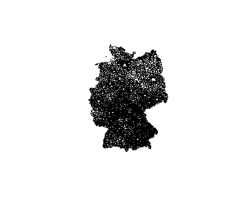

```{r setup, include=FALSE}
knitr::opts_chunk$set(echo = T,message=F,warning=F,cache=T)
```

## Mehrere Minimas

```{r}
a <- c(1,4,6,23,1,7,4,3,2)
min(a)
which(a==min(a))
sort(a)
  # die drei kleinsten Werte
which(a%in%sort(a)[1:3])
```


## Kartendaten bekommen

```{r}
library(maptools)
data(wrld_simpl)
plot(wrld_simpl)
```


## Kartendaten unterhalb von Staaten

```{r,eval=F}
DEU <- raster::getData(name = "GADM",country="DEU", level=3)
```

```{r,eval=F,echo=F}
save(DEU,file="DEU.RData")
```

```{r,echo=F}
load("../data/DEU.RData")
```

### Die Karte plotten

```{r,eval=F}
plot(DEU)
```



## Die Daten der Karte

```{r}
head(DEU@data)
```

## Nur BaWü plotten

```{r}
plot(DEU[DEU$NAME_1=="Baden-Württemberg",])
```


## Scatterplot

```{r}
data(iris)
```

```{r}
plot(iris$Sepal.Length,iris$Sepal.Width,pch=20)
```

## Plot mit Farbabstufung

```{r}
colseq <- iris$Petal.Length/max(iris$Petal.Length)
plot(iris$Sepal.Length,iris$Sepal.Width,pch=20,
     col=rgb(0,0,colseq))
```

## Abstufung bei Größe der Punkte

```{r}
sizeseq <- iris$Petal.Width/max(iris$Petal.Width)
plot(iris$Sepal.Length,iris$Sepal.Width,pch=20,
     col=rgb(0,0,colseq),cex=sizeseq)
```

## [Legende hinzufügen](http://www.sthda.com/english/wiki/add-legends-to-plots-in-r-software-the-easiest-way)

```{r}
x<-1:10; y1=x*x; y2=2*y1
plot(x,y1,type="b",pch=19,col="red",xlab="x",ylab="y")
lines(x, y2, pch=18, col="blue", type="b", lty=2)
legend(1, 95, legend=c("Line 1", "Line 2"),
       col=c("red", "blue"), lty=1:2, cex=0.8)
```


## [Achsenbeschriftung ändern](http://www.sthda.com/english/wiki/add-custom-tick-mark-labels-to-a-plot-in-r-software)

```{r}
x<-1:10; y<-x*x
par(mfrow=c(1,2))
plot(x, y)
plot(x,y, col.axis="blue", font.axis=4, cex.axis=1.5)
```

## Achsenbeschriftung - Orientierung

```{r}
par(mfrow=c(1,2))
plot(x, y, las=0) # parallel
plot(x, y, las=1) # horizontal
plot(x, y, las=2) # perpendicular
```

## Abstand Beschriftung

```{r}
plot(x, y, xaxt="n", yaxt="n")
xtick<-seq(0, 10, by=5)
axis(side=1, at=xtick, labels = FALSE)
text(x=xtick,  par("usr")[3], 
     labels = xtick, srt = 45, pos = 1, xpd = TRUE)
```

