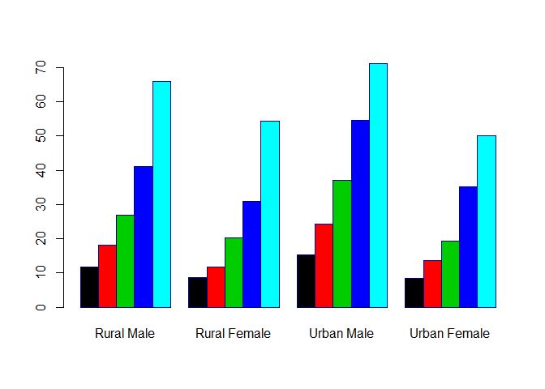

# Aufgabe - Barplot
Jan-Philipp Kolb  
3 Mai 2017  

## Aufgabe - einfache Grafiken

- Laden Sie den Datensatz `VADeaths` und erzeugen Sie den
folgenden plot:

<!-- -->

[Zurück zur Gliederung.](https://github.com/Japhilko/IntroR/blob/master/2017/README.md)
