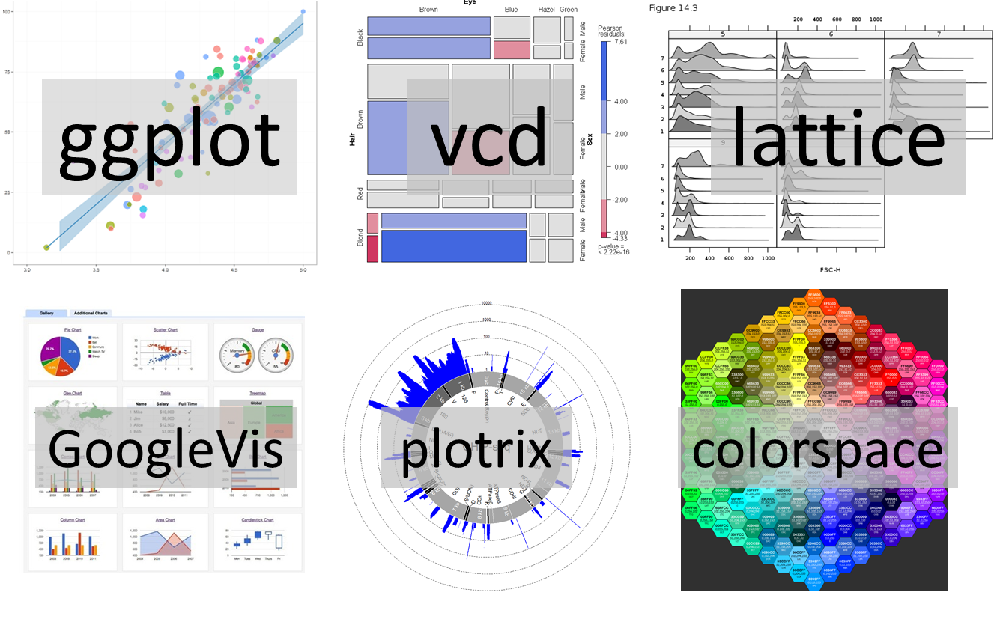
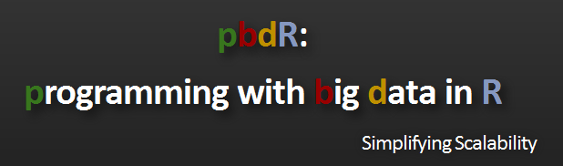

R als Taschenrechner
-----

```{r}
1+1
2-1
2*2
4/2
```


Mathematische Funktionen

```{r}
log(4)
log(4,base=2)
exp(4)
sqrt(4)
2^4
```


Reference cards
------

* Die bekannteste Version:

<http://cran.r-project.org/doc/contrib/Short-refcard.pdf>

* Eine Karte für Data Mining

<http://cran.r-project.org/doc/contrib/YanchangZhao-refcard-data-mining.pdf>

Modularer Aufbau
----------


<http://www.ats.ucla.edu/stat/r/seminars/intro.htm>


* Viele Funktionen sind im Basis-R enthalten 
* Viele spezifische Funktionen sind in zusätzlichen Bibliotheken integriert
* R kann modular erweitert werden durch sog. packages bzw. libraries
  		* Auf <r-project.org> werden die wichtigsten packages gehostet (im Moment 4567)
			* Weitergehende Pakete finden sich z.B. bei <www.bioconductor.org>


Beispiel für das Instalieren eines Paketes:
```{r,eval=FALSE}
install.packages("lme4")
library(lme4)
```




<http://cran.r-project.org/web/views/Graphics.html>

```{r, results='asis',echo=FALSE}

Tab1 <- rbind(c("Paket" , "Für was?"),
  c("lm" , "Einfache lineare Regression" ),
c("glm" , "Generalisierte Lineare Modelle" ) ,
c("tsDyn" , "Autoregressive Modelle (Zeitreihen)" )  ,
c("robustbase" , "Robuste Regressionen" ) ,
c("crs" , "Nichtparametrische Regression" ) ,
c("glmnet" , "Lasso Verfahren"))

knitr::kable(Tab1)
```


<http://data.princeton.edu/R/glms.html>

<http://cran.at.r-project.org/web/packages/tsDyn/vignettes/tsDyn.pdf>

<http://cran.r-project.org/doc/contrib/Fox-Companion/appendix-robust-regression.pdf>

<http://cran.r-project.org/web/views/Robust.html>

<http://journal.r-project.org/archive/2012-2/RJournal_2012-2_Nie+S~Racine.pdf>

<http://cran.r-project.org/doc/contrib/Fox-Companion/appendix-nonparametric-regression.pdf>


# Paket - fremde Datensätze (foreign)


```{r,echo=FALSE}
library(wordcloud)
library(tm)

Befehle <- c("lookup.xport","read.arff","read.dbf",
"read.dta","read.epiinfo","read.mtp",
"read.octave","read.spss","read.ssd",
"read.systat","read.xport","write.arff",
"write.dbf","write.dta","write.foreign")

p <- sample(1:5,length(Befehle),replace=T)
  
p[Befehle=="read.spss"] <- 15
p[Befehle=="read.dta"] <- 12
p[Befehle=="write.dta"] <- 10
p[Befehle=="write.foreign"] <- 8


pal <- brewer.pal(6,"Dark2")

wordcloud(Befehle,p,colors=pal)
```

# Paket - big data (pbdR)




<http://r-pbd.org/>

# Weitere wichtige Bibliotheken


Bibliothek  Thema
-------     -----
foreign     Functions for reading and writing data stored by statistical packages 
sampling    Functions for drawing and calibrating samples.
survey      Analysis of complex survey samples
MASS        Functions and Datasets for Venables and Ripley's Modern Applied Statistics with S'
xtable      Coerce data to LaTeX and HTML tables 
dummies     Expands factors, characters and other eligible classes into dummy/indicator variables.
mvtnorm     Multivariate Normal and t Distributions 
maptools    Tools for reading and handling spatial objects

## Wie bekommt man Hilfe?

Um generell Hilfe zu bekommen:

```{r,eval=FALSE}
help.start()
```


Online Dokumentation für die meisten Funktionen:


```{r,eval=FALSE}
help(name)
```


 Nutze `r?` um Hilfe zu bekommen.

Beispiel: `r?mean`

`r example(lm)` gibt ein Beispiel für die lineare Regression

Ansonsten kann natürlich auch hier <www.google.de> genutzt werden. Am Besten zusammen mit r-project suchen. Wenn man nur R eingibt sind die Suchergebnisse nicht auf die Programmiersprache eingegrenzt.

<http://stackoverflow.com/> bietet sich für detailiertere Fragen zum Programmieren an. Die Seite ist nicht auf R fokussiert. Es gibt sehr detailierte Diskussionen.


