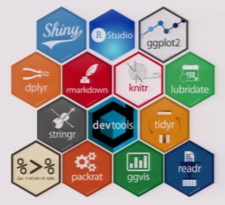
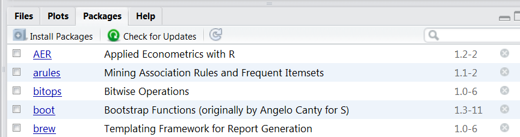

```{r, include=FALSE}
knitr::opts_chunk$set(echo = TRUE)
```


## [**Wo man Routinen findet**](https://stats.idre.ucla.edu/r/seminars/intro/)

```{r,eval=T,echo=F}
# http://blog.revolutionanalytics.com/2015/06/how-many-packages-are-there-really-on-cran.html
CRANmirror <- "http://cran.revolutionanalytics.com"
cran <- contrib.url(repos = CRANmirror, 
                      type = "source")
info <- available.packages(contriburl = cran, type = "source")
# nrow(info)
```


- Viele Funktionen sind in Basis-R enthalten. 
- Viele spezifische Funktionen sind in zusätzliche Bibliotheken integriert.
- R kann modular durch sogenannte Pakete oder Bibliotheken erweitert werden.
- Die wichtigsten Pakete, die auf CRAN gehostet werden (`r nrow(info)` at `r format(Sys.time(), "%a %d %b %Y")`)
- Weitere Pakete findet man z.B. unter [**bioconductor**](www.bioconductor.org)

## [Übersicht R-Pakete](https://www.youtube.com/watch?v=kKI9--Opmso)



## Installation von Paketen

- Die Anführungszeichen um den Paketnamen herum sind für den Befehl `install.packages` notwendig.
- Sie sind optional für den Befehl `library`.
- Man kann auch `require` anstelle von `library` verwenden.

```{r,eval=F}
install.packages("raster")

library(raster)
```

## Installation von Paketen mit RStudio


## Bestehende Pakete und Installation




## Übersicht Pakete:

- Luhmann - [**Übersicht mit vielen nützlichen Paketen**](http://www.beltz.de/fileadmin/beltz/downloads/OnlinematerialienPVU/28090_Luhmann/Verwendete%20Pakete.pdf)
- Mit dem Paket `leaflet` kann man interaktive Karten erstellen.
- Das Paket `tmap` zur Erstellung von thematischen Karten.
- [**Paket `maptools` um Karten zu erzeugen**](http://www.r-bloggers.com/tag/maptools/)
- Das Paket `sf` - bietet Zugang zu [**simple features**](https://de.wikipedia.org/wiki/Simple_Feature_Access).


<!--
- Paket für Import/Export - [**`foreign`**](http://cran.r-project.org/web/packages/foreign/foreign.pdf)

- [**`sampling`-Paket für die Stichprobenziehung**](http://iase-web.org/documents/papers/icots8/ICOTS8_4J1_TILLE.pdf)

- `xtable` Paket zur Integration von LateX in R ([**xtable Galerie**](http://cran.r-project.org/web/packages/xtable/vignettes/xtableGallery.pdf))

- [**`dummies` - Paket zur Erstellung von Dummies**](http://cran.r-project.org/web/packages/dummies/dummies.pdf)

- [**Paket `mvtnorm` um eine multivariate Normalverteilung zu erhalten. **](http://cran.r-project.org/web/packages/mvtnorm/index.html)

-->

## Pakete aus verschiedenen Quellen installieren

### Pakete vom CRAN Server installieren

```{r,eval=F}
install.packages("lme4")
```

### Pakete vom Bioconductor Server installieren

```{r,eval=F}
source("https://bioconductor.org/biocLite.R")
biocLite(c("GenomicFeatures", "AnnotationDbi"))
```


### Pakete von Github installieren

```{r,eval=F}
install.packages("devtools")
library(devtools)

install_github("hadley/maptools")
```


## Wie bekomme ich einen Überblick?

- Entdecke Pakete, die kürzlich auf den [**CRAN**](https://mran.microsoft.com/packages/) Server hochgeladen wurden

- Nutze eine Shiny Web-App, in der [**Pakete angezeigt werden, die kürzlich von CRAN**](https://gallery.shinyapps.io/cran-gauge/) heruntergeladen wurden.

- Werfe einen Blick auf eine [**Quick-Liste nützlicher Pakete**](https://support.rstudio.com/hc/en-us/articles/201057987-Quick-list-of-useful-R-packages)

- ...., oder auf eine Liste mit den [**besten Paketen für die Datenverarbeitung und -analyse**](http://www.computerworld.com/article/2921176/business-intelligence/great-r-packages-for-data-import-wrangling-visualization.html),.....

- ...., oder sieh Dir [**die 50 meistgenutzten Pakete**](https://www.r-bloggers.com/the-50-most-used-r-packages/) an.


## CRAN Task Views		
		
- Bezüglich mancher Themen gibt es einen Überblick über alle wichtigen Pakete - ([**CRAN Task Views**](https://cran.r-project.org/web/views/))
- Momentan gibt es 35 Task Views.
- Alle Pakete einer Task-View können mit folgendem Befehl installiert werden: [**command:**](https://mran.microsoft.com/rpackages/)

```{r,eval=F}
install.packages("ctv")
library("ctv")
install.views("Spatial")
```


## Übung -  zusätzliche Pakete

Geh bspw. auf <https://cran.r-project.org/> und suche nach Paketen...

- die sich für interaktive Karten eignen.
- mit denen man thematische Karten erstellen kann
- mit denen man die räumliche Distanz berechnen kann
- mit denen man eine Satellitenkarte bekommen kann


<!--
## Links zum Weiterlesen:


- [**Warum man R zuerst lerneen sollte wenn man Data Science machen möchte**](http://www.r-bloggers.com/why-you-should-learn-r-first-for-data-science/)

- RStudio hat den [**Infoworld 2015 Technology of the Year Award.**](http://www.r-bloggers.com/rstudio-infoworld-2015-technology-of-the-year-award-recipient/) bekommen

- [**Warum R gut für Unternehmen ist**](http://www.fastcolabs.com/3030063/why the r programming language is good for business) 

- Schaut auf [**R-bloggers**](http://www.r-bloggers.com/why-use-r/)
<!--
- [Intro R](http://www.ats.ucla.edu/stat/r/seminars/intro.htm)
- [Intro R II](http://www.ats.ucla.edu/stat/r/sk/)
-->

<!--

- Vergleich zwischen [**python und R**](http://www.dataschool.io/python-or-r-for-data-science/)

- R und Stata - [**Side-by-side**](http://economistry.com/2013/11/r-impact-evaluation-r-stata-side-side/)

- [**AWESOME R**](https://awesome-r.com/)

- [**1000 R tutorials/Links**](https://support.bioconductor.org/p/33781/)

- [**Zwei Minuten Videos auf Github**](https://www.youtube.com/playlist?list=PLcgz5kNZFCkzSyBG3H-rUaPHoBXgijHfC)

-->

<!--
## Shiny App - Einführung in R

http://www.intro-stats.com/


-->


<!--
https://craigwang.shinyapps.io/rPackageStats/
-->
